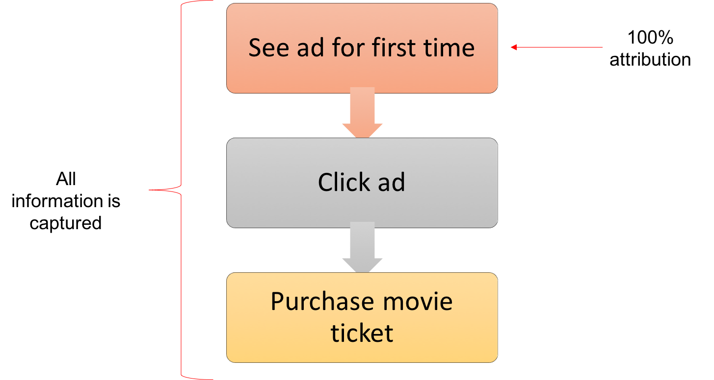
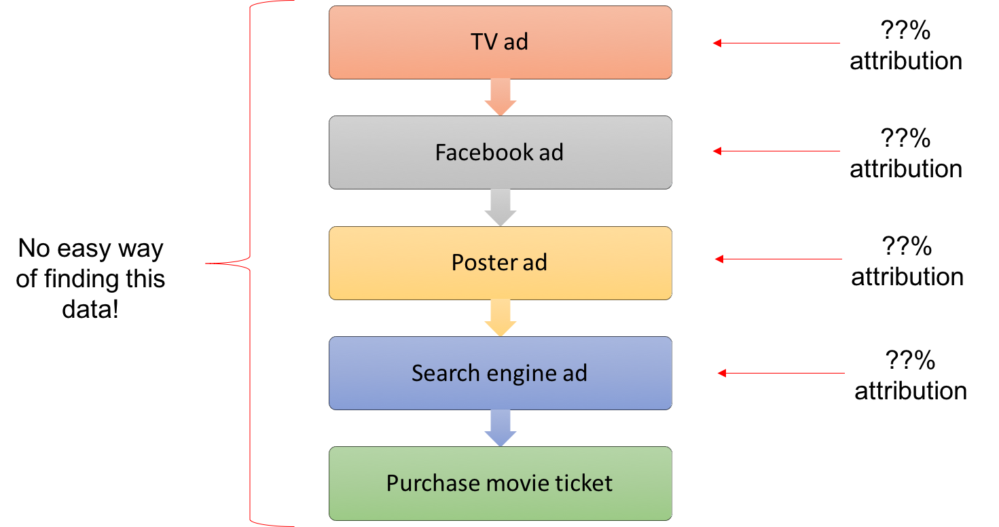
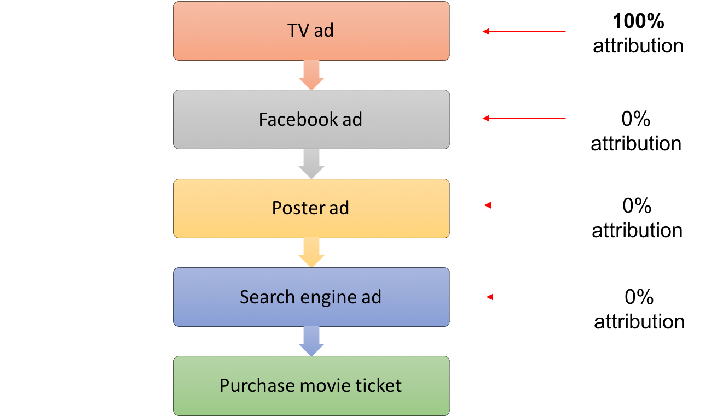
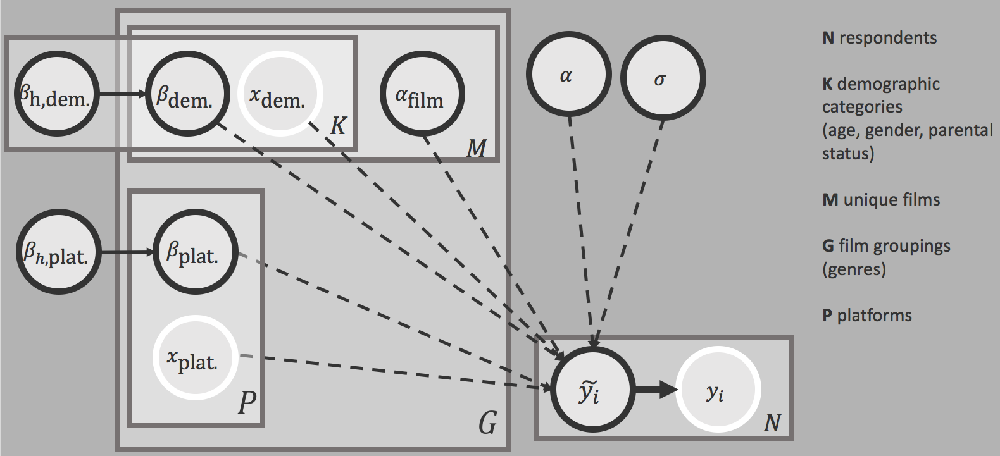
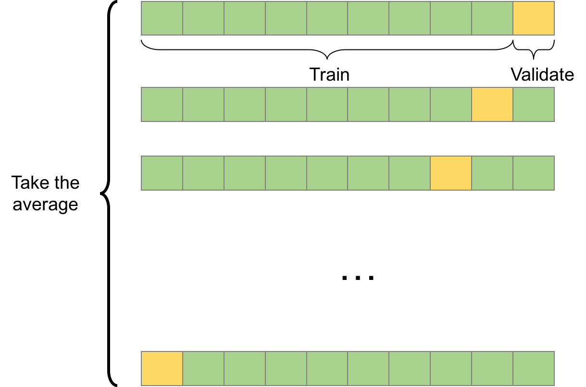

# The Problem
Advertising attribution is the method of quantifying the relative contributions of different advertising channels when a target consumer performs some desirable action (a "conversion"). It is a difficult issue that affects nearly all industries which rely on marketing in some form. Specifically in the movie industry, millions of dollars are spent marketing each film; sometimes this cost even outstrips the huge costs associated with producing the movie. It is a critical part of the box office success of a movie, but, often, these crucial marketing decisions have been made without the benefit of rigorous statistical analysis inferring the relative effectiveness of each marketing platform. Clearly, knowing something about the effectiveness of advertising platforms could help inform these marketing decisions and future budget allocations.

In an ideal world, we would be in a situation like below, where we have a user who discovers a movie by viewing an advertisement for the first time, and immediately purchases a movie ticket.
<div style="text-align:center; margin:12pt 0;"></div>

The reality is much more complicated though, and actually looks something more like this:
<div style="text-align:center; margin:12pt 0;"></div>

So there are two major problems when it comes to advertising attribution in the movie industry:

 1. The data about what advertising a consumer sees, and whether they ultimately watch a movie is not easily known; and
 2. Even if we have the data, it is not clear how best to identify the contributions of each advertising platform towards a conversion.
 

## Getting the Data
Like most mass-market products, many movie producers utilize 'offline' channels to promote their products (like TV ads or billboards in NYC's Times Square) so it is challenging to get data on advertisements a consumer has seen. Making matters more difficult, even if we knew about the advertisement exposures for an individual, it is often impossible to tie this information with whether a person ultimately goes to see a particular movie since most movie tickets are sold in-person at cinemas, and advertisers typically do not have access to ticket sales on an individual level.

Our solution here is to conduct a survey for a cohort of movies released around the same date. The data includes information such as:

1. A user's self-reported advertising exposure on a range of platforms;
2. A user's demographic information;
3. A user's movie preferences and movie-going behavior; and
4. Whether they ultimately go to see a movie in our survey set.

We used an online crowd-sourcing platform to select a static panel of respondents who completed a daily survey for 14 days. A daily cadence was selected to maximize the respondents' ability to remembers ads they have seen, while balancing the practical feasibility of completing the survey. In a typical survey run, there were around 2,000 respondents who completed 12 or more days of surveys and were included in the final analysis. This represented an 80% retention rate from the total pool of participants who were selected for the survey. In our full model, we conduct this survey at multiple different times across different cohorts of movies. Combining the results of these multiple survey cohorts together allows us to leverage the benefits of the partial-pooling approach in order to reduce the variance in the inferred posterior distribution of the model parameters.

We are making available a reduced, anonymized version of our proprietary data set to demonstrate our approach. In summary:
  
  - This version is a randomly sampled subset of the results from a single survey run.
  - The advertising platforms and movie names used in the survey have been anonymized.
  - Each row in the input data file represents a person-movie pairing (7,000 pairings) and there are 1,000 such pairings for each movie.
  - The ages have been normalized with mean 0 and unit variance.
  - The ad exposure data has been normalized with mean 0 and unit variance, first by row (person-movie pairing) and then by column (ad platform).
  - There are 7 distinct movies, each belonging to a single genre (the movies spanned across 2 distinct genres). 
  - There are 9 advertising platforms represented in the data.

## Assigning Credit
As mentioned above, a person does not simply view a single advertisement and immediately purchase a movie ticket. Advertising exposures are spaced out in time across different ad platforms, so there needs to be a way to determine the relative contributions of the ad platforms. Some general observations that are probably true:

1. The timing of an ad exposure likely matters;
2. Different ad platforms likely have different effects (e.g. ads that raise awareness versus ads that call to action);
3. Repeated ad exposures on a platform likely have some additive effects; and
4. Ad exposures that do not lead to a conversion may still deserve some credit.

It is non-trivial to figure out a robust method to assign credit to different ad platforms that addresses all these dynamics, and it remains an open research area.[@dalessandro2012causally; @abhishek2012media; @yadagiri2015non] Nevertheless, we discuss some common methods that have been used in practice. Later, we will show how the efficacy of different attribution methods can be compared, and how our model can be readily adapted to use some of these different methods.

### First and Last-touch Attribution
One common method in use in web-advertising is to simply take the last advertising platform that was seen before the conversion; this is known as "Last Touch Attribution". This metric is popular in web-advertising since the required data is usually available and the metric is easily measurable:

<div style="text-align:center; margin:12pt 0;"></div>

Equivalently, there are methods known as "First Touch Attribution" which gives full credit to the first advertisement seen.
<div style="text-align:center; margin:12pt 0;"></div>

Clearly, these are very rough estimates of contribution, and can be quite unfair since they are all-or-nothing. This is especially problematic for ad platforms that are not usually accessed immediately before a conversion; radio advertisements, for example, may bring a consumer's awareness to a product without directly leading to an immediate conversion. As we will show later, both First and Last-touch Attribution can be used in our model with only minor changes to the preparation of the data.

### Equal Weight Attribution
The technique we focus on for this example is known as "Equal Weight Attribution" where all ad platforms that contributed to the conversion are given equal credit. This effectively ignores the time component of the ad exposures. We also incorporate the proportion of ad exposures by platform for each conversion (rather than a binary value), so platforms that were viewed more often are given a higher overall credit for that conversion.

<div style="text-align:center; margin:12pt 0;"></div>

### Other Measures
More advanced attribution techniques include "Time Weighted Attribution" which incorporates time-decay. The central idea is that ads viewed a long time before conversion probably did not have as big an impact as those ads viewed close to the time of conversion.

There are also techniques which use Hidden Markov Models (HMMs) that incorporate latent states in an attempt to assign credit to advertising platforms even when ultimately no conversion occurred.[@abhishek2012media]

# Model

In this example, we use a hierarchical Bayesian logistic regression model to infer the relative effectiveness of advertising platforms on whether a user goes to see a movie. The main goal here is not to get the absolute highest predictive accuracy, but to understand the effectiveness of different advertising platforms on movie attendance. Key benefits of this model include the highly interpretable model parameters, and detailed insights about their posterior distributions.

Consider the $i$-th data point representing some person-movie pairing. For some vector of parameters (e.g. demographics and ad platform effectiveness), $\boldsymbol{\beta_{\omega}}$, if we have the corresponding vector of values for a data point, $\boldsymbol{x_i}$, the probability of whether a person watches a particular film, $y_i$ is modeled as:

$$
\mu = logit^{-1}(x_{i,age}\beta_{\omega,age} + x_{i,gender}\beta_{\omega,gender} + x_{i,parent}\beta_{\omega,parent} + \boldsymbol{x_{i,ad}}^T\boldsymbol{\beta_{\omega,ad}} + \beta_{\omega,0} + \beta_0 + \bar{y}) \\
y_i \sim Bernoulli(\mu)
$$


Variables:

- $N$ is the number of person-movie data points
- $i = 1 ... N$ indexes data points describing a person-movie pairing
- $f = 1 ... F$ indexes films
- $g = 1 ... G$ indexes genres

Data:

- $x_{i, attr}$ is the value of the attribute `attr` for the data point $i$
- $y_{i} \in \left\{ 0, 1\right\}$ is the binary response of whether, for data point $i$, the associated person saw the associated film
- $\bar{y}$ is the mean of the response variable in the entire survey cohort across all films

Parameters:

- $\beta_{\omega, attr}$ is the effect of some attribute `attr` for the relevant film
- $\boldsymbol{\beta_{\omega, ad}}$ is the vector of ad exposure effects for all ad platforms for the relevant film
- $\beta_{\omega, 0}$ is the intercept for the relevant film
- $\beta_0$ is the model intercept


Priors:

- We use Gaussian priors centered at 0 for the model coefficients, with weakly informative half-Cauchy hyperpriors for the scale parameter.[@gelman2006prior]
- We use a non-centered parameterization of the hierarchical model for faster convergence.[@bernardo2003non; @betancourt2013hamiltonian] Under this parameterization, $\beta_{\omega}$ is the overall effect of a parameter for a particular data point after incorporating the relevant genre ($\beta_{g}, \sigma_{g}$) and film-level ($\beta_{f}, \sigma_{f}$) effects.
- For the demographic model coefficients (i.e. age, gender and parent status)
    - $\beta_{\omega, demo} = \sigma_{t, demo} ( \sigma_{g, demo} \beta_{f, demo} + \beta_{g, demo})$
    - $\beta_{f, demo} \sim \mathcal{N}(0, 1)$
    - $\beta_{g, demo} \sim \mathcal{N}(0, 1)$
        - $\sigma_{g, demo} \sim Cauchy(0, 1) \mid \sigma_{g, demo}>0$
    - $\sigma_{t, demo} \sim Cauchy(0, 0.5) \mid \sigma_{t, demo}>0$
- For the ad platform effectiveness model coefficients
    - $\beta_{\omega, ad} = \sigma_{t, ad} (  \mu_{ad} + ( \sigma_{g, ad} \beta_{f, ad} + \beta_{g, ad}))$
    - $\mu_{ad} \sim \mathcal{N}(0, 1)$
    - $\beta_{f, ad} \sim \mathcal{N}(0, 1)$
    - $\beta_{g, ad} \sim \mathcal{N}(0, 1)$
        - $\sigma_{g, ad} \sim Cauchy(0, 1) \mid \sigma_{g, ad}>0$
    - $\sigma_{t, ad} \sim Cauchy(0, 0.5) \mid \sigma_{t, ad}>0$
- For the film-specific intercepts
    - $\beta_{\omega, 0} = \sigma_{t, 0} ( \sigma_{g, 0} \beta_{f, 0} + \beta_{g, 0})$
    - $\beta_{f, 0} \sim \mathcal{N}(0, 1)$
    - $\beta_{g, 0} \sim \mathcal{N}(0, 1)$
        - $\sigma_{g, 0} \sim Cauchy(0, 1) \mid \sigma_{g, 0}>0$
    - $\sigma_{t, 0} \sim Cauchy(0, 1) \mid \sigma_{t, 0}>0$
- For the model intercept
    - $\beta_0 \sim \mathcal{N}(0, 0.5)$

As discussed above, we acknowledge there are limitations to this simplified model, but it still provides some illustrative inferences. In this model, we include:

 1. Individual-level demographic data (e.g. age, gender, parent status);
 2. Ad exposure information (i.e. normalized number of exposures on each ad platform); and
 3. Whether an individual went to see a particular movie (i.e. 1 or 0).
 
In the full model that we use, we also incorporate additional variables like nuisance variables (e.g. initial awareness of a movie), and additional individual-level characteristics (e.g. genre preferences) that likely affects movie-going behavior. We also use multiple survey cohorts to increase the sample size.

Each film will have different parameter estimates, so the effect of age or gender on whether a person sees a film is going to differ between films making it unreasonable to treat all film parameters the same ("complete pooling"). While we could model each film separately ("unpooled"), treating all films as completely unrelated entities:

1. Does not seem entirely accurate; and 
2. Leaves us with a very limited data set since we do not leverage data from other films in each film's parameter estimates.

The hierarchical aspect of the model allows us to pool together data across different films to inform our parameter estimates. Our proposed approach is to use genre-level parameters that are distributed using priors drawn from a common, higher-level distribution. The film-level parameters are then drawn from a distribution based on the relevant genre-level distribution.




```{stan, output.var='ad_attr_stan', eval=FALSE}
data {
	int<lower=0> N ; # Total number of data points
	int<lower=0> K_m; # Number of films
	int<lower=0> K_mg; # Number of film groups
	int<lower=0> K_ads; # Number of ad platforms

	int<lower=0,upper=1> y[N] ; # Have seen target film

	int<lower=0,upper=1> x_parent[N] ; # Parent code
	real x_age[N] ; # Age
	real<lower=0> x_gender[N] ; # Gender
	int<lower=0> x_film[N] ; # Film
	matrix[N, K_ads] x_ads ; # Ad impressions per platform

	int<lower=1, upper=K_mg> x_mg[K_m] ; # Film groups
}

transformed data {
	real realN;
	real logit_mean_y;
	realN = N;
	
	logit_mean_y = logit(sum(y) / realN);
}

parameters {
	real b;
	
	real<lower=0> v_age_sigma;
	vector[K_mg] v_age_g;
	vector<lower=0>[K_mg] v_age_sigma_g;
	vector[K_m] v_age;
		
	real<lower=0> v_gender_sigma;
	vector[K_mg] v_gender_g;
	vector<lower=0>[K_mg] v_gender_sigma_g;
	vector[K_m] v_gender;
	
	real<lower=0> v_parent_sigma;
	vector[K_mg] v_parent_g;
	vector<lower=0>[K_mg] v_parent_sigma_g;
	vector[K_m] v_parent;
	
	real<lower=0> v_ad_sigma;
	vector[K_ads] v_ad_platform_mean;
	vector<lower=0>[K_ads] v_ad_platform_sigma;
	matrix[K_ads, K_mg] v_ad_platform_g;
	matrix<lower=0>[K_ads, K_mg] v_ad_platform_sigma_g;
	matrix[K_m,K_ads] v_ad_platform_film;
	
	real<lower=0> v_film_sigma;
	vector<lower=0>[K_mg] v_film_g_sigma;
	vector[K_mg] v_film_g;
	vector[K_m] v_film_s;
}

model {
	real y_pred[N];
	
	b ~ normal(0, 0.5);
	
	v_age_sigma ~ cauchy(0, 0.5);
	v_age_g ~ normal(0, 1);
	v_age_sigma_g ~ cauchy(0, 1);
	v_age ~ normal(0, 1);
	
	v_gender_sigma ~ cauchy(0, 0.5);
	v_gender_g ~ normal(0, 1);
	v_gender_sigma_g ~ cauchy(0, 1);
	v_gender ~ normal(0, 1);
	
	v_parent_sigma ~ cauchy(0, 0.5);
	v_parent_g ~ normal(0, 1);
	v_parent_sigma_g ~ cauchy(0, 1);
	v_parent ~ normal(0, 1);
	
	v_ad_sigma ~ cauchy(0, 0.5);
	v_ad_platform_mean ~ normal(0, 1);
	v_ad_platform_sigma ~ cauchy(0, 1);
	
    to_vector(v_ad_platform_g) ~ normal(0, 1);
    to_vector(v_ad_platform_sigma_g) ~ cauchy(0, 1);
    to_vector(v_ad_platform_film) ~ normal(0, 1);
	
	v_film_sigma ~ cauchy(0,1);
	v_film_g_sigma ~ cauchy(0,1);
	v_film_g ~ normal(0,1);
	v_film_s ~ normal(0,1);

	for (n in 1:N) {
		int g;
		int m;
		real comb_ad_platform;
		
		m = x_film[n];
		g = x_mg[m];
		
		comb_ad_platform = 0;
		for (k in 1:K_ads) {
			comb_ad_platform = comb_ad_platform +
				v_ad_sigma * (v_ad_platform_mean[k] + v_ad_platform_sigma[k] * (v_ad_platform_g[k,g]  + v_ad_platform_sigma_g[k,g] * v_ad_platform_film[m,k])) * x_ads[n,k];
		}
		
		y_pred[n] = logit_mean_y + b + 
			(v_age_sigma * (v_age_sigma_g[g] * v_age[m] + v_age_g[g])) * x_age[n] +		
			(v_gender_sigma * (v_gender_sigma_g[g] * v_gender[m] + v_gender_g[g])) * x_gender[n] + 
			(v_parent_sigma * (v_parent_sigma_g[g] * v_parent[m] + v_parent_g[g])) * x_parent[n] + 
			comb_ad_platform +
			v_film_sigma * (v_film_g_sigma[g] * v_film_s[m] + v_film_g[g]);
	}
	
	y ~ bernoulli_logit(y_pred);
}
	
generated quantities {
  real log_lik[N]; # Log-likelihood of each data point given a posterior sample
  real theta[N]; # The probabilities of p(y=1|x) for each data point and MCMC sample

	for (n in 1:N) {
		int g;
		int m;
		real t_i;
		real comb_ad_platform;

		m = x_film[n];
		g = x_mg[m];

		comb_ad_platform = 0;
		for (k in 1:K_ads) {
			comb_ad_platform = comb_ad_platform +
				v_ad_sigma * (v_ad_platform_mean[k] + v_ad_platform_sigma[k] * (v_ad_platform_g[k,g]  + v_ad_platform_sigma_g[k,g] * v_ad_platform_film[m,k])) * x_ads[n,k];
		}

		t_i = logit_mean_y + b + 
			(v_age_sigma * (v_age_sigma_g[g] * v_age[m] + v_age_g[g])) * x_age[n] +		
			(v_gender_sigma * (v_gender_sigma_g[g] * v_gender[m] + v_gender_g[g])) * x_gender[n] + 
			(v_parent_sigma * (v_parent_sigma_g[g] * v_parent[m] + v_parent_g[g])) * x_parent[n] + 
			comb_ad_platform +
			v_film_sigma * (v_film_g_sigma[g] * v_film_s[m] + v_film_g[g]);

		log_lik[n] = bernoulli_logit_lpmf( y[n] | t_i );
		theta[n] = inv_logit( t_i );
	}
}

```


# RStan
Using RStan, we can run the Stan program using MCMC sampling. Installing the latest RStan version from Github may be required since some plotting functions come up with errors in earlier versions. The code for this notebook is run using Rstan 2.12.1.
```{r, eval=FALSE, include=FALSE}
# This gets the latest rstan version from the 'develop' branch on Github

library(devtools)
install_github('stan-dev/rstan/rstan/rstan', ref='develop')
```


```{r}
# ---- RStan utility functions ------------

#' Load a single object into a temporary environment and return that object only
#' 
#' Must contain only a single object, or otherwise it returns some arbitrary 
#' object.
#' 
#' @param f The file that contains the single R object
#' @return The R object contained in the file, \code{f}
#' @note Source: http://stackoverflow.com/questions/5577221/how-can-i-load-an-object-into-a-variable-name-that-i-specify-from-an-r-data-file
#' @export

load_obj <- function(f)
{
  env <- new.env()
  nm <- load(f, env)[1]
  env[[nm]]
}

#' Creates a Stan model after preparing data
#' 
#' Save all the results into a single object to keep things neat. 
#' Also allows for additional parameters to be extracted from the Stan model 
#' into the return object.
#' 
#' @param rda_file Where the Stan data is stored (usually an RDA file).
#' @param stan_file Where the Stan model file is stored (usually a .stan file).
#' @param iter,chains Parameters for training the Stan model.
#' @param pars Additional parameters that should be extracted from the Stan 
#'   model into the return object. Will be stored with name 
#'   'param_'+<param_name>
#' @return Named list with the data, Stan fitted model.
#' @export

create_stan_model <- function(rda_file, stan_file, iter = 250, chains = 4, pars = NULL) {
  ret = list(data = load_obj(rda_file))
  
  ret[['stan_fit']] <- stan(file = stan_file, data = ret[['data']] , iter = iter, chains = chains)  # Fit the model
  
  # If required, extract some additional parameters from the model (assumes they are defined in Stan)
  if( !is.null(pars) ) {
    for( p in pars ) {
      ret[[paste0('param_', p)]] = extract( ret[['stan_fit']], pars=p)
    }
  }
  
  return (ret)
}
```

```{r, message=FALSE, warning=FALSE}
library(rstan)

rstan_options(auto_write = TRUE) # Save model to reduce recompiling time
options(mc.cores = parallel::detectCores()) # Use multiple cores

# Load the data and run the model, extracting the p(y=1|x) and log-likelihood parameters for all MCMC samples
comb_res = create_stan_model('stancon_data.rda', 'stancon_model.stan', pars=c('theta', 'log_lik'), iter = 750)

```


A quick look at the histogram of the posteriors for some of the parameters suggests we are getting some reasonable results. The posterior distributions are roughly shaped like Gaussians and do not appear to be truncated at either extreme. Many parameters are also centered on non-zero values, implying the data is shifting the posterior away from the prior distribution.
```{r echo = FALSE, message = FALSE, warning = FALSE}
library(Rmisc)

#' Create a histogram of a parameter from a Stan fitted object
#'
#' Using the extracted samples from a fitted Stan object, create
#' a histogram for a parameter, or each element of the parameter
#' if the parameter is a vector.
#'
#' @param par A string of the parameter of interest
#' @param fit The Stan fitted object
#' @param xmin,xmax The min and max x-values of the histogram
#' @return None. Plots directly to the default device.
#' @export
custom_hist <- function(par, fit, xmin = -3, xmax = 3, p_cols = 3) {
  par_samps = extract(fit, pars=par)[[par]]
  par_plots = list()
  for( i in 1:NCOL(par_samps) ) {
    par_plots[[i]] = ggplot() + 
      geom_histogram( data = data.frame( val=par_samps[, i]), aes(x=val), color = 'black', fill = '#B2001D', binwidth = 0.15 ) + 
      geom_vline(xintercept = 0, linetype='dashed') + 
      coord_cartesian(xlim=c(xmin,xmax)) +
      theme_minimal() + 
      labs(x = paste0(par, '[', i, ']'), y = '') + 
      scale_x_continuous(labels = ceiling(xmin):floor(xmax), breaks = ceiling(xmin):floor(xmax)) +
      theme(axis.title.y = element_blank(), axis.ticks.y = element_blank(), axis.text.y = element_blank(), panel.grid = element_blank(), axis.title.x = element_text(face='bold'))
  }
  multiplot(plotlist=par_plots, cols = p_cols)
}

```

```{r echo = FALSE, message = FALSE, warning = FALSE}
custom_hist('v_age', comb_res$stan_fit)
```

```{r echo = FALSE, message = FALSE, warning = FALSE}
custom_hist('v_parent', comb_res$stan_fit)
```

Below, we can see the average advertising effectiveness for each of the 9 ad platforms across all films in the cohort ($\mu_{ad}$). Note these are the averages across the cohort, so each individual film will have its own set of ad platform effectiveness parameters that will incorporate the partially pooled information from film genre, and the survey data points for that particular movie. 

On average, ad platform number 2 is notably less effective than the other platforms when comparing the medians of the posterior (the significance of this difference is substantially increased in our full data set). Similarly, we can see that platforms 1, 6, 7, and 8 seem to be more effective when comparing median values of this mean parameter.

```{r warning=FALSE, message=FALSE, echo=FALSE}
stan_plot(comb_res$stan_fit, 'v_ad_platform_mean') + 
  labs(x = 'Parameter value', title = 'Posterior of ad platform means') +
  theme(axis.title = element_text(), axis.title.y = element_blank())
```

An added benefit of using a hierarchical model is that we can also look at the model parameters at different levels of the hierarchy. In this case, it may reveal differences across genres that could be useful to understand how advertising effectiveness might vary across genres, or whether certain demographic groups are attracted to particular movie genres. Looking at the genre-level parameter for age below, we can see that younger people are more likely to view movies in genre 1, while older viewers are more likely to view movies in genre 2.


```{r warning=FALSE, message=FALSE, echo=FALSE}
stan_plot(comb_res$stan_fit, 'v_age_g') + 
  labs(x = 'Parameter value', title = 'Posterior of genre-level age parameter') +
  theme(axis.title = element_text(), axis.title.y = element_blank())
```


# Analyzing the model
In order to ensure the model is appropriate and stable, we consider:

1. MCMC diagnostics; and
2. Posterior predictive checks.

## MCMC Diagnostics

As a starting point, we want to see if the chains are converging to the target distribution (or at least to some equilibrium distribution). There are multiple ways of doing this, but we focus on the potential scale reduction statistic, $\hat{R}$, as proposed by Gelman and Rubin.[@gelman1992inference] This compares the average variance within each chain to the pooled variance across all chains. The proposed rule of thumb by Gelman and Rubin is to continue sampling until all $\hat{R}$ values are below 1.1. We note there are some strong assumptions behind this statistic, and there is additional complexity behind assessing whether convergence has actually occurred, but we keep it simple here for the sake of brevity.

As seen below, all $\hat{R}$ statistics are clearly below 1.1, suggesting that equilibrium has been achieved. Note we only use 4 chains here, but again, in practice we would have many more in order to increase the likelihood that the posterior space is well-explored. The danger with only having a few chains is that convergence could appear to have been achieved, when in fact there could be entirely unexplored spaces in the posterior due to the particular random initializations of each chain. In general, there is no way of guaranteeing this does not happen even with a large number of chains, but more chains decreases the likelihood of this happening.

```{r warning = FALSE, message = FALSE, echo = FALSE}
param_summary = summary(comb_res$stan_fit)$summary
stan_rhat(comb_res$stan_fit) + 
  labs(title = 'Rhat for all parameters', subtitle = paste0('Maximum Rhat = ', round(max(param_summary[, 'Rhat']), 4)))
```

We should also consider the Effective Sample Size (ESS) which accounts for autocorrelation between samples. This is important, for example, when considering standard error measurements arising from the central limit theorem which assumes independent samples; calculations using the standard sample size are instead replaced with ESS.[@stanmanual] Highly correlated samples will have a much lower ESS compared to the actual sample size. The absolute ESS value matters also since estimation error is proportional to $1/\sqrt{N_{eff}}$, so depending on the acceptable level of error, we may need to include more samples. The ESS is fairly low for some parameters in this small example, but in practice there should be more samples (usually, at least several thousand).

```{r echo = FALSE, message = FALSE, warning = FALSE}
stan_ess(comb_res$stan_fit) + 
  labs(title = 'Effective Sample Size ratio for all parameters', subtitle = paste0('Effective Sample Size range = [', round(min(param_summary[, 'n_eff'])), ', ',round(max(param_summary[, 'n_eff'])),']'))
```

## Posterior Predictive Checks
A basic way to check whether the model is performing reasonably and is appropriate for the problem, is to simulate how well it is able to recreate the training data.[@gelman2014bayesian] Specifically, we want to compare the posterior predictive distribution of the dependent variable for each data point to the actual observed value. If the actual observed value is towards the extreme ends of the posterior predictive distribution (or outside the range altogether), that may suggest our model needs to be improved. For example, perhaps we are not modeling higher-order interaction terms, or we are omitting essential data from our model.

Of course, the true posterior distribution is unknown so the MCMC samples will form the estimate. Specifically, the posterior predictive distribution is:
$$
p(\tilde{y} | \boldsymbol{X}, \boldsymbol{y}) = \int{ p(\tilde{y} | \theta) p(\theta|\boldsymbol{X}, \boldsymbol{y}) d\theta}
$$
Using $S$ posterior samples as a substitute for the true posterior distribution, with the $k$-th posterior sample denoted by $\theta^k$:
$$
p(\tilde{y} |  \boldsymbol{X}, \boldsymbol{y}) \approx \frac{1}{S} \sum_{k=1}^{S}{ p(\tilde{y} | \theta^k) }
$$

In order to create replications of the training data set, each posterior sample will create a replication based on the distribution of $\tilde{y_i^k}$ for the $i$-th data point and $k$-th sample. Since the dependent variable is a Bernoulli random variable, each replication is a draw from the Bernoulli distribution with mean $p(\tilde{y_i^k} = 1 | \theta^k)$. Let the concrete replication for data point $i$ and sample $k$ be $y_{pred, i}^{k} \in \left\{0, 1\right\}$.

Rather than look at each individual data point, looking at the distribution of predictions across certain groups might suggest more meaningful ideas for model improvement. It could be, for example, that the model overestimates the age effect for people who are very young or very old due to the linear effect implied in the model, leading to poor replicated results for those age groups. Or perhaps the model performs poorly for people who are not parents.

If we consider a split of the data by parent status and movie genre, the box plots below show that the actual proportion of movie-going falls within the first and third quartile of all sets of replications. More generally, it is also possible to calculate a test statistic to compare the replications against the actual observed values, as well as an accompanying "p-value." In this case, the test statistic is just the proportion of $y_{pred, i}^{k} = 1$ for all $i$ in a particular set (e.g. parents) across the $k$ replications. Here, one possible p-value formulation is $p( T(y_{pred, G}) > T(y_G) )$ for a grouping of data points, $G$. These results so far do not indicate any problems with the performance of the model, since our model-based replications can often produce outcomes similar to the actual outcome observed.

```{r}
# ---- Plotting utility functions ------------

library(dplyr)

#' Utility function that returns the result of Bernoulli draws
#' 
#' Given some input matrix, repeatedly make a single draw from a Bernoulli 
#' distribution with probability given by each element in the input matrix. The
#' result is a matrix of the same size as the input matrix.
#' 
#' @param theta A matrix of elements in \in [0, 1] representing the probability
#'   of success in a Bernoulli distribution.
#' @return A matrix of elements in \in {0, 1} representing whether the
#'   Bernoulli draw was successful for that particular matrix element.
#' 
#' @export
get_y_rep_bernoulli <- function(theta) {
  numSamples= dim(theta)[1]
  numDataPoints = dim(theta)[2]
  
  unif_draws = matrix( runif(numSamples * numDataPoints), numSamples, numDataPoints )
  raw_seen_prop = (theta > unif_draws) # Find which bernoulli trials were successful
  
  return (raw_seen_prop)
}

#' Utility function for getting the proportions of y=1 for a given field
#' 
#' For some given field given by the \code{field} string, the relevant vector in the
#' nested list \code{data} is extracted. We group by the values in this vector and take
#' the proportion of elements for which the response variable is 1.
#' 
#' @param data The nested listed containing the data to be queried.
#' @param field The string representing the field of interest in a nested list.
#' @param resp The string representing the response variable in a nested list.
#' 
#' @export

get_actual_props = function(data, field, resp='y') {
  df = data.frame(val = data[[field]], y=data[[resp]])
  ret = df %>%
    group_by(val) %>%
    summarise_each(funs(mean)) %>%
    arrange(val)
  
  return(ret$y)
}

#' Utility function to create a matrix based on the values in another vector
#' 
#' Take some \code{data} matrix and choose to split it based on a vector 
#' \code{split_attr}. For each value in the vector \code{split_attr}, a boolean 
#' vector is created where an element in this new boolean vector is \code{TRUE} 
#' where the corresponding element in \code{split_attr} is exactly equal to this
#' value. The boolean vector is then used to subset \code{data} by column or row
#' based on the flag variable \code{by_col}. The return value is a dataframe 
#' with the means of the elements belonging to each value in \code{split_attr}.
#' 
#' @param split_attr A vector containing the values to determine the split of 
#'   the data matrix.
#' @param data A matrix containing the data to be subset.
#' @param by_col Whether the subset of \code{data} should be done by column or 
#'   row.
#'   
#' @return attr_summary A dataframe with an attribute column and a column with
#'   the mean of the values.
#'   
#' @export

split_theta_by_field <- function(split_attr, data, by_col = T) {
  df = if(by_col) data.frame(t(data)) else data.frame(data) # Create a dataframe from the data matrix
  df$attr = split_attr # Add the attribute column
  numRows = dim(df)[1]
  
  attr_summary = df %>%
    group_by(attr) %>%
    summarise_each(funs(mean))
  
  return(attr_summary)
}


#' Plot proportions of y=1 based on a discrete variable of interest
#' 
#' Takes an NxM matrix \code{raw_seen_prop} of {0,1} with each row 
#' representing a Bernoulli draw across \code{M} data points based on a single
#' sample from the posterior. This matrix is split across a discrete variable 
#' of interest to plot the proportions of y=1 for each of the unique values of
#' the discrete variable, across all the \code{N} posterior samples.
#' 
#' @param raw_seen_prop An NxM matrix of {0,1} which represents whether a 
#'   particular data point had a response of y=1 for that particular posterior
#'   sample.
#' @param stan_data The nested list of data. Must include the field of 
#'   interest.
#' @param field The name of the field in \code{stan_data} that is the field 
#'   of interest.
#' @param names The x-axis labels of the box plot (will use the discrete
#'   values of the variable of interest by default).
#' @param attr_name Some descriptive word to describe the attribute being 
#'   analyzed (e.g. gender).
#'   
#' @export

plot_proportions_discrete = function(raw_seen_prop, stan_data, field, names=NULL, attr_name='attribute') {
  if( !(field %in% names(stan_data) ) ) {
    warning(paste('Error:', field, 'is not in stan data! Can\'t plot discrete values, returning...'))
    return(-1)
  }
  
  props = get_actual_props(stan_data, field) # Get the actual proportions of the response variable by the discrete variable
  numFactors = length(props) # Number of different values the discrete variable can take
  
  df = split_theta_by_field(stan_data[[field]], raw_seen_prop)
  arrange(df, attr) # So we get 0, 1 etc. so the names line up
  attr_col= df$attr
  names = if(is.null(names)) attr_col else names # Names for the corresponding variable in sorted order
  df = select(df,select=-attr) # Drop the attribute column when plotting
  
  # Get the p-values for each attribute value (e.g. parent and non-parent)
  for( r in 1:length(attr_col) ) {
    p_val = sum(df[r, ] > props[r])/length(df[r, ])
    print( paste0("p-value for ", attr_name, " = ", attr_col[r],": ", p_val) )
  }
  
  # Create the box plot
  boxplot(t(df), names=names, main=paste("Proportion of movie-goers by", attr_name), xlab=attr_name, ylab="Proportion", las=2)
  
  for( s_p in 1:numFactors ) {
    segments(0.5+(s_p-1), props[s_p], 1.5+(s_p-1), props[s_p], col='red', lty=2) # Draw the actual proportions as red dashed lines
  }
  
  legend("topright", legend=c('Actual'), lty=c(2), lwd=c(2.5),col=c("red"))
  
}

```

```{r}
means_k_i = comb_res$param_theta$theta  # Matrix of values for p( y_i^k = 1 | theta^k )
reps = get_y_rep_bernoulli( means_k_i )  # Generate the replications
plot_proportions_discrete(reps, comb_res$data, 'x_parent', names = c('Not Parent', 'Parent'), attr_name = 'Parent status')
plot_proportions_discrete(reps, comb_res$data, 'x_mg', names = c('Genre 1', 'Genre 2'), attr_name = 'Genre')
```


# Model selection
## Overview
One of the interesting issues with advertising attribution is that there are many competing models for how to assign credit for conversions (e.g. last touch attribution, equal weighted attribution etc). One method is to compare model performance on some unseen validation set to see which model performs best, and then assessing that best model on another unseen test set to get a true unbiased estimate of actual performance. While this is great for large data sets, with the kind of small-scale survey data we have here, this kind of data segmentation severely limits the amount of training data we have left. In addition, the size of the validation set may be too small leading to high variance in performance and unreliable estimates of which model actually has the best performance.

We can address some of these problems with $K$-fold cross-validation. This is a technique that randomly subsets the training data set into $K$ parts. Using $K$ separate fittings of the model, each fitting uses $K-1$ parts and performance is assessed on the $1$ held-out part. This allows for a more economical use of limited training data, and should also lower the variance in performance that might arise from trying to assess on a single validation set.

<div style="text-align:center; margin:12pt 0;"></div>

With limited data though, sometimes even using $K-1$ parts of the training data to fit the model is not enough if $K$ is too small since the variance can still be high; certain models might be significantly altered if even a small number of data points are left out of the limited training data set.[@vehtari2016practical, pp.7-8] It follows then, that perhaps we need $N$-fold cross-validation, where each time we omit only a single data point from being used for training, and then assess model performance on that single left-out data point. This is also known as "Leave One Out Cross Validation" (LOO-CV). This technique is generally computationally expensive since it requires $N$ model fittings, but it may be possible for certain models that can be fit quickly.

However, for most Bayesian models that rely on MCMC, this is typically going to be computationally infeasible for anything larger than trivially small data sets. Fortunately, a method was developed called PSIS-LOO which uses Pareto smoothed importance sampling to approximate the expected log point-wise predictive density of LOO-CV in Bayesian models using only a single model fitting.[@vehtari2016practical]

## Bayesian Leave-One-Out Cross-Validation (LOO-CV)

There are a few possible models to compare between, such as partial pooling versus no pooling, or different ad platform attribution schemes. Here, we focus on comparing between Last Touch Attribution, and Equal Weighted Attribution (both are partially pooled). First, let's fit another model to the same data using Last Touch Attribution. The underlying data is the same, but now the ad exposures are a one-hot encoding representing the last platform on which an ad was seen. The model is also the same as for Equal Weighted Attribution.

```{r, message=FALSE, warning=FALSE}
comb_res_lta = create_stan_model('stancon_data_lta.rda', 'stancon_model.stan', pars=c('theta', 'log_lik'), iter = 750)
```


Now that we have two different models, we can compare an approximation of their LOO-CV performance by using PSIS-LOO through the `loo` package. Using the `loo` library makes it straight-forward to use this in practice, though it requires the log-likelihood matrix which contains the point-wise log-likelihood of all data points across all MCMC samples. This requires explicit specification of $p(y_i | \theta^s)$ in the Stan model for each data point. The log-likelihood matrix can be implemented in Stan in the `generated quantities` block which is evaluated after each sample.


```{r}
library(loo)  # Notebook run with version 0.1.6

loo_lta = loo( comb_res_lta[['param_log_lik']]$log_lik )
loo_ewa = loo( comb_res[['param_log_lik']]$log_lik )
compare_lta_ewa = compare( loo_lta, loo_ewa )
```

```{r, echo=FALSE, message=FALSE, warning=FALSE}
# Plot the elpd_loo values for LTA and EWA
df = data.frame( elpd = round( c(loo_lta$elpd_loo, loo_ewa$elpd_loo), 2), elpd_se = round( c(loo_lta$se_elpd_loo, loo_ewa$se_elpd_loo), 2), model = c('Last Touch', 'Equal Weighted') )
df
ggplot(df, aes(x = model, y = elpd)) +
  geom_bar(stat = 'identity', width = 0.9) +
  geom_errorbar( aes(ymin = elpd - elpd_se, ymax = elpd + elpd_se), width = 0.5 ) +
  theme_minimal() +
  labs(title = 'ELPD Model Performance', subtitle='Using PSIS-LOO to approximate predictive performance', x = 'Model', y = 'ELPD (Higher is better)')

```

There is no straight-forward interpretation of the expected log predictive density value (ELPD), but the relative values can be used to compare models across the same data set. The higher the `elpd_loo` value (or lower the `looic` value), the better the approximate predictive performance of the model on unseen data. It appears Equal Weighted Attribution is significantly better than Last Touch Attribution on this metric. We can get a better estimate for the significance of the ELPD difference between two models by using the `loo` library function, `compare`; when provided with the log-likelihood matrix for two models fitted on the same data set, this function calculates the standard error of the ELPD difference over the paired data points to yield a better standard error estimate.

```{r, echo=FALSE, message=FALSE, warning=FALSE}
# Plot the comparison figures
df = data.frame( elpd_diff = round(compare_lta_ewa['elpd_diff'], 2), se = round(compare_lta_ewa['se'],2), comparison = 'LTA vs EWA', row.names = NULL )
df
ggplot(df, aes(x = comparison, y = elpd_diff)) +
  geom_bar(stat = 'identity', width = 0.5) +
  geom_errorbar( aes(ymin = elpd_diff - se, ymax = elpd_diff + se), width = 0.25 ) +
  theme_minimal() +
  labs(title = 'ELPD Pair-wise Model Comparison', subtitle='Using PSIS-LOO to approximate predictive performance (2nd model is better for positive differences)', x = 'Model Comparison', y = 'ELPD Difference')
```

The results show that using Equal Weighted Attribution is expected to perform better on unseen data according to this approximation, since the `elpd_diff` is significantly positive meaning the second argument to `compare` has better expected predictive performance. Of course, this is only a single measure, and predictive performance is only one aspect to consider when making model selection decisions.

# Conclusion
We present a Bayesian method for inferring advertising platform effectiveness as applied to the movie industry, and show some possibilities for drawing inferences by analyzing model parameters at different levels of the hierarchy. In addition, we show some common ways to check model efficacy, and possibilities for comparing between different models.

# Acknowledgments
The authors would like to acknowledge the work of Joseph Schenosky and Kitty Cheung, who were involved with elements of the survey design and execution.

# License
BSD (3 clause) (code), CC BY 4.0 (text), CC BY-NC 4.0 (data)

# References