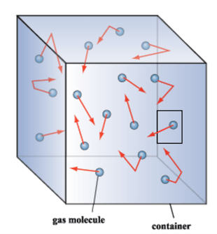
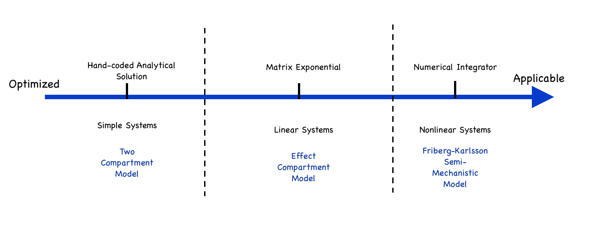
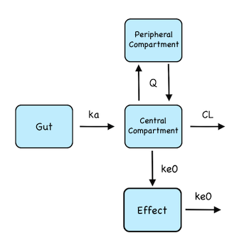

<!-- Load packages. Install them if needed: -->
```{r initialization, include=FALSE}
## reinitialize all variables
rm(list = ls())
gc()

source("pkgSetup.R")

.libPaths("lib")
library(knitr)
library(rstan)
library(ggplot2)
library(dplyr)
library(tidyr)
knitr::opts_chunk$set(echo = TRUE)
```

## 1. Introduction

Differential Equations can help us model sophisticated processes in biology, physics, and many other fields. Over the past year, the Stan team has developed many tools to tackle models based on differential equations.

### 1.1 Why Use Ordinary Differential Equations (ODEs)?

We deal with an ODE when we want to determine a function $y(t)$ at a specific time but only know the derivative of that function, $\frac{dy}{dt}$. In other words, we know the rate at which a quantity of interest changes but not the quantity itself. In many scenarios, the rate depends on the quantity itself. 

To get a basic intuition, let us consider an example. Imagine a gas container with a hole in it. We can think of the gas as being made of molecules that move randomly in the container. Each molecule has a small chance of leaking through the hole. Thus the more molecules there are inside the container, the higher the number of escaping molecules per unit time.



If there are a large number of molecules, and the gas behaves like a continuous fluid, we'll observe that the more gas in the container, the higher the leakage. This statement can be written as the differential equation:

$$ \frac{dy}{dt} = -ky(t) $$

where $k$ is a positive constant.

In this presentation, I'll use examples from pharmacometrics to motivate the use of differential equations. _Pharmacometrics_ is the quantitative study of how drug compounds circulate in and affect the patient’s body.

In a _compartment model_, we treat physiological components, such as organs, tissues, and circulating blood, as compartments between which the drug flows and/or in which the drug has an effect.

A compartment may refer to more than one physiological component. For example, the _central compartment_ typically consists of the systemic circulation (the blood) plus tissues and organs into which the drug diffuses rapidly.   

Just like our leaking gas in a container, the rate at which the drug amount changes depends on the drug amount in the various compartments. Things are slightly more complicated because instead of one box, we now deal with a network of containers. This results in a system of differential equations, where each equation describes the drug amount in one compartment.


### 1.2 Tools for Solving ODEs

Solving ODEs can be notoriously hard.

In the best case scenario, an ODE system has an analytical solution we can hand-code. That is, we figure $y(t)$ on paper and write the solution in the Stan file. You should always do this when possible, because it saves the computer the expensive task of solving ODEs.

The vast majority of times, we need to approximate the solution numerically. There exists a very nice technique, involving matrix exponentials, for solving linear ODEs. Nonlinear systems are significantly more difficult but fortunately we can tackle these problems with numerical integrators.

Specialized algorithms for solving ODEs tend be more efficient but have a narrower application; the reverse holds for more general tools. Stan provides both, thereby allowing users to tackle a broad range of problems and optimize their model when possible.


### 1.3 Overview of Cases

We present three models, based on three different types of ODE systems:

1. A system with an analytical solution we code by hand
2. A linear system we solve using a matrix exponential solution
3. A nonlinear system we integrate numerically

For each model, we will use a different technique to solve differential equations.



Note the ODE system only describes the natural evolution of the patient’s system, i.e, how does the drug behave once it is already in the body. It does not account for outside interventions, such as drug intake. To be accurate, our models must compute these exterior events and solve ODEs in the context of an event schedule.

All our examples are fitted to simulated data, generated with the R package _mrgsolve_ [1].


## 2. ODE System with an Analytical Solution

Consider the common scenario in which a patient orally takes a drug. The drug enters the body through the gut and is then absorbed into the blood. From there it diffuses into and circulates back and forth between various tissues and organs. Over time, the body clears the drug, i.e. the drug exits the body (for instance through urine).

Our model divides the patient's body into three compartments:

1. **The absorption compartment**: the gut 
2. **The central compartment**: the systemic circulation (blood) and tissues/organs into which the drug diffuses rapidly
3. **The peripheral compartment**: other tissues/organs into which the drug distributes more slowly


We conventionally call this a _Two Compartment Model_, which is unfortunate because the model has three compartments. The idea is that the “absorption compartment” doesn’t really count. We'll adopt this convention to agree with the community.


We describe the drug absorption with the following differential equations:

$$ \frac{dy_{\mathrm{gut}}}{dt} = -k_a y_{\mathrm{gut}} \\
\frac{dy_{\mathrm{central}}}{dt} = k_a y_{\mathrm{gut}} - (\frac{CL}{V_{\mathrm{central}}} + \frac{Q}{V_{\mathrm{central}}}) y_{\mathrm{central}} +  \frac{Q}{V_{\mathrm{peripheral}}} y_{\mathrm{peripheral}} \\
\frac{dy_{\mathrm{peripheral}}}{dt} = \frac{Q}{V_{\mathrm{central}}} y_{\mathrm{central}} - \frac{Q}{V_{\mathrm{peripheral}}} y_{\mathrm{peripheral}} $$
 
whith  
$y_{\mathrm{gut}}$ : the drug amount in the gut (mg)  
$y_{\mathrm{central}}$ : the drug amount in the central compartment (mg)  
$y_{\mathrm{peripheral}}$ : the drug amount in the peripheral compartment (mg)  
$k_a$ : the rate constant at which the drug flows from the gut to the central compartment ($h^{-1}$)  
$Q$ : the clearance at which the drug flows back and forth between the central and the peripheral compartment (L/h)  
$CL$ : the clearance at which the drug is cleared from the central compartment (L/h)  
$V_{\mathrm{central}}$ : the volume of the central compartment (L)  
$V_{\mathrm{peripheral}}$ : the volume of the peripheral compartment (L)

The data we fit our model to is the drug concentration in the blood, which our model treats as the concentration in the central compartment, and is given by:

$$ c = \frac{y_{\mathrm{central}}}{V_{\mathrm{central}}} $$

and the parameters we wish to estimate are $k_a$, $Q$, $CL$, $V_{\mathrm{central}}$, and $V_{\mathrm{peripheral}}$.


### 2.1 Stan Code

We'll first write a function that returns the solution to the ODEs at a time $t_0 + dt$. This function requires us to specify the initial state of the system at $t_0$. Since we know the analytical solution, we'll hand-code it (even though this requires a fair amount of work).

Remember the ODEs describe a physiological process, but they do not tell us anything about the treatment the patient receives. We typically think of a clinical trial as a series of events, such as a drug intake or a blood sampling for observation. Together these events make up the _event schedule_.

Some of the arguments in the following function, notably $amt$, $cmt$, and $evid$, are terms in pharmacometrics used to characterize the clinical treatment a patient recieves. Defining them is beyond the scope of this notebook, but it is worth pointing out these arguments come into play only _when an exterior intervention perturbs the natural evolution of the system_.

```
  vector twoCptModel1(real dt, vector init, real amt, int cmt, int evid,
		    real CL, real Q, real V1, real V2, real ka){
    vector[3] x;
    real k10;
    real k12;
    real k21;
    real ksum;
    vector[3] a;
    vector[3] alpha;

    k10 = CL / V1;
    k12 = Q / V1;
    k21 = Q / V2;
    ksum = k10 + k12 + k21;
    alpha[1] = (ksum + sqrt(ksum * ksum - 4.0 * k10 * k21))/2.0;
    alpha[2] = (ksum - sqrt(ksum * ksum - 4.0 * k10 * k21))/2.0;
    alpha[3] = ka;

    x = rep_vector(0.0, 3);

    if(init[1] != 0.0){
      x[1] = init[1] * exp(-alpha[3] * dt);
      a[1] = ka * (k21 - alpha[1]) / ((ka - alpha[1]) * (alpha[2] - alpha[1]));
      a[2] = ka * (k21 - alpha[2]) / ((ka - alpha[2]) * (alpha[1] - alpha[2]));
      a[3] = -(a[1] + a[2]);
      x[2] = init[1] * sum(a .* exp(-alpha * dt));
      a[1] = ka * k12 / ((ka - alpha[1]) * (alpha[2] - alpha[1]));
      a[2] = ka * k12 / ((ka - alpha[2]) * (alpha[1] - alpha[2]));
      a[3] = -(a[1] + a[2]);
      x[3] = init[1] * sum(a .* exp(-alpha * dt));
    }
    
    if(init[2] != 0){
      a[1] = (k21 - alpha[1]) / (alpha[2] - alpha[1]);
      a[2] = (k21 - alpha[2]) / (alpha[1] - alpha[2]);
      x[2] = x[2] + init[2] * sum(segment(a, 1, 2) .* exp(-segment(alpha, 1, 2) * dt));
      a[1] = k12 / (alpha[2] - alpha[1]);
      a[2] = -a[1];
      x[3] = x[3] + init[2] * sum(segment(a, 1, 2) .* exp(-segment(alpha, 1, 2) * dt));
    }

    if(init[3] != 0){
      a[1] = k21 / (alpha[2] - alpha[1]);
      a[2] = -a[1];
      x[2] = x[2] + init[3] * sum(segment(a, 1, 2) .* exp(-segment(alpha, 1, 2) * dt));
      a[1] = (k10 + k12 - alpha[1]) / (alpha[2] - alpha[1]);
      a[2] = (k10 + k12 - alpha[2]) / (alpha[1] - alpha[2]);
      x[3] = x[3] + init[3] * sum(segment(a, 1, 2) .* exp(-segment(alpha, 1, 2) * dt));
    }
   
    if(evid == 1) x[cmt] = x[cmt] + amt;

    return x;
  }
```

In this next piece of code, we write a function that handles the _event schedule_ and calls the function we just defined:

```
  matrix twoCptModel(real[] time, real[] amt, int[] cmt, int[] evid, 
		     real CL, real Q, real V1, real V2, real ka){
    vector[3] init;
    real dt;
    real t0;
    matrix[size(time), 3] result;
    int nt;

    nt = size(time);

    init = rep_vector(0, 3);
    t0 = time[1];
    for(i in 1:nt){
      dt = time[i] - t0;
      init = twoCptModel1(dt, init, amt[i], cmt[i], evid[i],
			   CL, Q, V1, V2, ka);
      for(j in 1:3) result[i, j] = init[j];
      t0 = time[i];
    }
    return result;
  }
```

The full model file can be found under `models/twoCpt/twoCpt.stan`.

### 2.2 R Script
 
<!-- Set working directories: -->
``` {r setup1, include=FALSE}
modelName <- "twoCpt"
scriptDir <- getwd()
projectDir <- dirname(scriptDir)
modelDir <- file.path(scriptDir, "models", modelName)
toolsDir <- file.path(scriptDir, "tools")
source(file.path(toolsDir, "stanTools.R"))
```

We fit the model to the data using 4 MCMC chains, each with a different initial parameter estimate. We compute 1000 warm-up iterations per chain to explore the parameter space, followed by another 1000 iterations to sample from the approximated posterior distribution. 

Read in data and create initial estimates:
```{R data1}
data <- read_rdump(file.path(modelDir, paste0(modelName,".data.R")))

## initial estimates will be generated randomly for each chain
init <- function(){
    list(CL = exp(rnorm(1, log(10), 0.2)),
         Q = exp(rnorm(1, log(20), 0.2)),
         V1 = exp(rnorm(1, log(70), 0.2)),
         V2 = exp(rnorm(1, log(70), 0.2)),
         ka = exp(rnorm(1, log(2), 0.2)),
         ke0 = exp(rnorm(1,log(1),0.2)),
         EC50 = exp(rnorm(1,log(100),0.2)),
         sigma = 0.5,
         sigmaResp = 20)
}
```

Fit the model:
```{R fit1, message=FALSE, warning=FALSE, cache=FALSE}
## Specify the variables for which you want history plots
parametersToPlot <- c("CL", "Q", "V1", "V2", "ka", "sigma")

## Additional variables to monitor
otherRVs <- c("cObsPred")

parameters <- c(parametersToPlot, otherRVs)
parametersToPlot <- c("lp__", parametersToPlot)

nChains <- 4
nPost <- 1000 ## Number of post-warm-up samples per chain after thinning
nBurn <- 1000 ## Number of warm-up samples per chain after thinning
nThin <- 1
nIter <- (nBurn + nPost) * nThin
nBurnin <- nBurn * nThin

fit <- stan(file = file.path(modelDir, paste(modelName, ".stan", sep = "")),
            data = data,
            pars = parameters,
            iter = nIter,
            warmup = nBurnin,
            thin = nThin, 
            init = init,
            chains = nChains,
            cores = min(nChains, parallel::detectCores()))

save(fit, file = file.path(modelDir, paste(modelName, "Fit.Rsave", sep = "")))
```


### 2.3 Diagnostics

Let's test whether the chains converged to a common distribution for all the key parameters. We include `lp__` in our analysis, the log posterior. `lp__` varies quickly and is susceptible to outliers, which makes it an interesting parameter to monitor when testing for convergence.

We start with the trace plot and the density plot:
```{R diagnostic1}
stan_trace(fit, parametersToPlot)
mcmcDensity(fit, parametersToPlot, byChain = TRUE)
```

The chains have a "fuzzy caterpillar" shape and all four chains are sampling from the same region of the parameter space. This is a strong indicator all 4 chains have converged to a common distribution.

Next, we look at the pairs plot, which is mostly descriptive, but also has certain diagnostic features (see RStan manual on pairs.stanfit). Pairs plots provide visualization of the univariate and bivariate marginal posterior distributions. In doing so, it reveals correlations between parameters when they exist. Red points indicate iterations that encountered a divergent transition and yellow points a transition that hit the maximum tree depth. 
```{R diagnostic1.3}
pairs(fit, pars = parametersToPlot)
```

We note a strong correlation between $k_a$ and $V_1$ ($V_{\mathrm{central}}$). This indicates the uncertainty in these parameter's estimates (i.e posteriors) are correlated given the available data. Such a ridge in the posterior may be cause of grief for other samplers, such as Gibbs in BUGS, but Stan's NUTS does the job. The absence of red and yellow points indicates they have been no divergent transitions, and that no transition has hit the maximum tree depth.

In addition to plots, Stan provides statistics about the parameter estimations: 
```{R estimates1}
print(fit, pars = parametersToPlot)
```

The $\hat{R}$ statistics can be used as a metric for convergence and we typically want it to be below 1.1 (see section 28.3 of the Stan user manual; and Gelman and Rubin, 1992 [2]). For all parameters $\hat{R} = 1$ which confirms the chains have converged.


### 2.4 Posterior Predictive Checks
The next question we want to answer is: given our parameter estimations, does our model generate predictions in agreement with our experimental data? If not, the parameters may have not been properly estimated or the model may not be consistent with the data (i.e no matter what the parameter values, this model cannot reproduce our experimental data). Fortunately, Stan provides a _generated quantities_ block, which allows us to simulate and save data. The data is simulated for each sampling iteration. Combining the predictions from all iterations, we get a median, surrounded by a 90% confidence interval. We're interested in seeing whether the experimental data fall in that prediction interval. 

```{R plots1}
## Plot posterior predictive distributions of plasma concentrations
xdata <- data.frame(data$cObs, data$time[data$evid != 1])
xdata <- plyr::rename(xdata, c("data.cObs" = "cObs", "data.time.data.evid....1." = "time"))

pred <- as.data.frame(fit, pars = "cObsPred") %>%
  gather(factor_key = TRUE) %>%
  group_by(key) %>%
  summarize(lb = quantile(value, probs = 0.05),
            median = quantile(value, probs = 0.5),
            ub = quantile(value, probs = 0.95)) %>%
  bind_cols(xdata)

p1 <- ggplot(pred, aes(x = time, y = cObs))
p1 <- p1 + geom_point() +
  labs(x = "time (h)", y = "plasma concentration (mg/L)") +
  theme(text = element_text(size = 12), axis.text = element_text(size = 12),
        legend.position = "none", strip.text = element_text(size = 8))
p1 + geom_line(aes(x = time, y = median)) +
  geom_ribbon(aes(ymin = lb, ymax = ub), alpha = 0.25)
```

The model (line and shaded area, which represent the 90% confidence interval) and the experimental data (points) are in agreement. This is no surprise, because the fitted model is identical to the one used to simulate the data.


## 3. Linear ODE System

### 3.1 Effect Compartment

We now add a new compartment to our previous example to illustrate the body’s response to the drug. This response depends on the drug concentration in the blood, but not in the gut or in the peripheral compartment.

This fourth compartment can be used to model several physical phenomenon. It often represents a delay between the time the drug enters the patient’s blood and its action. For example, the drug could trigger a biochemical cascade that (with time) leads to the inhibition of a hormone.

With this fourth compartment, our ODE system becomes:

$$ \frac{dy_{\mathrm{gut}}}{dt} = -k_a y_{\mathrm{gut}} \\
\frac{dy_{\mathrm{central}}}{dt} = k_a y_{\mathrm{gut}} - (\frac{CL}{V_{\mathrm{central}}} + \frac{Q}{V_{\mathrm{central}}}) y_{\mathrm{central}} +  \frac{Q}{V_{\mathrm{peripheral}}} y_{\mathrm{peripheral}} \\
\frac{dy_{\mathrm{peripheral}}}{dt} = \frac{Q}{V_{\mathrm{central}}} y_{\mathrm{central}} - \frac{Q}{V_{\mathrm{peripheral}}} y_{\mathrm{peripheral}} \\
 \frac{dy_{\mathrm{effect}}}{dt} = k_{e0} y_{\mathrm{central}} - k_{e0} y_{\mathrm{effect}}$$
 


Note the input and output constant rate of the effect compartment are identical. This means the time-averaged amount in the blood and the effect compartments are the same, which we expect, given the fourth compartment models a physical delay. 

We could work out an analytical solution to the above equations, but for the purposes of this notebook, we will use another method. Notice the system is linear, i.e. each dependent variable ($\frac{dy_{\mathrm{gut}}}{dt}$, $\frac{dy_{\mathrm{central}}}{dt}$, $\frac{dy_{\mathrm{peripheral}}}{dt}$, $\frac{dy_{\mathrm{effect}}}{dt}$)  depends linearly on the independent variables $y_{\mathrm{gut}}$, $y_{\mathrm{central}}$, $y_{\mathrm{peripheral}}$, and $y_{\mathrm{effect}}$.

Linearity allows us to rewrite the equation in the matrix form:

$$y' = \mathbf{A}y$$

where $\mathbf{A}$ is a constant matrix and $$\mathbf{A} = \left[\begin{array}
{rrr}
-k_a & 0 & 0 & 0 \\
k_a & -(\frac{CL}{V_{\mathrm{cent}}} + \frac{Q}{V_{\mathrm{cent}}}) & \frac{Q}{V_{\mathrm{peri}}} & 0 \\
0 & \frac{Q}{V_{\mathrm{cent}}} & -\frac{Q}{V_{\mathrm{peri}}} & 0 \\
0 & k_{e0} & 0 & -k_{e0}
\end{array}\right]
$$

The solution at time $t$ is then given by $y = e^{tA}y_0$, where $y_0$ is an initial condition and $e$ the matrix exponential, formally defined by the convergent series:

$$e^{tA} = \sum_{i=0}^{\infty} \frac{(tA)^i}{i!} = I + tA + \frac{t^2A^2}{2!} + ... $$

According to the above definition taking the derivative of $e^{tA}$ with respect to $t$ returns $Ae^{tA}$ — which is exactly the property we need to solve our ODE system!

The drug response is given by $E$:

$$ c_e = \frac{y_{\mathrm{effect}}}{V_1} \ , \
E = \frac{100c_e}{EC_{50} + c_e}
$$

The above terms correspond to a _Michaelis-Menten equation_, and largely speaking indicate that as the drug amount grows the effect increases, up to a certain point, after which the effect plateaus.

In this study, the patient only receives one dose.

### 3.2 Stan Code

The stan program can be found in `model/effCptModel/effCptModel.stan`. This time the _solver_ uses the `matrix_exp()` function to compute a matrix exponential solution: 
```
 real[] effCptModel1(real t0, real t, real[] init, real amt, int cmt, int evid,
			  real CL, real Q, real V1, real V2, real ka, real ke0){
    real k10;
    real k12;
    real k21;
    matrix[4, 4] K;

    real x[4];

    x = rep_array(0, 4);

    k10 = CL / V1;
    k12 = Q / V1;
    k21 = Q / V2;


    K = rep_matrix(0, 4, 4);

    K[1, 1] = -ka;
    K[2, 1] = ka;
    K[2, 2] = -(k10 + k12);
    K[2, 3] = k21;
    K[3, 2] = k12;
    K[3, 3] = -k21;
    K[4, 2] = ke0;
    K[4, 4] = -ke0;

    x = to_array_1d(matrix_exp((t - t0) * K) * to_vector(init));
   
    if(evid == 1) x[cmt] = x[cmt] + amt;

    return x;
  }
```

The rest of the model is comparable to what we did in section 2.

### 3.3 R Script
<!-- Set paths and directory for compartment model -->
```{r setup2, include=FALSE}
## reinitialize all variables
# rm(list = ls())
# gc()

modelName <- "effCpt"
scriptDir <- getwd()
projectDir <- dirname(scriptDir)
modelDir <- file.path(scriptDir, "models", modelName)
toolsDir <- file.path(scriptDir, "tools")
source(file.path(toolsDir, "stanTools.R"))
```

We fit the model to the data using 4 MCMC chains, each with a different initial parameter estimate. We compute 1000 warm-up iterations per chain to explore the parameter space, followed by another 1000 iterations to sample from the approximated posterior distribution.

Read in data and create initial estimates:
```{R, data2}
## read-in data
data <- read_rdump(file.path(modelDir, paste0(modelName, ".data.R")))

## create initial estimates
init <- function(){
    list(CL = exp(rnorm(1, log(10), 0.2)),
         Q = exp(rnorm(1, log(20), 0.2)),
         V1 = exp(rnorm(1, log(70), 0.2)),
         V2 = exp(rnorm(1, log(70), 0.2)),
         ka = exp(rnorm(1, log(2), 0.2)),
         ke0 = exp(rnorm(1,log(1),0.2)),
         EC50 = exp(rnorm(1,log(100),0.2)),
         sigma = 0.5,
         sigmaResp = 20)
}
```

Fit the model:
```{R fit2, message=FALSE, warning=FALSE, cache=TRUE}
## Specify the variables for which you want history plots
parametersToPlot <- c("CL", "Q", "V1", "V2", "ka", 
                      "ke0", "EC50", "sigma", "sigmaResp")

## Additional variables to monitor
otherRVs <- c("cObsPred", "respObsPred")

parameters <- c(parametersToPlot, otherRVs)
parametersToPlot <- c("lp__", parametersToPlot)

nChains <- 4
nPost <- 1000 ## Number of post-warm-up samples per chain after thinning
nBurn <- 1000 ## Number of warm-up samples per chain after thinning
nThin <- 1
nIter <- (nBurn + nPost) * nThin
nBurnin <- nBurn * nThin

fit <- stan(file = file.path(modelDir, paste(modelName, ".stan", sep = "")),
            data = data,
            pars = parameters,
            iter = nIter,
            warmup = nBurnin,
            thin = nThin, 
            init = init,
            chains = nChains,
            cores = min(nChains, parallel::detectCores()))

save(fit, file = file.path(modelDir, paste(modelName, "Fit.Rsave", sep = "")))
```


### 3.4 Diagnostics

Once again, let's run some checks.

Diagnostic plots:
```{R diagnostics2}
stan_trace(fit, parametersToPlot)
mcmcDensity(fit, parametersToPlot, byChain = TRUE)
```
The MCMC history plots suggest the 4 chains have converged to common distributions for all of the key parameters.  

```{R pairs2}
pairs(fit, pars = parametersToPlot)
```

No transition diverges or hits the maximum tree depth.

Let's look at the parameter estimations:
```{R estimates2}
print(fit, pars = parametersToPlot)
```
Once again $\hat{R}$ stays below 1.1, which confirms what the plots showed us.


Next let's see how the model predictions compare to the data for drug concentration:
```{R plots2}
## Plot posterior predictive distributions of plasma concentrations
xdata <- data.frame(data$cObs, data$respObs, data$time[data$evid != 1])
xdata <- plyr::rename(xdata, c("data.cObs" = "cObs", "data.respObs" = "respObs",
                               "data.time.data.evid....1." = "time"))

## prediction of future observations for plasma drug concentration
pred <- as.data.frame(fit, pars = "cObsPred") %>%
    gather(factor_key = TRUE) %>%
        group_by(key) %>%
            summarize(lb = quantile(value, probs = 0.05, na.rm = TRUE),
                      median = quantile(value, probs = 0.5, na.rm = TRUE),
                      ub = quantile(value, probs = 0.95, na.rm = TRUE)) %>%
                          bind_cols(xdata)

p1 <- ggplot(pred, aes(x = time, y = cObs))
p1 <- p1 + geom_point() +
  labs(x = "time (h)", y = "plasma concentration (mg/L)") +
  theme(text = element_text(size = 12), axis.text = element_text(size = 12),
        legend.position = "none", strip.text = element_text(size = 8))
p1 + geom_line(aes(x = time, y = median)) +
  geom_ribbon(aes(ymin = lb, ymax = ub), alpha = 0.25)
```

We're not done yet! We also have data for the drug response. So let's see if the model's predictions agree with this data too:
```{R morePlots2}
## predictions for future observations for drug effect
pred <- as.data.frame(fit, pars = "respObsPred") %>%
  gather(factor_key = TRUE) %>%
  group_by(key) %>%
  summarize(lb = quantile(value, probs = 0.05, na.rm = TRUE),
            median = quantile(value, probs = 0.5, na.rm = TRUE),
            ub = quantile(value, probs = 0.95, na.rm = TRUE)) %>%
  bind_cols(xdata)

p1 <- ggplot(pred, aes(x = time, y = respObs))
p1 <- p1 + geom_point() +
  labs(x = "time (h)", y = "response") +
  theme(text = element_text(size = 12), axis.text = element_text(size = 12),
        legend.position = "none", strip.text = element_text(size = 8))
p1 + geom_line(aes(x = time, y = median)) +
  geom_ribbon(aes(ymin = lb, ymax = ub), alpha = 0.25)
```

The model predictions agree with our two data sets. Once again, this is expected because the fitted model is almost identical to the one used to simulate data. The one notable difference is that we used a matrix exponential solution in Stan, while the data was simulated using an ODE integrator.

## 4 Non-Linear ODE system

### 4.1 Friberg-Karlsson Semi-mechanistic Model 

In this final example, we deal with a more sophisticated drug response that introduces nonlinearity in our ODE system. The model we study is the Friberg-Karlsson semi-mechanistic model.

The body keeps the amount of neutrophils (a type of white blood cells) at a baseline using a feedback mechanism. When the neutrophil count in the _circulating compartment_ is low, the _proliferation compartment_ produces new neutrophils to bring the level back to baseline.

A side-effect of our drug is to perturb this mechanism, causing _myelosuprression_, i.e a decrease in neutrophil count. The semi-mechanistic Friberg-Karlsson model [3] describes this drug response:

$$
\frac{dy_{\mathrm{prol}}}{dt} = k_{\mathrm{prol}} y_{\mathrm{prol}} (1 - E_{drug})(\frac{Circ_0}{y_{\mathrm{circ}}})^\gamma - k_{\mathrm{tr}}y_{\mathrm{prol}} \\
\frac{dy_{\mathrm{\mathrm{tr}ansit1}}}{dt} = k_{\mathrm{tr}} y_{\mathrm{prol}} - k_{\mathrm{tr}} y_{\mathrm{\mathrm{tr}ansit1}} \\
\frac{dy_{\mathrm{\mathrm{tr}ansit2}}}{dt} = k_{\mathrm{tr}} y_{\mathrm{\mathrm{tr}ansit1}} - k_{\mathrm{tr}} y_{\mathrm{\mathrm{tr}ansit2}}  \\
\frac{dy_{\mathrm{\mathrm{tr}ansit3}}}{dt} = k_{\mathrm{tr}} y_{\mathrm{\mathrm{tr}ansit2}} - k_{\mathrm{tr}} y_{\mathrm{\mathrm{tr}ansit3}}  \\
\frac{dy_{\mathrm{circ}}}{dt} = k_{\mathrm{tr}} y_{\mathrm{\mathrm{tr}ansit3}} - k_{\mathrm{tr}} y_{\mathrm{circ}}
$$

where $E_{drug} = \alpha \frac{y_{\mathrm{blood}}}{V_1}$.

![**Figure 5: Friberg-Karlsson Semi-Mechanistic Model** (taken from [3])](figures/neutrophilModel.jpg)

The drug only perturbs the feedback mechanism once it is in the patient’s blood. We still model the drug’s absorption using a Two Compartment Model, which adds three equations to the above system.

The end result is a nonlinear system of eight differential equations. To solve this equation we use a numerical integrator.

### 4.2 Numerical Integrators in Stan

Stan provides two ODE integrators: a general solver, `integrate_ode_rk45` which is relatively fast, and a slower but more robust algorithm, `integrate_ode_bdf`. In particular, the latter can handle a _stiff_ system of equations.

Stiffness is not a mathematically rigorously defined property but here’s the general idea. When we solve an ODE numerically, we construct the solution — the function $y(t)$ — one step at a time using a tangent approximation. If the step is small, we gain in precision but it takes more steps to build the solution. We therefore need to find a balance between precision and computational speed.

In a stiff equation, the rate at which the solution changes with respect to the dependent variable (time in our example) can vary dramatically from one region to the other. This makes it difficult to pick a step size and requires a specialized algorithm. Stan implements the backward differentiation technique in the `integrate_ode_bdf` function.

`integrate_ode_rk45`, on the other hand, is faster but will fail with stiff systems.

Since we do not know the parameters, we are not sure whether our system is stiff or not. Our approach is to be optimistic and attempt a solution with the non-stiff solver. Should it fail, we will resort to the more robust stiff solver.

### 4.3 Stan Program

The stan program can be found in `models/neutropenia/neutropenia.stan`. In order to use the numerical intgerator, we first write our ODE system in the function block. This function returns $\frac{dy}{dt}$.

The signature of this function is fixed for all ODE systems. The arguments of the function are various terms $\frac{dy}{dt}$ may depend on: notably $t$ and $y$. Our function can also depend on parameters and data in our model, which we must respectively store in the arrays `parms`, `rdata` (for real data) and `idata` (for integer data).

```
    real[] twoCptNeutModelODE(real t,
			real[] y,
			real[] parms,
			real[] rdata,
			int[] idata){
    real k10;
    real k12;
    real k21;
    real CL;
    real Q;
    real V1;
    real V2;
    real ka;
    real mtt;
    real circ0;
    real gamma;
    real alpha;
    real ktr;
    real dydt[8];
    real conc;
    real EDrug;
    real transit1;
    real transit2;
    real transit3;
    real circ;
    real prol;

    CL = parms[1];
    Q = parms[2];
    V1 = parms[3];
    V2 = parms[4];
    ka = parms[5];
    mtt = parms[6];	
    circ0 = parms[7];
    gamma = parms[8];
    alpha = parms[9];

    k10 = CL / V1;
    k12 = Q / V1;
    k21 = Q / V2;

    ktr = 4 / mtt;
  
    dydt[1] = -ka * y[1];
    dydt[2] = ka * y[1] - (k10 + k12) * y[2] + k21 * y[3];
    dydt[3] = k12 * y[2] - k21 * y[3];
    conc = y[1]/V1;
    EDrug = alpha * conc;
    // y[4], y[5], y[6], y[7] and y[8] are differences from circ0.
    prol = y[4] + circ0;
    transit1 = y[5] + circ0;
    transit2 = y[6] + circ0;
    transit3 = y[7] + circ0;
    circ = fmax(machine_precision(), y[8] + circ0); // Device for implementing a modeled initial condition
    dydt[4] = ktr * prol * ((1 - EDrug) * ((circ0 / circ)^gamma) - 1);
    dydt[5] = ktr * (prol - transit1);
    dydt[6] = ktr * (transit1 - transit2);
    dydt[7] = ktr * (transit2 - transit3);
    dydt[8] = ktr * (transit3 - circ);

  }
```


Below is the call to the integrator:
```
temp = integrate_ode_rk45(twoCptNeutModelODE, init, t0, t, parms, rdata, idata,
				  1.0E-6, 1.0E-6, 1.0E8);
```
`twoCptNeutModelODE`: the ODE system we defined earlier in the function block.  
`init`: the initial state of $y$ at time `t0`.  
`t`: an array of times at which we want the solution function to be evaluated.  
`parms`, `rdata`, and `idata`: arrays which contain the parameters and data we want to pass to the ODE system.  
The last three terms are tuning parameters for the integrator. We direct the reader to the Stan manual, section 19.6 for more information.

The rest of the model follows the structure we used in the previous two examples. Note we use informative priors, based on the results obtained in the first example and on literature on the Friberg-Karlsson model.


### 4.4 R Script

<!-- Set paths and directory for compartment model -->
```{r setup3, include=FALSE}
## reinitialize all variables
# rm(list = ls())
# gc()

modelName <- "neutropenia"
scriptDir <- getwd()
projectDir <- dirname(scriptDir)
modelDir <- file.path(scriptDir, "models", modelName)
toolsDir <- file.path(scriptDir, "tools")
source(file.path(toolsDir, "stanTools.R"))
```

We fit the model to the data using 4 MCMC chains, each with a different initial parameter estimate. We compute 250 warm-up iterations per chain to explore the parameter space, followed by another 250 iterations to sample from the approximated posterior distribution. Solving our nonlinear ODE system at each iteration is a computationally expensive task, and in the interest of time, we find ourselves using less iterations than in the previous example.

Read in data and create initial estimates:
```{R, data3}
## read-in data
data <- read_rdump(file.path(modelDir, paste0(modelName, ".data.R")))

## initial estimated will be generated randomly for each chain
init <- function(){
    list(CL = exp(rnorm(1, log(10), 0.2)),
         Q = exp(rnorm(1, log(20), 0.2)),
         V1 = exp(rnorm(1, log(70), 0.2)),
         V2 = exp(rnorm(1, log(70), 0.2)),
         ka = exp(rnorm(1, log(1), 0.2)),
         sigma = runif(1, 0.5, 2),
         alpha = exp(rnorm(1, log(2E-3), 0.2)),
         mtt = exp(rnorm(1, log(125), 0.2)),
         circ0 = exp(rnorm(1, 5, 0.2)),
         gamma = exp(rnorm(1, 0.17, 0.2)),
         sigmaNeut = runif(1, 0.5, 2))
}
```

Let's run it:
```{R fit3, message=FALSE, warning=FALSE, cache=TRUE}
## Specify the variables for which you want history plots
parametersToPlot <- c("CL", "Q", "V1", "V2", "ka",
                      "sigma",
                      "alpha", "mtt", "circ0", "gamma",
                      "sigmaNeut")

## Additional variables to monitor
otherRVs <- c("cPred", "neutPred")

parameters <- c(parametersToPlot, otherRVs)
parametersToPlot <- c("lp__", parametersToPlot)

nChains <- 4
nPost <- 250 ## Number of post-warm-up samples per chain after thinning
nBurn <- 250 ## Number of warm-up samples per chain after thinning
nThin <- 1

nIter <- (nPost + nBurn) * nThin
nBurnin <- nBurn * nThin

RNGkind("L'Ecuyer-CMRG")
# mc.reset.stream()

fitNeut <- stan(file = file.path(modelDir, paste(modelName, ".stan", sep = "")),
            data = data,
            pars = parameters,
            iter = nIter,
            warmup = nBurnin,
            thin = nThin, 
            init = init,
            chains = nChains,
            cores = min(nChains, parallel::detectCores()),
            refresh = 10,
            control = list(adapt_delta = 0.95, stepsize = 0.01))

save(fitNeut, file = file.path(modelDir, paste(modelName, "Fit.Rsave", sep = "")))
```


### 4.5 Diagnostics

We use the same methods we used previously:
```{R checks3}
stan_trace(fitNeut, parametersToPlot)
mcmcDensity(fitNeut, parametersToPlot, byChain = TRUE)
```

The plots are not as convincing as in the previous examples. We suspect this is due to the fact we used less iterations. It does however look as though the chains converged (in particular, we obtained the desired "fuzzy caterpillar" shape in the trace plots). The density plots hint the chains have converged to similar distributions. More iterations would be desirable.

```{R pairs3}
pairs(fitNeut, pars = parametersToPlot)
```

No transition diverges or hits the maximum tree depth.

Let's check out the parameters estimations:
```{R estimates3}
print(fitNeut, pars = parametersToPlot)
```

The $\hat{R}$ are all below 1.1 which is encouraging.

Let's see how the model predictions compare to the data.

Once again, we'll start with the drug concentration in the blood:
```{R plots3}
## Format data for GGplot
cObs <- rep(NA, 89)
cObs[data$iObsPK] <- data$cObs
neut <- rep(NA, 89)
neut[data$iObsPD] <- data$neutObs
xdataNeut <- data.frame(cObs, neut, data$time)
xdataNeut <- plyr::rename(xdataNeut, c("data.time"  = "time"))

## Plot posterior predictive distributions of plasma concentrations
pred <- as.data.frame(fitNeut, pars = "cPred") %>%
  gather(factor_key = TRUE) %>%
  group_by(key) %>%
  summarize(lb = quantile(value, probs = 0.05),
            median = quantile(value, probs = 0.5),
            ub = quantile(value, probs = 0.95)) %>%
  bind_cols(xdataNeut)

p1 <- ggplot(pred, aes(x = time, y = cObs))
p1 <- p1 + geom_point() +
  labs(x = "time (h)", y = "plasma concentration (mg/L)") +
  theme(text = element_text(size = 12), axis.text = element_text(size = 12),
        legend.position = "none", strip.text = element_text(size = 8))
p1 + geom_line(aes(x = time, y = median)) +
  geom_ribbon(aes(ymin = lb, ymax = ub), alpha = 0.25)
```


Next, we look at absolute neutrophil count in the circulating compartment:
```{R morePlots3}
## Plot posterior predictive distributions of neutrophil count
pred <- as.data.frame(fitNeut, pars = "neutPred") %>%
  gather(factor_key = TRUE) %>%
  group_by(key) %>%
  summarize(lb = quantile(value, probs = 0.05),
            median = quantile(value, probs = 0.5),
            ub = quantile(value, probs = 0.95)) %>%
  bind_cols(xdataNeut)

p1 <- ggplot(pred, aes(x = time, y = neut))
p1 <- p1 + geom_point() +
  labs(x = "time (h)", y = "Absolute Neutrophil Count") +
  theme(text = element_text(size = 12), axis.text = element_text(size = 12),
        legend.position = "none", strip.text = element_text(size = 8))
p1 + geom_line(aes(x = time, y = median)) +
  geom_ribbon(aes(ymin = lb, ymax = ub), alpha = 0.25)
```

The model predictions seem to agree with our two data sets.

## References
[1] Baron, K.T., Hindmarsh, A.C., Petzold, L.R., Gillespie, W.R., Margossian, C.C., and Metrum Research Group, LLC. mrgsolve: Simulation from ODE-based population PK/PD and system pharmacology models. https://github.com/metrumresearchgroup/mrgsolve  
[2] Gelman, A. and Rubin, D. B. (1992). Inference from iterative simulation using multiple sequences. Statistical Science, 7(4):457–472. 26, 347    
[3] Friberg, L.E. and Karlsson, M.O. Mechanistic models for myelosuppression. Invest New Drugs 21 (2003):183–194.
