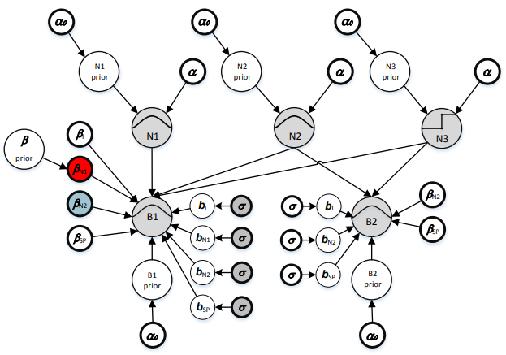
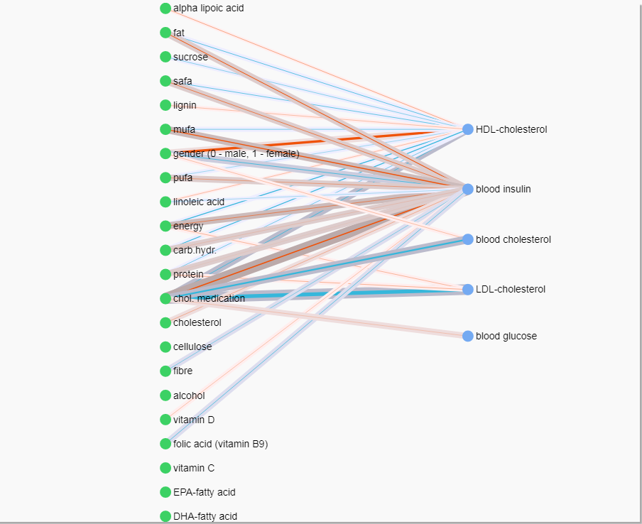

The Effects of Nutrition
------------------------

Nutritional therapists have known for a long that people can react differently to the same nutrition. I am proposing a Mixed-Effect Bayesian Network (MEBN) as a method for modeling the effects of nutrition in both population and personal level. By the effects of nutrition we mean the way how people react to different levels of nutrients at their diets. There have been studies of these effects on limited cases, like personal glucose metabolism (Zeevi et al. 2015), but MEBN would allow more general modeling.

The Bayesian Networks (BN) are directed acyclic graphical models that contain both observed and latent random variables as vertices and edges as indicators of connection. In the setting of nutritional modeling the observed variables are nutrients at person's diet and their correponding bodily responses, like blood characteristics. The connections between these variables can be very complex and the BNs seem to be intuatively appealing method for modeling such a system.

Besides of the typical correlations at the system, we are interested in the personal variations at the reaction types. Are some people more sensitive to some nutrient than the others? If this information could be systemically quantified, it would allow us to predict personal networks of reaction types. This in turn, opens up lots of new applications in personal recommendations and health care.

For capturing these personal variances we need a dataset that contains several repeated measurements from number of persons. Measurements from each person are correlated with each other and a general method for modeling this correlation is hierarchical, or mixed-effect, model. The same model can be used to estimate the reaction type in both population and personal level.

Previously BNs have been considered mainly for uncorrelated observations (Scutari and Denis 2014, Nagarajan and Scutari (2013), Aussem et al. (2010)), but in this work we are using Mixed-Effect Bayesian Network parametrization (Bae et al. 2016) that allows combining the hierarchical mixed-effect modeling and Bayesian Network as a general framework for expressing the system.

This presentation covers first briefly the theory of graphical models and how it can be expanded to correlated observations. Then it is shown how this modeling can be implemented with Stan and what benefits fully Bayesian estimation can offer in understanding the uncertainty at the model.

Mixed-Effects Bayesian Network
------------------------------

Let us denote the graph of interconnected nutrients and responses with *G*. We can then formulate the modeling problem as finding the graph *G* that is most probable given the data *D*

By using Bayes' Rule we can be split this probability into proportions of data likelihood with given graph and any prior information we might have about suitable graphs

Now the problem is converted into a search of the maximum likelihood graph for given data. If all the graphs are equally probable then *P*(*G*) is a constant and does not affect the search, but it can be also beneficial to use it to guide the search towards meaningful graphs (Bishop:2006:PRM:1162264, Nagarajan and Scutari 2013).

**Decomposition of the likelihood.** Bayesian network factorizes into local distributions according to stating that a variable *X*<sub>*i*</sub> is independent of its non-descendants given its parents at the graph. The states that a variable is independent of all the remaining variables in the graph conditionally on its that consists its parents and child nodes at the graph, and additional parents of the child nodes (Bae et al. 2016, Koller and Friedman (2009)). With this decomposition the joint probability of the graph can be calculated with sum and product rules of probability as a product of the independent local graphs *G*<sub>*i*</sub>. The graph structure depends also on the parameters *ϕ*<sub>*i*</sub> describing the dependencies and they should be taken into account at the estimation. We assume that *ϕ*<sub>*i*</sub> is a set that pools all the parameters that describe the relationship.

Likelihood of the data is then

assuming we have *v* independent local distributions at the graph. The notation *p**a*(*X*<sub>*i*</sub>) denotes the parent variables of variable *X*<sub>*i*</sub> according to graph structure *G*<sub>*i*</sub>. Since the probability of data in the graph depends on the parameters of the local distributions, *ϕ*<sub>*i*</sub>, they have to be integrated out from the equation to make the probability of graph independent of any specific choice of parameters

Besides the Markov properties, we also assume *global independence of the parameters*

and for Bayesian estimation we assume *hyper-Markov law* (Dawid and Lauritzen 1993) for ensure that these decompositions are indeed independent.

**Linear dependency between variables.** As we are more interested in the system and less considered about details of any specific nutritional response, we consider it adequate to model the dependency between the nutrients and bodily responses with an approximate linear model. However, simple linear model is not enough, but we need a parametrization that is able to reflect the correlations between observations and express the amount of variability between persons since the data consists of several repeated measurements from different persons.

<center>


</center>
</br>

Generally, the local probability distributions can be from exponential family of distributions, but in this example we consider only normally distributed response variables. Subset of parent nodes possibly containing personal variance is denoted with *p**a*<sub>*Z*</sub>(*X*<sub>*i*</sub>). For mixed-effect modeling we assume parameters *ϕ*<sub>*i*</sub> = {*β*<sub>*i*</sub>, *b*<sub>*i*</sub>} for expressing typical and personal reaction types. In multivariate normal model the uncertainty is furthermore defined by variance-covariance matrix *V*<sub>*i*</sub>

This theory motivates our search for optimal graph with Stan. By decomposing the joint likelihood into local probability distributions according to Markov properties it is possible to find the optimal graph by estimating one local distributions one by one.

Estimating the Hierarchical Local Distributions with Stan
---------------------------------------------------------

In the mixed-effect modeling the purpose is to explain some of the model's variance in *V*<sub>*i*</sub> with the latent personal effect variables *b*<sub>*i*</sub>. These in turn offer us a way to detect and express the personal variations in nutritional effects. Let us assume that matrix *Z* is a design matrix of personal effects. Then variance-covariance matrix is defined by

where *R* is a variance-covariance matrix of residuals and *D* is a variance-covariance matrix of personal, or random-effects,

where 𝒯 is a diagonal matrix of personal effect variances and *C* is correlation matrix that can be divided into Cholesky decompositions as

and with *L* we can define the personal effects as

as we assume for now that personal random-effects are drawn from Normal distribution.

This is implemented in Stan as follows

    transformed parameters {
      // ...
      // Create diagonal matrix from sigma_b and premultiply it with L
      D = diag_pre_multiply(sigma_b, L); 
      
      // Group-level effects are generated by multipying D with z that has standard normal distribution
      for(j in 1:J) 
        b[j] = D * z[j];   
    }

The actual model with Normal distribution having the linear mixed-effect likelihood is defined below. Notice that instead of matrix *V*, in Stan we are using vectors `group` and scalar `sigma_e`.

    model { 
      // ...
      // Standard normal prior for random effects
      for (j in 1:J)
        z[j] ~ normal(0,1);

      // Likelihood 
      // - link function (identity function for Normal dist.) for typical correlation
      mu = temp_Intercept + Xc * beta;

      // - add personal (group) effects
      for (i in 1:N) 
      {
         mu[i] = mu[i] + Z[i] * b[group[i]];
      }

      // Y and mu are vectors, sigma_e is a scalar that is estimated for whole vector
      Y ~ normal(mu, sigma_e);
    }

Constructing the Population Level Graph of Nutrional Effects
------------------------------------------------------------

The dataset in this example comes from Sysdimet study (Lankinen et al. 2011) that studied altogether 106 men and women with impaired glucose metabolism. For each person we have four observations on diet and on blood tests. The blood tests are taken a week after the diet observation. We have picked few interesting variables indicating person's diet, blood test results and personal information, like gender and medication.

There exist plenty of general algorithms for constructing BNs, but for this special case we can constrain the search to biologically plausible reaction graphs. We assume that all possible graphs are directed bipartite graphs with nutrients and personal information as root nodes and blood tests as targets.

``` r
# Read the data description
datadesc <- mebn.load_datadesc("Data description.xlsx")

# Read the actual data matching the description
sysdimet <- read.csv(file="data\\SYSDIMET_diet.csv", sep=";", dec=",")

# Define how to iterate through the graph
assumedpredictors <- datadesc[datadesc$Order==100,]    
assumedtargets <- datadesc[datadesc$Order==200,] 
```

**Pruning the edges.** The construction of the graph starts from fully connected graph, but for gaining nutritional knowledge of significant connections and also for effecient factorization of the BN likelihood, it is necessary to prune out the insignificant connections at the graph. For this we use shrinkage prior on beta coefficients to push the insignificant coefficients towards zero. Especially, we use regularized horseshoe prior (Piironen and Vehtari 2017a) that allows specifying the number of non-zero coefficients for each target. In the nutritional setting this provides a way for specifying prior knowledge about the relevant nutrients for each response. For now, we approximate that one third of the predictive nutrients are relevant, but finer approximation will be done based on previous nutritional research.

``` r
shrinkage_parameters <- within(list(),
{
    scale_icept  <- 1         # prior std for the intercept
    scale_global <- 0.01821   # scale for the half-t prior for tau: 
                              # (p0=6) / (D=22-6)*sqrt(n=106*4)
    nu_global    <- 1         # degrees of freedom for the half-t priors for tau
    nu_local     <- 1         # degrees of freedom for the half-t priors for lambdas
    slab_scale   <- 1         # slab scale for the regularized horseshoe
    slab_df      <- 1         # slab degrees of freedom for the regularized horseshoe           
})
```

If the shrinkage prior does not shrink the coefficients to exactly zero, we are pruning out the insignificant connections with following test. Notice that in the population level graph we are keeping the connections that have large variance between persons even though they are not typically relevant. Personal variance means that the connection is relevant for someone.

The effect of shrinkage can be studied by using an alternative with Stan model "BLMM.stan" that omits the shrinkage.

``` r
my.RanefTest <- function(localsummary, PredictorId)
{
  abs(localsummary$fixef[PredictorId]) > 0.001 ||
    localsummary$ranef_sd[PredictorId] > 0.05
}
```

To assure that this pruning does not affact predicting accuracy of the model a projection method (Piironen and Vehtari 2017b) could be also used here. In projection approarch the edges are removed if it does not affect the distance from the true model measured with KL-divergence.

**Construction of the graph.** The data structure of the graph is based on iGraph package. The process of BN construction starts by adding a node for every observed variable at the dataset.

``` r
# Add data columns describing random variables as nodes to the graph
# - initial_graph is iGraph object with only nodes and no edges 
initial_graph <- mebn.new_graph_with_randomvariables(datadesc)
```

The joint distribution of the Bayesian Network is decomposed as local distributions, one for each target variable. These local distributions correspond to hierarchical regression models that are estimated with Stan and the resulting MCMC sampling is cached to files.

For estimating the typical graph, we iterate the hierarchical Stan-model through all the assumed predictors and targets. The result is an iGraph object that contains a directed bipartite graph with relating nutrients as predictors and blood test results as targets. We normalize all the values to unit scale and centering before the estimation. Instead of sampling, it is also possible to estimate the same model with Stan implementation of variational Bayes by switching the local\_estimation-paramter.

``` r
sysdimet_graph <- mebn.typical_graph(reaction_graph = initial_graph, 
                                   inputdata = sysdimet,
                                   predictor_columns = assumedpredictors, 
                                   assumed_targets = assumedtargets, 
                                   group_column = "SUBJECT_ID",
                                   local_estimation = mebn.sampling,
                                   local_model_cache = "models", 
                                   stan_model_file = "mebn\\BLMM_rhs.stan",
                                   edge_significance_test = my.RanefTest, 
                                   normalize_values = TRUE, 
                                   reg_params = shrinkage_parameters)
```

    ## [1] "Loading models\\fshdl_blmm.rds"
    ## [1] "Loading models\\fsldl_blmm.rds"
    ## [1] "Loading models\\fsins_blmm.rds"
    ## [1] "Loading models\\fskol_blmm.rds"
    ## [1] "Loading models\\fpgluk_blmm.rds"

Sampling may still cause some divergent transitions and errors on estimating correlation matrix that is quite restricted data type. Estimations of parameters seem nevertheless realistic.

Now "sysdimet\_graph" is a Mixed Effect Bayesian Network for whole sample population. We can store it in GEXF-format and load to visualization for closer inspection. The visual nature of the Bayesian Networks, and the graphical models in general, provide a useful framework for creating visualizations. Comparing to schematic figure 1, the coefficients and latent variables are removed and denoted by different colors. Blue edge denotes typically negative correlation, red edge denotes positive correlation and gray shade denotes the amount of personal variation at the correlation.

<script>
  var sysdimet_graph = '<?xml version="1.0" encoding="UTF-8"?><gexf xmlns="http://www.gexf.net/1.2draft" xmlns:viz="http://www.gexf.net/1.1draft/viz" xmlns:xsi="http://www.w3.org/2001/XMLSchema-instance" xsi:schemaLocation="http://www.gexf.net/1.2draft http://www.gexf.net/1.2draft/gexf.xsd" version="1.2">  <meta lastmodifieddate="2018-04-03">    <creator>NodosChile</creator>    <description>A graph file writing in R using "rgexf"</description>    <keywords>gexf graph, NodosChile, R, rgexf</keywords>  </meta>  <graph mode="static" defaultedgetype="directed">    <attributes class="edge" mode="static">      <attribute id="att1" title="mean" type="float"/>      <attribute id="att2" title="l95CI" type="float"/>      <attribute id="att3" title="u95CI" type="float"/>    </attributes>    <nodes>      <node id="fshdl" label="HDL-cholesterol">        <viz:color r="116" g="170" b="242" a="1"/>        <viz:size value="1"/>        <viz:shape value="circle"/>      </node>      <node id="fsldl" label="LDL-cholesterol">        <viz:color r="116" g="170" b="242" a="1"/>        <viz:size value="1"/>        <viz:shape value="circle"/>      </node>      <node id="fsins" label="blood insulin">        <viz:color r="116" g="170" b="242" a="1"/>        <viz:size value="1"/>        <viz:shape value="circle"/>      </node>      <node id="fskol" label="blood cholesterol">        <viz:color r="116" g="170" b="242" a="1"/>        <viz:size value="1"/>        <viz:shape value="circle"/>      </node>      <node id="fpgluk" label="blood glucose">        <viz:color r="116" g="170" b="242" a="1"/>        <viz:size value="1"/>        <viz:shape value="circle"/>      </node>      <node id="sukupuoli" label="gender (0 - male, 1 - female)">        <viz:color r="60" g="209" b="100" a="1"/>        <viz:size value="1"/>        <viz:shape value="circle"/>      </node>      <node id="kolestrolilaakitys" label="cholesterolmed.">        <viz:color r="60" g="209" b="100" a="1"/>        <viz:size value="1"/>        <viz:shape value="circle"/>      </node>      <node id="energia" label="energy">        <viz:color r="60" g="209" b="100" a="1"/>        <viz:size value="1"/>        <viz:shape value="circle"/>      </node>      <node id="prot" label="protein">        <viz:color r="60" g="209" b="100" a="1"/>        <viz:size value="1"/>        <viz:shape value="circle"/>      </node>      <node id="rasva" label="fat">        <viz:color r="60" g="209" b="100" a="1"/>        <viz:size value="1"/>        <viz:shape value="circle"/>      </node>      <node id="safa" label="safa">        <viz:color r="60" g="209" b="100" a="1"/>        <viz:size value="1"/>        <viz:shape value="circle"/>      </node>      <node id="mufa" label="mufa">        <viz:color r="60" g="209" b="100" a="1"/>        <viz:size value="1"/>        <viz:shape value="circle"/>      </node>      <node id="pufa" label="pufa">        <viz:color r="60" g="209" b="100" a="1"/>        <viz:size value="1"/>        <viz:shape value="circle"/>      </node>      <node id="linoli" label="linoleic acid">        <viz:color r="60" g="209" b="100" a="1"/>        <viz:size value="1"/>        <viz:shape value="circle"/>      </node>      <node id="linoleeni" label="alpha lipoic acid">        <viz:color r="60" g="209" b="100" a="1"/>        <viz:size value="1"/>        <viz:shape value="circle"/>      </node>      <node id="kol" label="cholesterol">        <viz:color r="60" g="209" b="100" a="1"/>        <viz:size value="1"/>        <viz:shape value="circle"/>      </node>      <node id="hhydr" label="carb.hydr.">        <viz:color r="60" g="209" b="100" a="1"/>        <viz:size value="1"/>        <viz:shape value="circle"/>      </node>      <node id="sakkar" label="sucrose">        <viz:color r="60" g="209" b="100" a="1"/>        <viz:size value="1"/>        <viz:shape value="circle"/>      </node>      <node id="kuitu" label="fibre">        <viz:color r="60" g="209" b="100" a="1"/>        <viz:size value="1"/>        <viz:shape value="circle"/>      </node>      <node id="sellul" label="cellulose">        <viz:color r="60" g="209" b="100" a="1"/>        <viz:size value="1"/>        <viz:shape value="circle"/>      </node>      <node id="ligniini" label="lignin">        <viz:color r="60" g="209" b="100" a="1"/>        <viz:size value="1"/>        <viz:shape value="circle"/>      </node>      <node id="alkoholi" label="alcohol">        <viz:color r="60" g="209" b="100" a="1"/>        <viz:size value="1"/>        <viz:shape value="circle"/>      </node>      <node id="dvit" label="vitamin D">        <viz:color r="60" g="209" b="100" a="1"/>        <viz:size value="1"/>        <viz:shape value="circle"/>      </node>      <node id="foolih" label="folic acid (vitamin B9)">        <viz:color r="60" g="209" b="100" a="1"/>        <viz:size value="1"/>        <viz:shape value="circle"/>      </node>      <node id="cvit" label="vitamin C">        <viz:color r="60" g="209" b="100" a="1"/>        <viz:size value="1"/>        <viz:shape value="circle"/>      </node>      <node id="epa" label="EPA-fatty acid">        <viz:color r="60" g="209" b="100" a="1"/>        <viz:size value="1"/>        <viz:shape value="circle"/>      </node>      <node id="dha" label="DHA-fatty acid">        <viz:color r="60" g="209" b="100" a="1"/>        <viz:size value="1"/>        <viz:shape value="circle"/>      </node>    </nodes>    <edges>      <edge id="0" label="beta = 0.017, b_sigma = 0.08" source="sukupuoli" target="fshdl" value="confband" weight="0.01706231">        <attvalues>          <attvalue for="att1" value="0.01706231"/>          <attvalue for="att2" value="-0.02287126"/>          <attvalue for="att3" value="0.05699588"/>        </attvalues>      </edge>      <edge id="1" label="beta = -0.003, b_sigma = 0.11" source="kolestrolilaakitys" target="fshdl" value="confband" weight="-0.003364275">        <attvalues>          <attvalue for="att1" value="-0.003364275"/>          <attvalue for="att2" value="-0.0581932"/>          <attvalue for="att3" value="0.05146465"/>        </attvalues>      </edge>      <edge id="2" label="beta = -0.006, b_sigma = 0.075" source="energia" target="fshdl" value="confband" weight="-0.005528406">        <attvalues>          <attvalue for="att1" value="-0.005528406"/>          <attvalue for="att2" value="-0.04306882"/>          <attvalue for="att3" value="0.03201201"/>        </attvalues>      </edge>      <edge id="3" label="beta = -0.004, b_sigma = 0.074" source="prot" target="fshdl" value="confband" weight="-0.003535555">        <attvalues>          <attvalue for="att1" value="-0.003535555"/>          <attvalue for="att2" value="-0.04029728"/>          <attvalue for="att3" value="0.03322617"/>        </attvalues>      </edge>      <edge id="4" label="beta = -0.004, b_sigma = 0.073" source="rasva" target="fshdl" value="confband" weight="-0.004284239">        <attvalues>          <attvalue for="att1" value="-0.004284239"/>          <attvalue for="att2" value="-0.04094264"/>          <attvalue for="att3" value="0.03237416"/>        </attvalues>      </edge>      <edge id="5" label="beta = -0.003, b_sigma = 0.07" source="safa" target="fshdl" value="confband" weight="-0.003023311">        <attvalues>          <attvalue for="att1" value="-0.003023311"/>          <attvalue for="att2" value="-0.0380644"/>          <attvalue for="att3" value="0.03201778"/>        </attvalues>      </edge>      <edge id="6" label="beta = -0.003, b_sigma = 0.072" source="mufa" target="fshdl" value="confband" weight="-0.00297088">        <attvalues>          <attvalue for="att1" value="-0.00297088"/>          <attvalue for="att2" value="-0.03885418"/>          <attvalue for="att3" value="0.03291242"/>        </attvalues>      </edge>      <edge id="7" label="beta = -0.003, b_sigma = 0.072" source="pufa" target="fshdl" value="confband" weight="-0.002556792">        <attvalues>          <attvalue for="att1" value="-0.002556792"/>          <attvalue for="att2" value="-0.0384014"/>          <attvalue for="att3" value="0.03328782"/>        </attvalues>      </edge>      <edge id="8" label="beta = 0.002, b_sigma = 0.052" source="linoli" target="fshdl" value="confband" weight="0.00155164">        <attvalues>          <attvalue for="att1" value="0.00155164"/>          <attvalue for="att2" value="-0.02439783"/>          <attvalue for="att3" value="0.0275011"/>        </attvalues>      </edge>      <edge id="9" label="beta = 0.001, b_sigma = 0.053" source="linoleeni" target="fshdl" value="confband" weight="0.001481343">        <attvalues>          <attvalue for="att1" value="0.001481343"/>          <attvalue for="att2" value="-0.02494313"/>          <attvalue for="att3" value="0.02790581"/>        </attvalues>      </edge>      <edge id="10" label="beta = -0.001, b_sigma = 0.07" source="kol" target="fshdl" value="confband" weight="-0.001411896">        <attvalues>          <attvalue for="att1" value="-0.001411896"/>          <attvalue for="att2" value="-0.03638888"/>          <attvalue for="att3" value="0.03356509"/>        </attvalues>      </edge>      <edge id="11" label="beta = -0.005, b_sigma = 0.072" source="hhydr" target="fshdl" value="confband" weight="-0.005381225">        <attvalues>          <attvalue for="att1" value="-0.005381225"/>          <attvalue for="att2" value="-0.04162515"/>          <attvalue for="att3" value="0.0308627"/>        </attvalues>      </edge>      <edge id="12" label="beta = -0.003, b_sigma = 0.067" source="sakkar" target="fshdl" value="confband" weight="-0.002702682">        <attvalues>          <attvalue for="att1" value="-0.002702682"/>          <attvalue for="att2" value="-0.03643025"/>          <attvalue for="att3" value="0.03102489"/>        </attvalues>      </edge>      <edge id="13" label="beta = -0.001, b_sigma = 0.072" source="kuitu" target="fshdl" value="confband" weight="-0.0009086093">        <attvalues>          <attvalue for="att1" value="-0.0009086093"/>          <attvalue for="att2" value="-0.03710434"/>          <attvalue for="att3" value="0.03528713"/>        </attvalues>      </edge>      <edge id="14" label="beta = 0.001, b_sigma = 0.071" source="sellul" target="fshdl" value="confband" weight="0.001153569">        <attvalues>          <attvalue for="att1" value="0.001153569"/>          <attvalue for="att2" value="-0.03439659"/>          <attvalue for="att3" value="0.03670373"/>        </attvalues>      </edge>      <edge id="15" label="beta = 0.001, b_sigma = 0.064" source="ligniini" target="fshdl" value="confband" weight="0.001358488">        <attvalues>          <attvalue for="att1" value="0.001358488"/>          <attvalue for="att2" value="-0.03082757"/>          <attvalue for="att3" value="0.03354454"/>        </attvalues>      </edge>      <edge id="16" label="beta = 0, b_sigma = 0.056" source="alkoholi" target="fshdl" value="confband" weight="0.0003193397">        <attvalues>          <attvalue for="att1" value="0.0003193397"/>          <attvalue for="att2" value="-0.02752965"/>          <attvalue for="att3" value="0.02816833"/>        </attvalues>      </edge>      <edge id="17" label="beta = -0.001, b_sigma = 0.066" source="dvit" target="fshdl" value="confband" weight="-0.001158442">        <attvalues>          <attvalue for="att1" value="-0.001158442"/>          <attvalue for="att2" value="-0.03411903"/>          <attvalue for="att3" value="0.03180215"/>        </attvalues>      </edge>      <edge id="18" label="beta = 0, b_sigma = 0.07" source="foolih" target="fshdl" value="confband" weight="-0.0001166899">        <attvalues>          <attvalue for="att1" value="-0.0001166899"/>          <attvalue for="att2" value="-0.0351731"/>          <attvalue for="att3" value="0.03493972"/>        </attvalues>      </edge>      <edge id="19" label="beta = 0, b_sigma = 0.066" source="cvit" target="fshdl" value="confband" weight="-0.0001775389">        <attvalues>          <attvalue for="att1" value="-0.0001775389"/>          <attvalue for="att2" value="-0.03304715"/>          <attvalue for="att3" value="0.03269207"/>        </attvalues>      </edge>      <edge id="20" label="beta = 0, b_sigma = 0.06" source="epa" target="fshdl" value="confband" weight="0.0002251802">        <attvalues>          <attvalue for="att1" value="0.0002251802"/>          <attvalue for="att2" value="-0.02958087"/>          <attvalue for="att3" value="0.03003123"/>        </attvalues>      </edge>      <edge id="21" label="beta = 0, b_sigma = 0.06" source="dha" target="fshdl" value="confband" weight="0.0004947947">        <attvalues>          <attvalue for="att1" value="0.0004947947"/>          <attvalue for="att2" value="-0.029722"/>          <attvalue for="att3" value="0.03071159"/>        </attvalues>      </edge>      <edge id="22" label="beta = -0.001, b_sigma = 0.076" source="sukupuoli" target="fsldl" value="confband" weight="-0.001029042">        <attvalues>          <attvalue for="att1" value="-0.001029042"/>          <attvalue for="att2" value="-0.03880965"/>          <attvalue for="att3" value="0.03675156"/>        </attvalues>      </edge>      <edge id="23" label="beta = -0.027, b_sigma = 0.107" source="kolestrolilaakitys" target="fsldl" value="confband" weight="-0.02689791">        <attvalues>          <attvalue for="att1" value="-0.02689791"/>          <attvalue for="att2" value="-0.0804033"/>          <attvalue for="att3" value="0.02660748"/>        </attvalues>      </edge>      <edge id="24" label="beta = 0.002, b_sigma = 0.075" source="energia" target="fsldl" value="confband" weight="0.001891176">        <attvalues>          <attvalue for="att1" value="0.001891176"/>          <attvalue for="att2" value="-0.03566244"/>          <attvalue for="att3" value="0.03944479"/>        </attvalues>      </edge>      <edge id="25" label="beta = 0.002, b_sigma = 0.073" source="prot" target="fsldl" value="confband" weight="0.002044839">        <attvalues>          <attvalue for="att1" value="0.002044839"/>          <attvalue for="att2" value="-0.03434679"/>          <attvalue for="att3" value="0.03843647"/>        </attvalues>      </edge>      <edge id="26" label="beta = 0, b_sigma = 0.072" source="rasva" target="fsldl" value="confband" weight="0.0004969463">        <attvalues>          <attvalue for="att1" value="0.0004969463"/>          <attvalue for="att2" value="-0.03540704"/>          <attvalue for="att3" value="0.03640093"/>        </attvalues>      </edge>      <edge id="27" label="beta = 0.001, b_sigma = 0.072" source="safa" target="fsldl" value="confband" weight="0.001247882">        <attvalues>          <attvalue for="att1" value="0.001247882"/>          <attvalue for="att2" value="-0.03469421"/>          <attvalue for="att3" value="0.03718997"/>        </attvalues>      </edge>      <edge id="28" label="beta = 0, b_sigma = 0.071" source="mufa" target="fsldl" value="confband" weight="0.0004256812">        <attvalues>          <attvalue for="att1" value="0.0004256812"/>          <attvalue for="att2" value="-0.0353145"/>          <attvalue for="att3" value="0.03616586"/>        </attvalues>      </edge>      <edge id="29" label="beta = 0, b_sigma = 0.07" source="pufa" target="fsldl" value="confband" weight="-0.0001076969">        <attvalues>          <attvalue for="att1" value="-0.0001076969"/>          <attvalue for="att2" value="-0.03490654"/>          <attvalue for="att3" value="0.03469115"/>        </attvalues>      </edge>      <edge id="30" label="beta = -0.001, b_sigma = 0.051" source="linoli" target="fsldl" value="confband" weight="-0.001152355">        <attvalues>          <attvalue for="att1" value="-0.001152355"/>          <attvalue for="att2" value="-0.02655297"/>          <attvalue for="att3" value="0.02424826"/>        </attvalues>      </edge>      <edge id="31" label="beta = -0.001, b_sigma = 0.053" source="linoleeni" target="fsldl" value="confband" weight="-0.0009118408">        <attvalues>          <attvalue for="att1" value="-0.0009118408"/>          <attvalue for="att2" value="-0.02759095"/>          <attvalue for="att3" value="0.02576727"/>        </attvalues>      </edge>      <edge id="32" label="beta = 0.001, b_sigma = 0.069" source="kol" target="fsldl" value="confband" weight="0.001139634">        <attvalues>          <attvalue for="att1" value="0.001139634"/>          <attvalue for="att2" value="-0.03326598"/>          <attvalue for="att3" value="0.03554525"/>        </attvalues>      </edge>      <edge id="33" label="beta = 0.001, b_sigma = 0.07" source="hhydr" target="fsldl" value="confband" weight="0.001189714">        <attvalues>          <attvalue for="att1" value="0.001189714"/>          <attvalue for="att2" value="-0.03401366"/>          <attvalue for="att3" value="0.03639309"/>        </attvalues>      </edge>      <edge id="34" label="beta = -0.001, b_sigma = 0.066" source="sakkar" target="fsldl" value="confband" weight="-0.001052266">        <attvalues>          <attvalue for="att1" value="-0.001052266"/>          <attvalue for="att2" value="-0.03392467"/>          <attvalue for="att3" value="0.03182013"/>        </attvalues>      </edge>      <edge id="35" label="beta = 0, b_sigma = 0.07" source="kuitu" target="fsldl" value="confband" weight="0.0001325749">        <attvalues>          <attvalue for="att1" value="0.0001325749"/>          <attvalue for="att2" value="-0.03474844"/>          <attvalue for="att3" value="0.03501359"/>        </attvalues>      </edge>      <edge id="36" label="beta = 0, b_sigma = 0.068" source="sellul" target="fsldl" value="confband" weight="-0.0002627336">        <attvalues>          <attvalue for="att1" value="-0.0002627336"/>          <attvalue for="att2" value="-0.0342538"/>          <attvalue for="att3" value="0.03372834"/>        </attvalues>      </edge>      <edge id="37" label="beta = -0.001, b_sigma = 0.062" source="ligniini" target="fsldl" value="confband" weight="-0.001212358">        <attvalues>          <attvalue for="att1" value="-0.001212358"/>          <attvalue for="att2" value="-0.03233911"/>          <attvalue for="att3" value="0.0299144"/>        </attvalues>      </edge>      <edge id="38" label="beta = 0.001, b_sigma = 0.055" source="alkoholi" target="fsldl" value="confband" weight="0.001368972">        <attvalues>          <attvalue for="att1" value="0.001368972"/>          <attvalue for="att2" value="-0.02599559"/>          <attvalue for="att3" value="0.02873354"/>        </attvalues>      </edge>      <edge id="39" label="beta = 0, b_sigma = 0.063" source="dvit" target="fsldl" value="confband" weight="0.0002628233">        <attvalues>          <attvalue for="att1" value="0.0002628233"/>          <attvalue for="att2" value="-0.03126336"/>          <attvalue for="att3" value="0.03178901"/>        </attvalues>      </edge>      <edge id="40" label="beta = 0.001, b_sigma = 0.068" source="foolih" target="fsldl" value="confband" weight="0.0005458407">        <attvalues>          <attvalue for="att1" value="0.0005458407"/>          <attvalue for="att2" value="-0.03361403"/>          <attvalue for="att3" value="0.03470572"/>        </attvalues>      </edge>      <edge id="41" label="beta = 0.001, b_sigma = 0.064" source="cvit" target="fsldl" value="confband" weight="0.000995325">        <attvalues>          <attvalue for="att1" value="0.000995325"/>          <attvalue for="att2" value="-0.03085637"/>          <attvalue for="att3" value="0.03284702"/>        </attvalues>      </edge>      <edge id="42" label="beta = 0.001, b_sigma = 0.058" source="epa" target="fsldl" value="confband" weight="0.0005551536">        <attvalues>          <attvalue for="att1" value="0.0005551536"/>          <attvalue for="att2" value="-0.02839482"/>          <attvalue for="att3" value="0.02950513"/>        </attvalues>      </edge>      <edge id="43" label="beta = 0.001, b_sigma = 0.058" source="dha" target="fsldl" value="confband" weight="0.0008686476">        <attvalues>          <attvalue for="att1" value="0.0008686476"/>          <attvalue for="att2" value="-0.02830227"/>          <attvalue for="att3" value="0.03003957"/>        </attvalues>      </edge>      <edge id="44" label="beta = -0.004, b_sigma = 0.099" source="sukupuoli" target="fsins" value="confband" weight="-0.004419155">        <attvalues>          <attvalue for="att1" value="-0.004419155"/>          <attvalue for="att2" value="-0.05413153"/>          <attvalue for="att3" value="0.04529322"/>        </attvalues>      </edge>      <edge id="45" label="beta = 0.008, b_sigma = 0.16" source="kolestrolilaakitys" target="fsins" value="confband" weight="0.00810898">        <attvalues>          <attvalue for="att1" value="0.00810898"/>          <attvalue for="att2" value="-0.07187903"/>          <attvalue for="att3" value="0.08809699"/>        </attvalues>      </edge>      <edge id="46" label="beta = 0.003, b_sigma = 0.103" source="energia" target="fsins" value="confband" weight="0.003000637">        <attvalues>          <attvalue for="att1" value="0.003000637"/>          <attvalue for="att2" value="-0.04833175"/>          <attvalue for="att3" value="0.05433302"/>        </attvalues>      </edge>      <edge id="47" label="beta = 0, b_sigma = 0.097" source="prot" target="fsins" value="confband" weight="0.0003831033">        <attvalues>          <attvalue for="att1" value="0.0003831033"/>          <attvalue for="att2" value="-0.04794231"/>          <attvalue for="att3" value="0.04870852"/>        </attvalues>      </edge>      <edge id="48" label="beta = 0.005, b_sigma = 0.1" source="rasva" target="fsins" value="confband" weight="0.005167793">        <attvalues>          <attvalue for="att1" value="0.005167793"/>          <attvalue for="att2" value="-0.04459082"/>          <attvalue for="att3" value="0.0549264"/>        </attvalues>      </edge>      <edge id="49" label="beta = 0.003, b_sigma = 0.097" source="safa" target="fsins" value="confband" weight="0.00346046">        <attvalues>          <attvalue for="att1" value="0.00346046"/>          <attvalue for="att2" value="-0.04483299"/>          <attvalue for="att3" value="0.05175391"/>        </attvalues>      </edge>      <edge id="50" label="beta = 0.007, b_sigma = 0.1" source="mufa" target="fsins" value="confband" weight="0.007027948">        <attvalues>          <attvalue for="att1" value="0.007027948"/>          <attvalue for="att2" value="-0.04317927"/>          <attvalue for="att3" value="0.05723517"/>        </attvalues>      </edge>      <edge id="51" label="beta = 0.002, b_sigma = 0.096" source="pufa" target="fsins" value="confband" weight="0.002224686">        <attvalues>          <attvalue for="att1" value="0.002224686"/>          <attvalue for="att2" value="-0.04595794"/>          <attvalue for="att3" value="0.05040731"/>        </attvalues>      </edge>      <edge id="52" label="beta = -0.002, b_sigma = 0.056" source="linoli" target="fsins" value="confband" weight="-0.002030047">        <attvalues>          <attvalue for="att1" value="-0.002030047"/>          <attvalue for="att2" value="-0.02987277"/>          <attvalue for="att3" value="0.02581267"/>        </attvalues>      </edge>      <edge id="53" label="beta = -0.002, b_sigma = 0.057" source="linoleeni" target="fsins" value="confband" weight="-0.001705583">        <attvalues>          <attvalue for="att1" value="-0.001705583"/>          <attvalue for="att2" value="-0.03015595"/>          <attvalue for="att3" value="0.02674478"/>        </attvalues>      </edge>      <edge id="54" label="beta = 0.002, b_sigma = 0.089" source="kol" target="fsins" value="confband" weight="0.001868154">        <attvalues>          <attvalue for="att1" value="0.001868154"/>          <attvalue for="att2" value="-0.04280646"/>          <attvalue for="att3" value="0.04654276"/>        </attvalues>      </edge>      <edge id="55" label="beta = 0.001, b_sigma = 0.097" source="hhydr" target="fsins" value="confband" weight="0.0007827768">        <attvalues>          <attvalue for="att1" value="0.0007827768"/>          <attvalue for="att2" value="-0.04781848"/>          <attvalue for="att3" value="0.04938403"/>        </attvalues>      </edge>      <edge id="56" label="beta = 0.001, b_sigma = 0.087" source="sakkar" target="fsins" value="confband" weight="0.0005783303">        <attvalues>          <attvalue for="att1" value="0.0005783303"/>          <attvalue for="att2" value="-0.04312099"/>          <attvalue for="att3" value="0.04427765"/>        </attvalues>      </edge>      <edge id="57" label="beta = -0.003, b_sigma = 0.09" source="kuitu" target="fsins" value="confband" weight="-0.002884656">        <attvalues>          <attvalue for="att1" value="-0.002884656"/>          <attvalue for="att2" value="-0.04774685"/>          <attvalue for="att3" value="0.04197754"/>        </attvalues>      </edge>      <edge id="58" label="beta = 0, b_sigma = 0.086" source="sellul" target="fsins" value="confband" weight="-0.0002784125">        <attvalues>          <attvalue for="att1" value="-0.0002784125"/>          <attvalue for="att2" value="-0.04341967"/>          <attvalue for="att3" value="0.04286284"/>        </attvalues>      </edge>      <edge id="59" label="beta = -0.001, b_sigma = 0.075" source="ligniini" target="fsins" value="confband" weight="-0.0006501404">        <attvalues>          <attvalue for="att1" value="-0.0006501404"/>          <attvalue for="att2" value="-0.03833704"/>          <attvalue for="att3" value="0.03703675"/>        </attvalues>      </edge>      <edge id="60" label="beta = 0, b_sigma = 0.062" source="alkoholi" target="fsins" value="confband" weight="-0.0003631471">        <attvalues>          <attvalue for="att1" value="-0.0003631471"/>          <attvalue for="att2" value="-0.03128498"/>          <attvalue for="att3" value="0.03055868"/>        </attvalues>      </edge>      <edge id="61" label="beta = 0.002, b_sigma = 0.078" source="dvit" target="fsins" value="confband" weight="0.00153658">        <attvalues>          <attvalue for="att1" value="0.00153658"/>          <attvalue for="att2" value="-0.0373011"/>          <attvalue for="att3" value="0.04037426"/>        </attvalues>      </edge>      <edge id="62" label="beta = -0.004, b_sigma = 0.093" source="foolih" target="fsins" value="confband" weight="-0.003825425">        <attvalues>          <attvalue for="att1" value="-0.003825425"/>          <attvalue for="att2" value="-0.05018558"/>          <attvalue for="att3" value="0.04253473"/>        </attvalues>      </edge>      <edge id="63" label="beta = 0, b_sigma = 0.084" source="cvit" target="fsins" value="confband" weight="0.0001627511">        <attvalues>          <attvalue for="att1" value="0.0001627511"/>          <attvalue for="att2" value="-0.04161634"/>          <attvalue for="att3" value="0.04194184"/>        </attvalues>      </edge>      <edge id="64" label="beta = 0.001, b_sigma = 0.068" source="epa" target="fsins" value="confband" weight="0.0009913768">        <attvalues>          <attvalue for="att1" value="0.0009913768"/>          <attvalue for="att2" value="-0.03323483"/>          <attvalue for="att3" value="0.03521758"/>        </attvalues>      </edge>      <edge id="65" label="beta = 0.001, b_sigma = 0.069" source="dha" target="fsins" value="confband" weight="0.0006795046">        <attvalues>          <attvalue for="att1" value="0.0006795046"/>          <attvalue for="att2" value="-0.0336272"/>          <attvalue for="att3" value="0.03498621"/>        </attvalues>      </edge>      <edge id="66" label="beta = 0.002, b_sigma = 0.073" source="sukupuoli" target="fskol" value="confband" weight="0.001611579">        <attvalues>          <attvalue for="att1" value="0.001611579"/>          <attvalue for="att2" value="-0.03511203"/>          <attvalue for="att3" value="0.03833519"/>        </attvalues>      </edge>      <edge id="67" label="beta = -0.012, b_sigma = 0.1" source="kolestrolilaakitys" target="fskol" value="confband" weight="-0.01182317">        <attvalues>          <attvalue for="att1" value="-0.01182317"/>          <attvalue for="att2" value="-0.06189603"/>          <attvalue for="att3" value="0.0382497"/>        </attvalues>      </edge>      <edge id="68" label="beta = 0.001, b_sigma = 0.071" source="energia" target="fskol" value="confband" weight="0.0005510194">        <attvalues>          <attvalue for="att1" value="0.0005510194"/>          <attvalue for="att2" value="-0.0349382"/>          <attvalue for="att3" value="0.03604024"/>        </attvalues>      </edge>      <edge id="69" label="beta = 0, b_sigma = 0.07" source="prot" target="fskol" value="confband" weight="0.0001260553">        <attvalues>          <attvalue for="att1" value="0.0001260553"/>          <attvalue for="att2" value="-0.0346662"/>          <attvalue for="att3" value="0.03491831"/>        </attvalues>      </edge>      <edge id="70" label="beta = 0, b_sigma = 0.069" source="rasva" target="fskol" value="confband" weight="-0.0002676312">        <attvalues>          <attvalue for="att1" value="-0.0002676312"/>          <attvalue for="att2" value="-0.03499678"/>          <attvalue for="att3" value="0.03446152"/>        </attvalues>      </edge>      <edge id="71" label="beta = 0, b_sigma = 0.068" source="safa" target="fskol" value="confband" weight="-0.0003052803">        <attvalues>          <attvalue for="att1" value="-0.0003052803"/>          <attvalue for="att2" value="-0.0344586"/>          <attvalue for="att3" value="0.03384804"/>        </attvalues>      </edge>      <edge id="72" label="beta = 0, b_sigma = 0.069" source="mufa" target="fskol" value="confband" weight="-0.0002477846">        <attvalues>          <attvalue for="att1" value="-0.0002477846"/>          <attvalue for="att2" value="-0.03482344"/>          <attvalue for="att3" value="0.03432787"/>        </attvalues>      </edge>      <edge id="73" label="beta = -0.001, b_sigma = 0.068" source="pufa" target="fskol" value="confband" weight="-0.0008978874">        <attvalues>          <attvalue for="att1" value="-0.0008978874"/>          <attvalue for="att2" value="-0.03507667"/>          <attvalue for="att3" value="0.03328089"/>        </attvalues>      </edge>      <edge id="74" label="beta = -0.001, b_sigma = 0.051" source="linoli" target="fskol" value="confband" weight="-0.0006051071">        <attvalues>          <attvalue for="att1" value="-0.0006051071"/>          <attvalue for="att2" value="-0.0259445"/>          <attvalue for="att3" value="0.02473428"/>        </attvalues>      </edge>      <edge id="75" label="beta = 0, b_sigma = 0.051" source="linoleeni" target="fskol" value="confband" weight="-0.0002605455">        <attvalues>          <attvalue for="att1" value="-0.0002605455"/>          <attvalue for="att2" value="-0.02565867"/>          <attvalue for="att3" value="0.02513758"/>        </attvalues>      </edge>      <edge id="76" label="beta = 0, b_sigma = 0.067" source="kol" target="fskol" value="confband" weight="0.0003195953">        <attvalues>          <attvalue for="att1" value="0.0003195953"/>          <attvalue for="att2" value="-0.03313586"/>          <attvalue for="att3" value="0.03377505"/>        </attvalues>      </edge>      <edge id="77" label="beta = 0, b_sigma = 0.067" source="hhydr" target="fskol" value="confband" weight="0.000260125">        <attvalues>          <attvalue for="att1" value="0.000260125"/>          <attvalue for="att2" value="-0.03346302"/>          <attvalue for="att3" value="0.03398327"/>        </attvalues>      </edge>      <edge id="78" label="beta = -0.001, b_sigma = 0.064" source="sakkar" target="fskol" value="confband" weight="-0.001217819">        <attvalues>          <attvalue for="att1" value="-0.001217819"/>          <attvalue for="att2" value="-0.03319784"/>          <attvalue for="att3" value="0.0307622"/>        </attvalues>      </edge>      <edge id="79" label="beta = 0, b_sigma = 0.068" source="kuitu" target="fskol" value="confband" weight="-0.0002515857">        <attvalues>          <attvalue for="att1" value="-0.0002515857"/>          <attvalue for="att2" value="-0.03402505"/>          <attvalue for="att3" value="0.03352188"/>        </attvalues>      </edge>      <edge id="80" label="beta = 0, b_sigma = 0.064" source="sellul" target="fskol" value="confband" weight="-0.0004990342">        <attvalues>          <attvalue for="att1" value="-0.0004990342"/>          <attvalue for="att2" value="-0.0327338"/>          <attvalue for="att3" value="0.03173573"/>        </attvalues>      </edge>      <edge id="81" label="beta = 0, b_sigma = 0.06" source="ligniini" target="fskol" value="confband" weight="-0.0001697605">        <attvalues>          <attvalue for="att1" value="-0.0001697605"/>          <attvalue for="att2" value="-0.0301434"/>          <attvalue for="att3" value="0.02980388"/>        </attvalues>      </edge>      <edge id="82" label="beta = 0.001, b_sigma = 0.053" source="alkoholi" target="fskol" value="confband" weight="0.0009688481">        <attvalues>          <attvalue for="att1" value="0.0009688481"/>          <attvalue for="att2" value="-0.02564928"/>          <attvalue for="att3" value="0.02758698"/>        </attvalues>      </edge>      <edge id="83" label="beta = 0, b_sigma = 0.063" source="dvit" target="fskol" value="confband" weight="-0.0002199372">        <attvalues>          <attvalue for="att1" value="-0.0002199372"/>          <attvalue for="att2" value="-0.03157372"/>          <attvalue for="att3" value="0.03113385"/>        </attvalues>      </edge>      <edge id="84" label="beta = 0, b_sigma = 0.068" source="foolih" target="fskol" value="confband" weight="-0.0003227288">        <attvalues>          <attvalue for="att1" value="-0.0003227288"/>          <attvalue for="att2" value="-0.03433235"/>          <attvalue for="att3" value="0.03368689"/>        </attvalues>      </edge>      <edge id="85" label="beta = 0.001, b_sigma = 0.062" source="cvit" target="fskol" value="confband" weight="0.0006704819">        <attvalues>          <attvalue for="att1" value="0.0006704819"/>          <attvalue for="att2" value="-0.03013709"/>          <attvalue for="att3" value="0.03147805"/>        </attvalues>      </edge>      <edge id="86" label="beta = 0, b_sigma = 0.056" source="epa" target="fskol" value="confband" weight="0.0004018972">        <attvalues>          <attvalue for="att1" value="0.0004018972"/>          <attvalue for="att2" value="-0.02754033"/>          <attvalue for="att3" value="0.02834413"/>        </attvalues>      </edge>      <edge id="87" label="beta = 0, b_sigma = 0.057" source="dha" target="fskol" value="confband" weight="0.0002681381">        <attvalues>          <attvalue for="att1" value="0.0002681381"/>          <attvalue for="att2" value="-0.02824518"/>          <attvalue for="att3" value="0.02878146"/>        </attvalues>      </edge>      <edge id="88" label="beta = 0, b_sigma = 0.071" source="sukupuoli" target="fpgluk" value="confband" weight="-2.240542e-05">        <attvalues>          <attvalue for="att1" value="-2.240542e-05"/>          <attvalue for="att2" value="-0.03527422"/>          <attvalue for="att3" value="0.03522941"/>        </attvalues>      </edge>      <edge id="89" label="beta = 0.001, b_sigma = 0.095" source="kolestrolilaakitys" target="fpgluk" value="confband" weight="0.001096637">        <attvalues>          <attvalue for="att1" value="0.001096637"/>          <attvalue for="att2" value="-0.0465248"/>          <attvalue for="att3" value="0.04871807"/>        </attvalues>      </edge>      <edge id="90" label="beta = 0, b_sigma = 0.068" source="energia" target="fpgluk" value="confband" weight="0.0002500078">        <attvalues>          <attvalue for="att1" value="0.0002500078"/>          <attvalue for="att2" value="-0.03378929"/>          <attvalue for="att3" value="0.0342893"/>        </attvalues>      </edge>      <edge id="91" label="beta = 0.001, b_sigma = 0.067" source="prot" target="fpgluk" value="confband" weight="0.0008624515">        <attvalues>          <attvalue for="att1" value="0.0008624515"/>          <attvalue for="att2" value="-0.03239091"/>          <attvalue for="att3" value="0.03411581"/>        </attvalues>      </edge>      <edge id="92" label="beta = 0.001, b_sigma = 0.067" source="rasva" target="fpgluk" value="confband" weight="0.0009869505">        <attvalues>          <attvalue for="att1" value="0.0009869505"/>          <attvalue for="att2" value="-0.03258507"/>          <attvalue for="att3" value="0.03455897"/>        </attvalues>      </edge>      <edge id="93" label="beta = 0, b_sigma = 0.065" source="safa" target="fpgluk" value="confband" weight="0.0001746725">        <attvalues>          <attvalue for="att1" value="0.0001746725"/>          <attvalue for="att2" value="-0.03237903"/>          <attvalue for="att3" value="0.03272837"/>        </attvalues>      </edge>      <edge id="94" label="beta = 0.001, b_sigma = 0.065" source="mufa" target="fpgluk" value="confband" weight="0.0007063847">        <attvalues>          <attvalue for="att1" value="0.0007063847"/>          <attvalue for="att2" value="-0.03201252"/>          <attvalue for="att3" value="0.03342529"/>        </attvalues>      </edge>      <edge id="95" label="beta = 0, b_sigma = 0.066" source="pufa" target="fpgluk" value="confband" weight="0.0004316718">        <attvalues>          <attvalue for="att1" value="0.0004316718"/>          <attvalue for="att2" value="-0.03245953"/>          <attvalue for="att3" value="0.03332287"/>        </attvalues>      </edge>      <edge id="96" label="beta = 0, b_sigma = 0.049" source="linoli" target="fpgluk" value="confband" weight="-0.0002206286">        <attvalues>          <attvalue for="att1" value="-0.0002206286"/>          <attvalue for="att2" value="-0.02474936"/>          <attvalue for="att3" value="0.02430811"/>        </attvalues>      </edge>      <edge id="97" label="beta = 0, b_sigma = 0.066" source="hhydr" target="fpgluk" value="confband" weight="4.019627e-06">        <attvalues>          <attvalue for="att1" value="4.019627e-06"/>          <attvalue for="att2" value="-0.03287397"/>          <attvalue for="att3" value="0.03288201"/>        </attvalues>      </edge>      <edge id="98" label="beta = 0, b_sigma = 0.062" source="sakkar" target="fpgluk" value="confband" weight="9.176365e-05">        <attvalues>          <attvalue for="att1" value="9.176365e-05"/>          <attvalue for="att2" value="-0.03067807"/>          <attvalue for="att3" value="0.03086159"/>        </attvalues>      </edge>      <edge id="99" label="beta = 0, b_sigma = 0.066" source="kuitu" target="fpgluk" value="confband" weight="-7.726178e-05">        <attvalues>          <attvalue for="att1" value="-7.726178e-05"/>          <attvalue for="att2" value="-0.03293981"/>          <attvalue for="att3" value="0.03278528"/>        </attvalues>      </edge>      <edge id="100" label="beta = 0, b_sigma = 0.064" source="sellul" target="fpgluk" value="confband" weight="0.0004261138">        <attvalues>          <attvalue for="att1" value="0.0004261138"/>          <attvalue for="att2" value="-0.03171301"/>          <attvalue for="att3" value="0.03256524"/>        </attvalues>      </edge>      <edge id="101" label="beta = 0.001, b_sigma = 0.058" source="ligniini" target="fpgluk" value="confband" weight="0.0007667972">        <attvalues>          <attvalue for="att1" value="0.0007667972"/>          <attvalue for="att2" value="-0.02846083"/>          <attvalue for="att3" value="0.02999443"/>        </attvalues>      </edge>      <edge id="102" label="beta = 0, b_sigma = 0.051" source="alkoholi" target="fpgluk" value="confband" weight="0.0002349689">        <attvalues>          <attvalue for="att1" value="0.0002349689"/>          <attvalue for="att2" value="-0.02535836"/>          <attvalue for="att3" value="0.0258283"/>        </attvalues>      </edge>      <edge id="103" label="beta = 0, b_sigma = 0.061" source="dvit" target="fpgluk" value="confband" weight="-1.247551e-05">        <attvalues>          <attvalue for="att1" value="-1.247551e-05"/>          <attvalue for="att2" value="-0.03055115"/>          <attvalue for="att3" value="0.0305262"/>        </attvalues>      </edge>      <edge id="104" label="beta = 0, b_sigma = 0.065" source="foolih" target="fpgluk" value="confband" weight="-0.0002569112">        <attvalues>          <attvalue for="att1" value="-0.0002569112"/>          <attvalue for="att2" value="-0.0329067"/>          <attvalue for="att3" value="0.03239287"/>        </attvalues>      </edge>      <edge id="105" label="beta = 0, b_sigma = 0.06" source="cvit" target="fpgluk" value="confband" weight="0.0004250465">        <attvalues>          <attvalue for="att1" value="0.0004250465"/>          <attvalue for="att2" value="-0.02953163"/>          <attvalue for="att3" value="0.03038172"/>        </attvalues>      </edge>      <edge id="106" label="beta = 0, b_sigma = 0.056" source="epa" target="fpgluk" value="confband" weight="0.00019559">        <attvalues>          <attvalue for="att1" value="0.00019559"/>          <attvalue for="att2" value="-0.0279572"/>          <attvalue for="att3" value="0.02834838"/>        </attvalues>      </edge>      <edge id="107" label="beta = 0.001, b_sigma = 0.056" source="dha" target="fpgluk" value="confband" weight="0.0005584419">        <attvalues>          <attvalue for="att1" value="0.0005584419"/>          <attvalue for="att2" value="-0.02726645"/>          <attvalue for="att3" value="0.02838333"/>        </attvalues>      </edge>    </edges>  </graph></gexf>';
</script>
<!-- the graph is drawn in this container. variable 'sysdimet_graph' is hard coded to contain the gexf-string -->

<!--  -->
<!--html_preserve-->
<link rel="stylesheet" href="visualization/css/jquery.mobile-1.4.5.min.css">
<script src="visualization/js/jquery.js"></script>
<script src="visualization/js/jquery.mobile-1.4.5.min.js"></script>
<!-- START SIGMA IMPORTS -->
<script src="visualization/src/sigma.core.js"></script>
<script src="visualization/src/conrad.js"></script>
<script src="visualization/src/utils/sigma.utils.js"></script>
<script src="visualization/src/utils/sigma.polyfills.js"></script>
<script src="visualization/src/sigma.settings.js"></script>
<script src="visualization/src/classes/sigma.classes.dispatcher.js"></script>
<script src="visualization/src/classes/sigma.classes.configurable.js"></script>
<script src="visualization/src/classes/sigma.classes.graph.js"></script>
<script src="visualization/src/classes/sigma.classes.camera.js"></script>
<script src="visualization/src/classes/sigma.classes.quad.js"></script>
<script src="visualization/src/classes/sigma.classes.edgequad.js"></script>
<script src="visualization/src/captors/sigma.captors.mouse.js"></script>
<script src="visualization/src/captors/sigma.captors.touch.js"></script>
<script src="visualization/src/renderers/sigma.renderers.canvas.js"></script>
<script src="visualization/src/renderers/sigma.renderers.webgl.js"></script>
<script src="visualization/src/renderers/sigma.renderers.svg.js"></script>
<script src="visualization/src/renderers/sigma.renderers.def.js"></script>
<script src="visualization/src/renderers/webgl/sigma.webgl.nodes.def.js"></script>
<script src="visualization/src/renderers/webgl/sigma.webgl.nodes.fast.js"></script>
<script src="visualization/src/renderers/webgl/sigma.webgl.edges.def.js"></script>
<script src="visualization/src/renderers/webgl/sigma.webgl.edges.fast.js"></script>
<script src="visualization/src/renderers/webgl/sigma.webgl.edges.arrow.js"></script>
<script src="visualization/src/renderers/canvas/sigma.canvas.labels.def.js"></script>
<script src="visualization/src/renderers/canvas/sigma.canvas.hovers.def.js"></script>
<script src="visualization/src/renderers/canvas/sigma.canvas.nodes.def.js"></script>
<script src="visualization/src/renderers/canvas/sigma.canvas.edges.def.js"></script>
<script src="visualization/src/renderers/canvas/sigma.canvas.edges.curve.js"></script>
<script src="visualization/src/renderers/canvas/sigma.canvas.edges.arrow.js"></script>
<script src="visualization/src/renderers/canvas/sigma.canvas.edges.curvedArrow.js"></script>
<script src="visualization/src/renderers/canvas/sigma.canvas.edgehovers.def.js"></script>
<script src="visualization/src/renderers/canvas/sigma.canvas.edgehovers.curve.js"></script>
<script src="visualization/src/renderers/canvas/sigma.canvas.edgehovers.arrow.js"></script>
<script src="visualization/src/renderers/canvas/sigma.canvas.edgehovers.curvedArrow.js"></script>
<script src="visualization/src/renderers/canvas/sigma.canvas.extremities.def.js"></script>
<script src="visualization/src/renderers/svg/sigma.svg.utils.js"></script>
<script src="visualization/src/renderers/svg/sigma.svg.nodes.def.js"></script>
<script src="visualization/src/renderers/svg/sigma.svg.edges.def.js"></script>
<script src="visualization/src/renderers/svg/sigma.svg.edges.curve.js"></script>
<script src="visualization/src/renderers/svg/sigma.svg.labels.def.js"></script>
<script src="visualization/src/renderers/svg/sigma.svg.hovers.def.js"></script>
<script src="visualization/src/middlewares/sigma.middlewares.rescale.js"></script>
<script src="visualization/src/middlewares/sigma.middlewares.copy.js"></script>
<script src="visualization/src/misc/sigma.misc.animation.js"></script>
<script src="visualization/src/misc/sigma.misc.bindEvents.js"></script>
<script src="visualization/src/misc/sigma.misc.bindDOMEvents.js"></script>
<script src="visualization/src/misc/sigma.misc.drawHovers.js"></script>
<!-- END SIGMA IMPORTS -->
<script src="visualization/plugins/sigma.parsers.gexf.min.js"></script>
<script src="visualization/plugins/dagre.js"></script>
<script src="visualization/plugins/sigma.layout.dagre.js"></script>
<script src="visualization/plugins/sigma.renderers.edgeLabels/sigma.canvas.edges.labels.confband.js"></script>
<style type="text/css">
    #sigmacontainer {
        max-width: 100%;
        height: 80vh;
        margin: auto;
        box-shadow: 3px 3px 1px #AAAAAA;
    }
</style>
<script>
/* custom confidence band edge renderer */

sigma.utils.pkg("sigma.canvas.edges");
sigma.canvas.edges.confband = function (edge, source, target, context, settings) {
    var color = edge.color,
        prefix = settings("prefix") || "",
        edgeColor = settings("edgeColor"),
        defaultNodeColor = settings("defaultNodeColor"),
        defaultEdgeColor = settings("defaultEdgeColor"),
        cp = {},
        size = edge[prefix + "size"] || 1,
        count = edge.count || 0,
        tSize = target[prefix + "size"],
        sX = source[prefix + "x"],
        sY = source[prefix + "y"],
        tX = target[prefix + "x"],
        tY = target[prefix + "y"],
        aSize = Math.max(size * 5.5, settings("minArrowSize")),
        d,
        aX,
        aY,
        vX,
        vY;

    if (!color)
        switch (edgeColor) {
            case "source":
                color = source.color || defaultNodeColor;
                break;
            case "target":
                color = target.color || defaultNodeColor;
                break;
            default:
                color = defaultEdgeColor;
                break;
        }

    //context.strokeStyle = color;
    //context.lineWidth = size;

    var meanvalue = edge.attributes.att1;
    var l95CI = edge.attributes.att2;
    var u95CI = edge.attributes.att3;

    var draw_confbands = true;

    if (draw_confbands) {
        CI_zoom = 40;

        var CI_width = 2 * u95CI;

        context.strokeStyle = "#dddddd";
        context.lineWidth = edge.size * 4 + CI_width * CI_zoom;
        context.beginPath();
        context.moveTo(sX, sY);
        context.lineTo(tX, tY);
        context.stroke();
    }

    // mean

    context.lineWidth = edge.size * 40;
    // context.lineWidth = 2

    if (edge.size > 0) {
        context.strokeStyle = "#ef5209"; //ef5209
    }
    else {
        context.strokeStyle = "#36b7db"; //36b7db
    }

    context.beginPath();
    context.moveTo(sX, sY);
    context.lineTo(tX, tY);
    context.stroke();

    // arrow head
    if (false) {
        cp = sigma.utils.getQuadraticControlPoint(sX, sY, tX, tY, count);

        d = Math.sqrt(Math.pow(tX - cp.x, 2) + Math.pow(tY - cp.y, 2));
        aX = cp.x + (tX - cp.x) * (d - aSize - tSize) / d;
        aY = cp.y + (tY - cp.y) * (d - aSize - tSize) / d;
        vX = (tX - cp.x) * aSize / d;
        vY = (tY - cp.y) * aSize / d;

        context.fillStyle = color;
        context.beginPath();
        context.moveTo(aX + vX, aY + vY);
        context.lineTo(aX + vY * 0.6, aY - vX * 0.6);
        context.lineTo(aX - vY * 0.6, aY + vX * 0.6);
        context.lineTo(aX + vX, aY + vY);
        context.closePath();
        context.fill();
    }

    // Call edge label renderer
    //sigma.canvas.edges.labels.confband(edge, source, target, context, settings)
};
/* custom edge renderer */

     var p = new DOMParser();
     var gexf_dom = p.parseFromString(sysdimet_graph, 'application/xml');

    sigma.parsers.gexf(gexf_dom, {
        container: "sigmacontainer",
        settings: {
            defaultNodeColor: "#ec5148",
            defaultEdgeType: "arrow",
            defaultNodeType: "circle"
        },
        renderer: {
            container: "sigmacontainer",
            type: "canvas"
        }
    },
    function (s) {
        s.graph.nodes().forEach(function (node, i, a) {
            node.type = node.viz.shape;
        });

        s.graph.edges().forEach(function (e) {

            // work around for bug in write.gexf
            if (e.attributes.att2)
                e.type = "confband";
            else
                e.type = "arrow";

            //console.log(e);
        })

        s.refresh();

        var config = {
            rankdir: "LR",
            ranksep: "5000",
            nodesep: "400",
            edgesep: "20"
        };

        // Start the dagre algorithm for topological layout
        var listener = sigma.layouts.dagre.configure(s, config);
        sigma.layouts.dagre.start(s);
    });
</script>
<!--/html_preserve-->
</br>

It can be seen from the visualization that many of the nutrients affect to several responses. This multiresponse effect is not yet implemented to the model, but should be accounted. It allows, for example, to gain knowledge about responses that have missing measurements for some persons, but have known connections to other responses and predictors.

Inference
---------

The graph gives an overview and we can query some of the most interesting reactions. We can, for example, investigate most significant typical reactions by quering largest beta coefficients

``` r
allnodes <- V(sysdimet_graph)
beta <- allnodes[allnodes$type=="beta"]

typical_effects<-data.frame(matrix(NA, nrow=length(beta), ncol=0))
typical_effects$name <- beta$name
typical_effects$value <- beta$value

largest_typical_negative <- typical_effects[order(typical_effects$value),]
largest_typical_positive <- typical_effects[order(-typical_effects$value),]
```

**Largest typical negative effects**

    ##                             name        value
    ## 24 beta_kolestrolilaakitys_fsldl -0.026897912
    ## 68 beta_kolestrolilaakitys_fskol -0.011823168
    ## 3             beta_energia_fshdl -0.005528406
    ## 12              beta_hhydr_fshdl -0.005381225
    ## 45          beta_sukupuoli_fsins -0.004419155

**Largest typical positive effects**

    ##                             name       value
    ## 1           beta_sukupuoli_fshdl 0.017062310
    ## 46 beta_kolestrolilaakitys_fsins 0.008108980
    ## 51               beta_mufa_fsins 0.007027948
    ## 49              beta_rasva_fsins 0.005167793
    ## 50               beta_safa_fsins 0.003460460

It can be inspected that females have typically higher levels of HDL cholesterol and cholesterol medication, besides of lowering the cholesterol levels, also raises blood insuling level.

What we are really interested in, though, are the variations between persons. For this, we can query the largest variances of random-effects..

``` r
b_sigma <- allnodes[allnodes$type=="b_sigma"]

personal_variances<-data.frame(matrix(NA, nrow=length(b_sigma), ncol=0))
personal_variances$name <- b_sigma$name
personal_variances$value <- b_sigma$value

largest_personal_variance <- personal_variances[order(-personal_variances$value),]
head(largest_personal_variance, 10)
```

    ##                                name      value
    ## 47            b_sigma_energia_fsins 0.15997602
    ## 3             b_sigma_energia_fshdl 0.10965785
    ## 25            b_sigma_energia_fsldl 0.10701078
    ## 48               b_sigma_prot_fsins 0.10266477
    ## 52               b_sigma_pufa_fsins 0.10041444
    ## 69            b_sigma_energia_fskol 0.10014573
    ## 50               b_sigma_safa_fsins 0.09951722
    ## 46 b_sigma_kolestrolilaakitys_fsins 0.09942475
    ## 57             b_sigma_sakkar_fsins 0.09720251
    ## 49              b_sigma_rasva_fsins 0.09665083

So, there seems to be large variance in how the energy intake affects to insulin and cholesterol levels.

Relevance of these estimations can be inspected from their posterior distribitions.

``` r
library("bayesplot")

# Local distribution for fsins
fsins_blmm <- mebn.get_localfit("fsins")
```

    ## [1] "Loading models\\fsins_blmm.rds"

``` r
# Index of predictor 'energy'
id <- match("energia", datadesc$Name)

posterior <- as.array(fsins_blmm)

mcmc_intervals(posterior, pars = c(paste0("sigma_b[",id,"]")), prob_outer = 0.95)
```


This shows that the there exists personal variance in how of energy intake affects to blood insulin levels as the 95% credible interval is above zero. The wide probability distribution shows that exact estimate is quite uncertain and we would need more observations or stricter prior information for more precise estimation. One can also observe the difference between typical choices of Bayesian point estimation; upper interval chart points at the posterior median, and the lower chart shows posterior mean and MAP estimate at the high point of the probability.

Conclusions
-----------

Mixed-effect Bayesian networks offer an appealing way to model the system of nutritional effects. By incorporating the mixed-effect modeling to local probability distributions we can estimate the effects in both population and personal level. Furthermore, the fully Bayesian estimation of the distributions allow direct means for including prior information at the model and also addressing the uncertainty of the estimates.

After estimating the personal variances in population level it is possible next to predict this kind of personal reaction graph for a new person with limited data only. These reaction graphs allow inference on any of the variables at the graph based on their predicted relationships. This enables interesting new applications in personal diet recommendations and personal health care.

</br>

References
----------

Aussem, Alex, André Tchernof, Sérgio Rodrigues de Morais, and Sophie Rome. 2010. “Analysis of Lifestyle and Metabolic Predictors of Visceral Obesity with Bayesian Networks.” *BMC Bioinformatics* 11 (1): 487. doi:[10.1186/1471-2105-11-487](https://doi.org/10.1186/1471-2105-11-487).

Bae, Harold, Stefano Monti, Monty Montano, Martin H. Steinberg, Thomas T. Perls, and Paola Sebastiani. 2016. “Learning Bayesian Networks from Correlated Data” 6 (May). The Author(s) SN -: 25156 EP. <http://dx.doi.org/10.1038/srep25156>.

Dawid, A. P., and S. L. Lauritzen. 1993. “Hyper Markov Laws in the Statistical Analysis of Decomposable Graphical Models.” *Ann. Statist.* 21 (3). The Institute of Mathematical Statistics: 1272–1317. doi:[10.1214/aos/1176349260](https://doi.org/10.1214/aos/1176349260).

Koller, Daphne, and Nir Friedman. 2009. *Probabilistic Graphical Models: Principles and Techniques - Adaptive Computation and Machine Learning*. The MIT Press.

Lankinen, M., U. Schwab, M. Kolehmainen, J. Paananen, K. Poutanen, H. Mykkanen, T. Seppanen-Laakso, H. Gylling, M. Uusitupa, and M. Ore?i? 2011. “Whole grain products, fish and bilberries alter glucose and lipid metabolism in a randomized, controlled trial: the Sysdimet study.” *PLoS ONE* 6 (8): e22646.

Nagarajan, Radhakrishnan, and Marco Scutari. 2013. *Bayesian Networks in R with Applications in Systems Biology*. New York: Springer. doi:[10.1007/978-1-4614-6446-4](https://doi.org/10.1007/978-1-4614-6446-4).

Piironen, Juho, and Aki Vehtari. 2017a. “Sparsity Information and Regularization in the Horseshoe and Other Shrinkage Priors.” *Electron. J. Statist.* 11 (2). The Institute of Mathematical Statistics; the Bernoulli Society: 5018–51. doi:[10.1214/17-EJS1337SI](https://doi.org/10.1214/17-EJS1337SI).

———. 2017b. “Comparison of Bayesian Predictive Methods for Model Selection.” *Statistics and Computing* 27 (3): 711–35. doi:[10.1007/s11222-016-9649-y](https://doi.org/10.1007/s11222-016-9649-y).

Scutari, Marco, and Jean-Baptiste Denis. 2014. *Bayesian Networks with Examples in R*. Boca Raton: Chapman; Hall.

Zeevi, David, Tal Korem, Niv Zmora, David Israeli, Daphna Rothschild, Adina Weinberger, Orly Ben-Yacov, et al. 2015. “Personalized Nutrition by Prediction of Glycemic Responses.” *Cell* 163 (5). Elsevier: 1079–94. doi:[10.1016/j.cell.2015.11.001](https://doi.org/10.1016/j.cell.2015.11.001).
