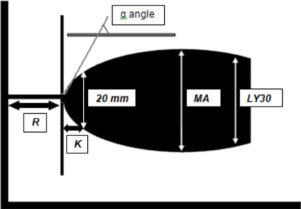

Traumatic injury is the leading cause of death for people under the
age of 44 [@Hoyert2012]. Many of these deaths are the result of uncontrolled bleeding
due to a trauma-induced disorder called Acute Traumatic Coagulapathy, or known more simply as
Coagulopathy [@Brohi2003]. How major trauma causes Coagulapathy and how to treat the disease is still a subject
of ongoing research. There are various competing hypotheses for why so many trauma
patients are coagulapathic. The Coagulation Cascade and the Fibrinolytic system are complex networks of
dynamically interacting proteins in blood that are responsible for forming and breaking up clots [@gonzalez2014trauma].

It is generally understood that Coagulopathy comes as
a result of a malfunction in one of or both these systems. To better study these complex networks, and how they are affected during trauma, doctors
and scientists have two major assays at their disposal: direct protein concentration
measurements and Thromboelastography, known as TEG (Figure 1). Direct protein concentration
measurements can tell us the concentration levels of key players in the body's coagulation
system, thus they can help us to understand why a patient's blood is not clotting and how
they can be treated. Unfortunately, these tests are only available at very select
number of hospitals specializing in trauma, they are expensive to run, and most importantly
they are slow to run in a setting where applying the correct treatment as quickly as
possible is of the utmost importance.


In contrast to direct protein measurements, TEG measurements are ubiquitous, inexpensive to run,
and can provide results in as little as 20 minutes. However, they do not measure protein
concentrations directly. Instead, TEG works by placing a small sample of blood in a cup,
chemically initiating the clotting process, then using a metal probe to measure the physical size of the resulting clot
over time in millimeters (mm) (Figure 2). The resulting output is a measure of clot
thickness over time for the patient that is indicative of several important features of
their clotting state including:

* How long it takes for a patient's blood to start forming a clot
* How fast the clot grows once clotting is initiated
* How strong the patient's clots become
* How long the clots are able to maintain their integrity before being broken up


## The Goal: Inferring Protein Concentrations Using TEG and Our Mechanistic Understanding of the Coagulation System.

While TEG measurements clearly contain useful information regarding a patient's clotting state,
they are simply a proxy for the latent system of clotting proteins in the blood that is
much more difficult to measure. Ideally, we can use our mechanistic understanding of the
coagulation system in the form of Ordinary Differential Equations (ODEs) along with a statistical model,
to better understand what exactly TEG is telling us about the state of the underlying coagulation system,
and furthermore to infer a patient's protein concentrations using solely their TEG measurements.

# A Mechanistic Model of the Coagulation System

The coagulation system is a well-studied, with several mechanistic ODE models in the literature
that describe how the system evolves dynamically over time. Models for the coagulation system vary
widely in the number of states, reactions, and parameters they contain, including complex models
with up to 80 states [@mitrophanov2014kinetic] . For our purposes we developed a simple reduced-order model
based off of elements from both the work by [@mitrophanov2014kinetic] as well as [@sagar2015dynamic] that captures
the most important players in the coagulation system. The model includes the most basic
components of the clotting process: the coagulation cascade responsible for forming clots,
actual clot material, and clot breakdown or Fibrinolysis (Figure 3). 


We model the coagualation cascade as primarily consisting of the activation of the blood protein FactorII ($FII$) to its activated form $FIIa$ via the action of a sigmoid delay function that is parameterized by parameters $b$ and $c$. We model these parameter values as specific to the patient. Importantly, $FIIa$ can be blocked by antithrombin ($AT$). $FIIa$ once activated can then facilitate the conversion of raw clot material, Fibrinogen, or $Fg$ in to an actual clot Fibrin, or $Fn$. Once a clot is formed, the clot can be broken up by the protein $tPA$, which itself can be blocked by the protein $PAI$. The differential equations for this model summarize this process and are shown below. Values for reaction constants represent how fast these respective reactions occur with respect to on another. The values we used for these constant were either gathered from the literature or fit using Maximum A-Posteriori (MAP) estimation.

$$
\begin{aligned}
\frac{dFII}{dt} &=& -\mathrm{CascadeDelay(t, b, c)} \cdot  \mathrm{TFPI(t)} \cdot \frac{FII}{K_{FIIa} + FII}\\
\frac{dFIIa}{dt} &=& \mathrm{CascadeDelay(t, b, c)} \cdot  \mathrm{TFPI(t)} \cdot \frac{FII}{K_{FIIa} + FII}-k_{AT}\cdot FIIa \cdot AT\\
\frac{dAT}{dt} &=& -k_{AT}\cdot FIIa \cdot AT\\
\frac{dFg}{dt} &=& -k_{clot} \cdot FIIa \cdot \frac{Fg}{K_{clot} + Fg}\\
\frac{dFn}{dt} &=& k_{clot} \cdot FIIa \cdot \frac{Fg}{K_{clot} + Fg} - k_{lys} \cdot tPA \cdot \frac{Fn}{K_{lys} + Fn}\\
\frac{dtPA}{dt} &=& -k_{PAI}\cdot tPA \cdot PAI\\
\frac{dPAI}{dt} &=& -k_{PAI}\cdot tPA \cdot PAI\\
\end{aligned}
$$

Using the R package deSolve, we can forward simulate from this ODE to get an idea of what
the solutions for this system look like:

```{r, message = FALSE}
library(tidyverse)
library(deSolve)
```


```{r, message=FALSE, cache = TRUE}

seven.state <- function(t, state, parameters) {
  with(as.list(c(state, parameters)), {
    
    cascade_delay <- 1/(1+exp(c-b*t))
    tfpi <- (1-tfpi_min)/(1+exp(-ct+bt*t)) + tfpi_min

    r_FIIa <- k_FIIa*cascade_delay*tfpi*((FII/g_FII)^c_FIIa)/(K_FIIa + (FII/g_FII)^c_FIIa)
    r_AT <- k_AT*FIIa*(AT/g_AT)
    r_clot <- k_clot*FIIa*((Fg/9e-6)^c_clot)/(K_clot + (Fg/9e-6)^c_clot)
    r_lys <- k_lys*tPA*(Fn^c_lys)/(K_lys + Fn^c_lys)
    r_PAI <- k_PAI*tPA*PAI
    
    dFII <- g_FII*(-r_FIIa)       # pct activity
    dFIIa <- r_FIIa -r_AT         # 10s of nmol/L
    dAT <- -g_AT*r_AT             # pct activity
    dFg <- -r_clot                # 1 mg/dl = 29.41 nmol/L
    dFn <- 1e7*(r_clot - r_lys)   # mm of clot
    dtPA <- -r_PAI                # 1 ng/mL = 14.29 pmol/L     
    dPAI <- -r_PAI                # 1 ng/mL = 23.26 pmol/L
    
    list(c(dFII, dFIIa, dAT, dFg, dFn, dtPA, dPAI))
  })
}

parameters <- c(g_FII = 100/1.4e-6, g_AT = 100/3.4e-6,
                c = 5.0, b = 0.4e-1,
                ct = 10, bt = 0.15e-1, tfpi_min = 0.2,
                k_FIIa = 3.5e-9, c_FIIa = 1, K_FIIa = 1.4e-6,
                k_AT = 1.6e4,
                k_clot = 3.0, c_clot = 1, K_clot = 0.75,
                k_lys = 1, c_lys = 1, K_lys = 0.5,
                k_PAI = 4.5e5)

state <- c(FII = 1e2, FIIa = 0, AT = 100, Fg = 9e-6, Fn = 0, tPA = 7e-11, PAI = 4e-10)

times <- seq(0, 1800, by = 2)

out <- ode(y = state, times = times, func = seven.state,
           parms = parameters, method = "bdf",
           atol = 1e-6, rtol = 1e-5) %>% as.data.frame %>% as_tibble

out %>%
  gather(state, value, -time) %>%
  mutate(state = factor(state, levels = c("FII", "FIIa", "AT", "Fg", "Fn", "tPA", "PAI"))) %>%
  ggplot(aes(time,value)) + geom_line() + facet_grid(state ~ ., scales = "free")
```


### A Mechanistic Model for TEG

While the model includes the concentration of $Fn$ (Fibrin) which is a criticial component of clots,
the actual clot thickness which TEG measures is not measuring $Fn$ per se, but some function of it.
Following @sagar2015dynamic , we used the Hill function

$$
\mathrm{ClotThickness(t)} = k \frac{Fn^2}{K + Fn^2}
$$
with $k = 64.0$ and $K = 100.0$ to translate $Fn$ to clot thickness. Clot thickness is plotted below for the ODE we simulated above:

```{r, message=TRUE}
Fn <- out$Fn
ClotThickness <- 64.0 * Fn^2/(100.0 + Fn^2)
qplot(times, ClotThickness, geom = "line") + xlab("Time")
```

# Inferring Hybrid Mechanistic-Statistical Models and the Unorthodox Nature of TEG Data
Typically, mechanistic ODE models are fit in Stan using data that consists of the
states of the ODE over time, see e.g. [@carpenterPredatorPrey2018] or [@margossianOde2017] . In these settings
one typically posits an error distribution for the data that is centered around the forward simulated values of the ODE.
In contrast, our TEG data does not come in the form of clot thickness over time, but rather
in the form of four quantities derived from the clot thickness curve that are typically used in the medical community to summarize the
most important properties of a TEG curve (Figure 4). These four quantities are described below:

1. **R:** The time (in minutes) for the clot to reach 2 mm. This quantity represents the time it takes for the clotting process to initiate.
2. **K:** The time (in minutes) for the clot to reach 20 mm from the time it reached 2 mm. This quantity represents speed of clot formation.
3. **MA:** The maximum amplitude of the clot i.e. the size of the clot when it is at its largest. This quantity measures the strength of a patient's clot.
4. **Ly30:** The percentage of the clot which has broken down after 30 minutes as compared to the maximum amplitude of the clot. This quantity measures how fast clots are being broken up.



To use these quantities to infer unknown parameters and initial conditions, we must first forward simulate our ODE,
compute the clot thickness as a function of $Fn$, then use the trajectory of clot of thickness over time
to derive our simulated TEG data, which we finally can compare to our data by positing some statistical model.
We describe the finer points of this process in the following section.


# Inferring ODEs Using Hitting Time and Max Data in Stan
In the typical ODE estimation setting, where our data consists of the value of the ODE states over time, $y_n,\,n = 1,\cdots, N$
we typically have a likelihood of the form

$$
\prod_{n=1}^N p(y_n | y_n^{(sim)}(y_0, \theta))
$$

where $y_n^{(sim)}(y_0, \theta)$ is a forward simulation of our ODE given the initial conditions $y_0$
and the parameters $\theta$. The Hamiltonian Monte Carlo (HMC) algorithm in Stan works by taking derivates
of the likelihood with resepct to the quantities we are trying to estimate, in this case $y_0$ and $\theta$.

In our case, the data consists of hitting times like $R$, which is the time the clot takes to reach a size of
2 mm, and we instead set up a probabilistic model, or likelihood of the form

$$
p(R | R^{(sim)}(y_0, \theta)).
$$

For HMC to get the correct gradients, we have to be careful about how we compute the hitting 
time $R^{sim}(y_0, \theta)$ in our Stan program. First, note that the ODE solver in Stan will return
the value of the solution at discrete time points, which we will then use to compute clot thickness, $C_n$ at the
discrete time points $t_1, \cdots, t_N$. $R$ is a continuous value formally defined as

$$
R := \inf \{ t: C(t | y_0, \theta) > 2.0 \}
$$
where $C(t)$ is the clot thickness over time. The discrete analogue we would be able to
compute with our ODE solution $C_n$ is

$$
R := \min \{t_n : C_n( y_0, \theta) > 2.0 \}
$$

which unfortunately does not have a smooth derivative with respect to the initial conditions and unknown parameters. In practice,
this would cause problems for HMC and Stan, because the log-likelihood should be a smooth function of the unknowns,
and ideally have smooth derivatives as well.

To ameliorate this, we can use our discrete solution points $\{ C_n( y_0, \theta) \}$ to obtain a continuous function
$C(t| y_0, \theta)$ by interpolating the solution points using cubic splines. The interpolated function
will have two smooth derivatives, allowing Stan's HMC to run smoothly.

### Using Cubic Splines to Obtain Continuous ODE Solutions in Stan

Fortunately, the Stan language is expressive enough to allow us to easily implement code for
computing a smooth function $C(t)$ that interpolates through the discrete points $C_n,\, n=0,\cdots, N$
defined at the points $t_0, \cdots, t_N$. In particular, we can write a function in Stan to
fit a cubic interpolating spline through a given set of points. We provide a quick review of cubic smoothing
splines and how to compute them loosely following the exposition in [@quarteroni2010numerical] . Actual Stan code for computing
cubic splines is freely available in our Stan files.

Our aim is to derive the functional form of a group of cubic splines $s_{3,i-1}(t)$ over the intervals $[t_{i-1}, t_i]$. The functions will be cubic polynomials and will be twice differentiable, even at the nodes $t_0, \cdots, t_N$. We first define $f_i = s_3(t_i)$, $m_i = s_3(t_i)$, and $M_i = s_3''(t_i)$ for $i = 0, \cdots, N$. Since $s_{3,i-1}$ is a cubic polynomial, its second derivative is linear. Since the cubic spline must have continuous second derivatives we have

$$
s_{3,i-1}''(t) = M_{i-1} \frac{t_i - t}{h_i} + M_i \frac{t - t_{i-1}}{h_i}
$$

for $t \in [t_{i-1}, t_i]$ where $h_i = t_i - t_{i-1}$. Integrating twice we obtain

$$
s_{3,i-1}(t) = M_{i-1} \frac{(t_i-t)^3}{6h_i} + M_i \frac{(t-t_{i-1})^3}{6h_i} + C_{i-1}(t - t_{i-1}) + \widetilde{C}_{i-1}
$$

The constants $C_{i-1}$ and $\widetilde{C}_{i-1}$ are uniquely determined by imposing the end point values
$s_3(t_{i-1}) = f_{i-1}$ and $s_3(t_i) = f_i$, yielding for $i = 1, \cdots, N-1$

$$
\begin{aligned}
\widetilde{C}_{i-1} &=& f_{i-1} - M_{i-1} \frac{h_i^2}{6}\\
C_{i-1} &=& \frac{f_i-f_{i-1}}{h_i} - \frac{h_i}{6} (M_i - M_{i-1})
\end{aligned}
$$
By imposing continuity of the first dervivatives at the nodes we arrive at the linear system

$$
\mu_i M_{i-1} + 2M_i + \lambda_i M_{i+1} = d_i,\, i = 1,\cdots, N_1
$$
where

$$
\begin{aligned}
\mu_i &=& \frac{h_i}{h_i + h_{i+1}}\\
\lambda_i &=& \frac{h_{i+1}}{h_i + h_{i+1}}\\
d_i &=& \frac{6}{h_i + h_{i+1}} \left( \frac{f_{i+1} - f_i}{h_{i+1}} - \frac{f_i - f_{i-1}}{h_i} \right)
\end{aligned}
$$
for $i = 1, \cdots, N-1$. Setting $\lambda_0 = \mu_N = 1$ and $d_0 = d_1$ leads to the following linear equation which
defines our spline coefficients:

$$
\begin{pmatrix}
2 & \lambda_0 & 0 & \cdots & 0\\
\mu_1 & 2 & \lambda_1 &  \ddots & \vdots\\
0  & \ddots & \ddots & \ddots &  0\\
\vdots & \ddots & \mu_{N-1} & 2 & \lambda_{N-1}\\
0 & \cdots & 0 & \mu_N &  2
\end{pmatrix}
\begin{pmatrix}
M_0\\
M_1\\
\vdots\\
M_{N-1}\\
M_N
\end{pmatrix}
=
\begin{pmatrix}
d_0\\
d_1\\
\vdots\\
d_{N-1}\\
d_N
\end{pmatrix}
$$

Because this system is tridiagonal, we can solve it in $\mathcal{O}(N)$ time using the Thomas algorithm, which is implemented in our provided Stan files.

### Obtaining Hitting Times from the Spline Interpolation

With our continuous clot thickness function in hand, we are now able to compute stopping times that are a smooth
function of our unknowns by using an algebraic solver on our continuous function and appealing to the implicit function theorem.
Letting $C(t | y_0, \theta)$ represent our spline function that interpolates the discrete points $C_n(y_0, \theta)$, $R$ is defined implicitly as

$$
C(R(y_0, \theta) | y_0, \theta) = 2.0.
$$
Note that $R$, the time that the clot hits 2.0 mm is dependent on the initial value of the system, as well as the parameter values of the system. Taking the partial derivative of both sides of the equation with respect to $\theta$ yields

$$
\frac{\partial}{\partial R}C(R | y_0, \theta) \frac{\partial R}{\partial \theta} + \frac{\partial}{\partial \theta} C(R | y_0, \theta) = 0.0.
$$

which then yields the correct partial derivative we need for HMC:

$$
\frac{\partial R}{\partial \theta} = - \frac{\partial}{\partial \theta} C(R | y_0, \theta) \left( \frac{\partial}{\partial R}C(R | y_0, \theta)  \right)^{-1}.
$$


This solve can be accomplished and the correct partial derivative will be used in Stan's HMC implementation by simply
passing the function $C(t)$ to the algebraic solver available in Stan which uses a modified version of Newton's method to find
the solution of nonlinear systems of equations [@margossianAlgSolver2018] .

Because Newton Iterations may diverge with a bad starting point, and at the time of this writing Stan's algebraic solver does not support
variable initial guesses, we opted to implement a custom C++ solver based off of the bisection method. For a tutorial on using custom
C++ functions and their gradients in Stan models see [@balesCustomGradients2018] .

### Obtaining the Max of Our Spline Function

Note that the MA, or maximum amplitude TEG values also requires a nonlinear solve to obtain. To compute this value we also
use custom C++ code based off of the bisection method on the derivative of the function. In this case the appropriate gradient
can be comptued similarly.

# Testing our Code on the ODE Test Equation

We first try out our code for inferring unknowns using hitting times on the simple ODE test equation:

$$
\frac{dy}{dt} = -\lambda y.
$$
with initial value $y(0) = 1$ and $\lambda = 1$. The solution of this equation is simply $y(t) = e^{-t}$, which hits the
value $y(t) = 0.6$ at $t = -\ln 0.6 \approx = 0.5108$. We set up a Stan model to infer the value of the initial condition
given the value of the hitting time.

```{r, message=FALSE, warning = FALSE, results = "hide"}
library(rstan)
options(mc.cores = parallel::detectCores())

# use special include arugments since we're compiling a Stan model with externally
# defined custom C++ code
fit.test.eq.cpp.src <- stanc("stan/fit_test_eq.stan", allow_undefined = TRUE)$cppcode

fit.test.eq.stan.model <- stan_model("stan/fit_test_eq.stan", allow_undefined = TRUE,
                         includes = paste0('\n#include "', file.path(getwd(), 'src/cubic_spline_solvers.hpp'), '"\n'))
```

```{r, message=TRUE, cache = TRUE}
# fit model
test.eq.stanfit <- sampling(fit.test.eq.stan.model, chains = 4, iter = 1000,
                data = list(Nt = 200, ts = seq(0.01, 2.0, by = 0.01), teg = 0.5108256),
                init = list(list(y0 = array(1,1)), list(y0 = array(1,1)), list(y0 = array(1,1)), list(y0 = array(1,1))))
```

As expected, the value of the hitting time and the value of the initial condition are highly correlated. When the initial condition
is large, it takes longer for the ODE to reach $y(t) = 0.6$. Note that our posterior samples have a much smaller
variance than our prior samples, indicating that the stopping time is very informative of the initial value of the ODE.

```{r, message= FALSE, warning=FALSE, cache = TRUE}
#print posterior summary and pairs plot
test.eq.stanfit
pairs(test.eq.stanfit, pars = c("y0", "teg_sim"))

# compare prior to posterior
test.eq.stan.samples <- rstan::extract(test.eq.stanfit, pars = c("y0", "teg_sim"))

tibble(y0.prior = rnorm(2000, 1, 0.1), y0.posterior = test.eq.stan.samples$y0[,1]) %>%
  gather(Distribution, Value) %>%
  mutate(Distribution = factor(Distribution, levels = c("y0.prior", "y0.posterior"), labels = c("Prior", "Posterior"))) %>%
  ggplot(aes(Value)) +
  geom_histogram(binwidth = 0.01) +
  facet_grid(Distribution ~ ., scales = "free") +
  xlab(expression(y[0]))

```

# Putting it All Together to Infer Protein Concentrations Using TEG Data

Now that we know our Stan code works on a simple problem, it's time to try it out on some real trauma data. We will try out
our model on the following trauma patient for whom we have TEG values for and initial protein values for all the proteins in our model
except for $tPA$ and $PAI$. Our goal here will be to infer this patients initial concentration of $tPA$ given their
TEG measurements. In theory this should be possible because $tPA$ is a protein primarily responsible for clot breakup
and the Ly30 measurement of TEG measures the amount of clot breakup after 30 minutes. In this case, the patient has an unusually high
Ly30 value of 1.7, indicating that 1.7% of their clot already broke up after only 30 minutes. In light of this, we should expect
this patient to have a higher than average $tPA$ concentration.

```{r, message= FALSE, warning=FALSE}
patient.data <- tibble(sex = "Male", age = 22, inj.mech = "StabWound",
                       FII = 90, AT = 115, Fg = 162*29.41*1e-9, tPA = NA, PAI = NA,
                       R = 0.8, K = 1.5, MA = 60.2, Ly30 = 1.7)

patient.data
```

### Choosing Priors for Unknown Protein Concentrations and Model Parameters

Recall that in our mechanistic model every patient has "cascade delay" parameters $b$ and $c$ that describe the specific state of the coagulation cascade. Using our four pieces of TEG data, we must infer there two parameters and also the value of the unknown protein concentrations $tPA$ and $PAI$ for our patient. To do this reasonably,
it helps to incorporate any prior knowledge we have about these parameters. For the protein concentrations, we set the prior distributions to exponential distributions with respective means 4e-10 and 9.3e-10. These are the distributions of these protein concentrations for general trauma patients. With the information given it's reasonable to assume our trauma patient's protein values are drawn form the distribution of protein values for trauma patients. For $b$ and $c$, we use weakly informative priors that are representative of a wide variety of possible coagulation profiles that we would expect to see in trauma patients.

### Results

With our priors set, we are ready to fit our model, integrating our prior knowledge and our data to produce a posterior distribution of this patient's $tPA$ values:

```{r, message=FALSE, warning = FALSE, results = "hide"}
# format data for Stan
times <- c(seq(0, 600, by = 6), seq(660, 1800, by = 60))

proteins <- patient.data %>% select(FII, AT, Fg, tPA, PAI) %>% as.matrix %>% as.vector
proteins <- ifelse(is.na(proteins), -1, proteins)

teg <-  patient.data %>% select(R, K, MA, Ly30) %>% as.matrix %>% as.vector

num_missing <- c(0,0,0,1,1)

dat <- list(Nt = length(times), ts = times, proteins = proteins, teg = teg, num_missing = num_missing)

# compile Stan model with custom C++ code
teg.cpp.src <- stanc("stan/fit_teg.stan", allow_undefined = TRUE)$cppcode
teg.stan.model <- stan_model("stan/fit_teg.stan", allow_undefined = TRUE,
                         includes = paste0('\n#include "', file.path(getwd(), 'src/cubic_spline_solvers.hpp'), '"\n'))
```

```{r, message=TRUE, warning=FALSE, cache = TRUE}

init.list <- list(FII_missing = rep(72.0, num_missing[1]),
                                 AT_missing = array(82.0, num_missing[2]),
                                 Fg_missing = rep(5.5-06, num_missing[3]),
                                 tPA_missing = array(1.6e-10, num_missing[4]),
                                 PAI_missing = array(3.4e-10, num_missing[5]),
                                 theta = c(3.0, 0.03))

# fit model
teg.fit <- sampling(teg.stan.model, chains = 4, iter = 1000, data = dat,
                control = list(adapt_delta = 0.99, max_treedepth = 8), refresh = 100,
                init = rep(list(init.list),4))

```

Once our model is fit we make sure to check our MCMC diagnostics, to ensure the integrity of our samples. In particular we make sure that there are no divergences and few max tree depth warnings, and that the $\hat{R}$ value for all of the sample parameters is below 1.01. 

```{r}
teg.fit
```


We are now ready to examine the posterior distribution of this patient's $tPA$ concentration. Sure enough, this patient's $tPA$ concentration is higher than the population average, which we used as our prior distribution. This is reflective of their relatively high Ly30 value, just as we expected!

```{r}
teg.stan.samples <- rstan::extract(teg.fit, pars = c("tPA_missing"))

tibble(tPA.prior = rexp(2000,1/(4e-10)), tPA.posterior = teg.stan.samples$tPA_missing[,1]) %>%
  gather(Distribution, Value) %>%
  mutate(Distribution = factor(Distribution, levels = c("tPA.prior", "tPA.posterior"), labels = c("Prior", "Posterior"))) %>%
  ggplot(aes(Value)) +
  geom_histogram() +
  facet_grid(Distribution ~ ., scales = "free") +
  xlab("Predicted tPA Value")
```

# Discussion

We showed how one can tackle the very practical problem of tying together disparate measures of coagulopathy by incorporating mechanistic and statistical knowledge in to Stan. In particular, we showed how TEG data, which consists of unorthodox measurement quantities, can be used to infer much less ubiquitous but more informative protein data with clever use of techniques from numerical analysis such as splines, root-finding, and the inverse function theorem.

In this notebook we fit a model to a single patient first to illustrate our tying together of various numerical techniques, and second to show how a mechanistic model together with Bayesian analysis in Stan can be used in a practical clinical setting to infer useful information. In a larger study for the purpose of more specific model callibration/checking it may be useful to fit multiple patients, forward simulate TEG data, and check callibration quantities with respect to uncertainty intervals to ensure that modeling and distributional assumptions are sound. We did not pursue this further in this notebook as it was outside of our scope, but we mention it for completeness.

We also point out that our priors for the protein concentrations were selected using an "empirical Bayes'" approach where we fit a point estimate to protein data from an entire population of patients we had data for. In a sense, this is a computationally convenient approximation to a hierarchical model which would simaltaneously incorporate data from multiple patients and "learn" the population level distributions.

## Acknowledgements

Research reported in this publication was performed by the Systems Biology
Coagulopathy of Trauma Program of the US Army Medical Research and Materiel
Command under award number W911QY-15-C-0026.

## References
