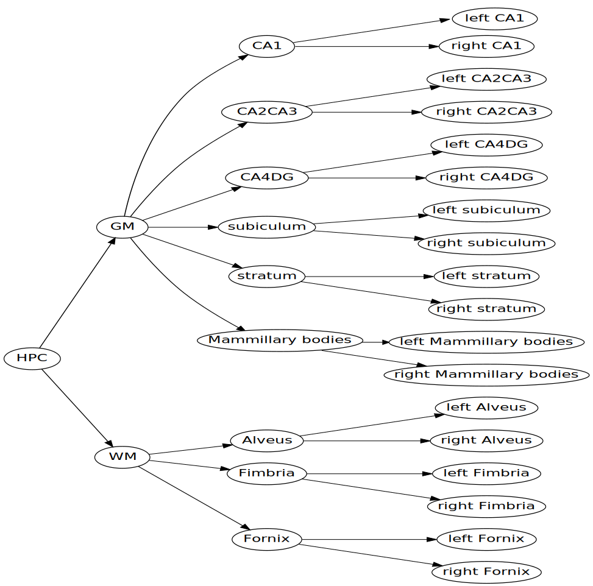
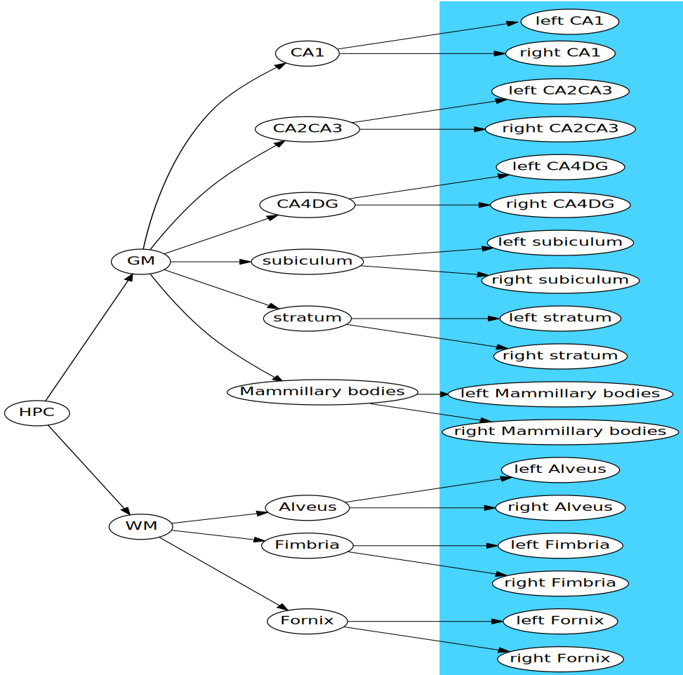
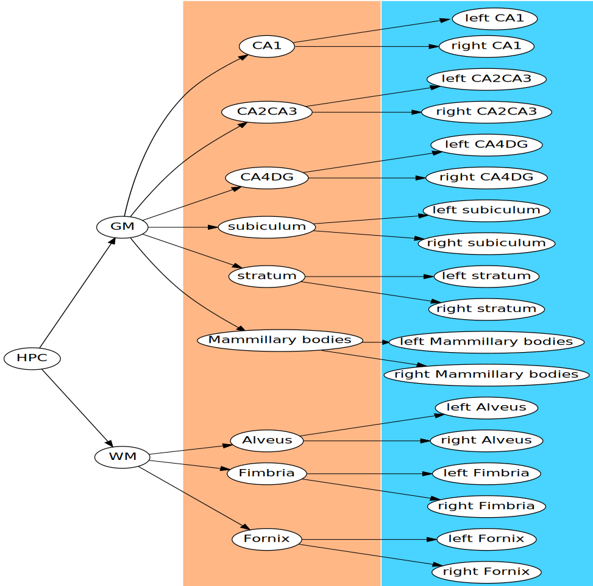
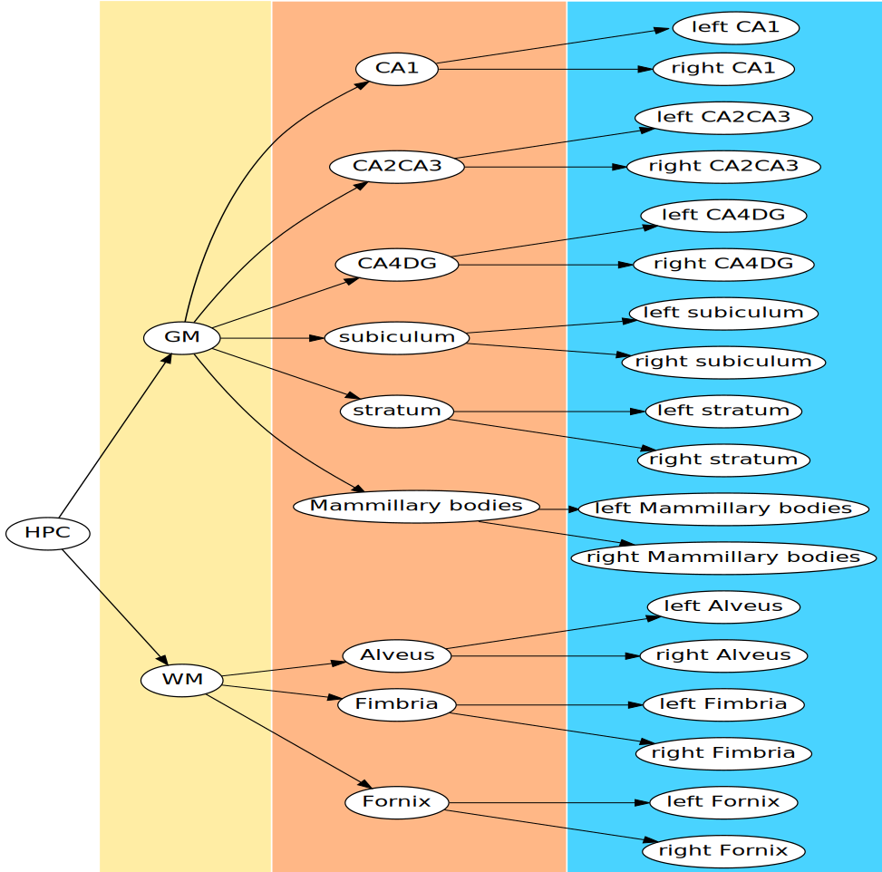
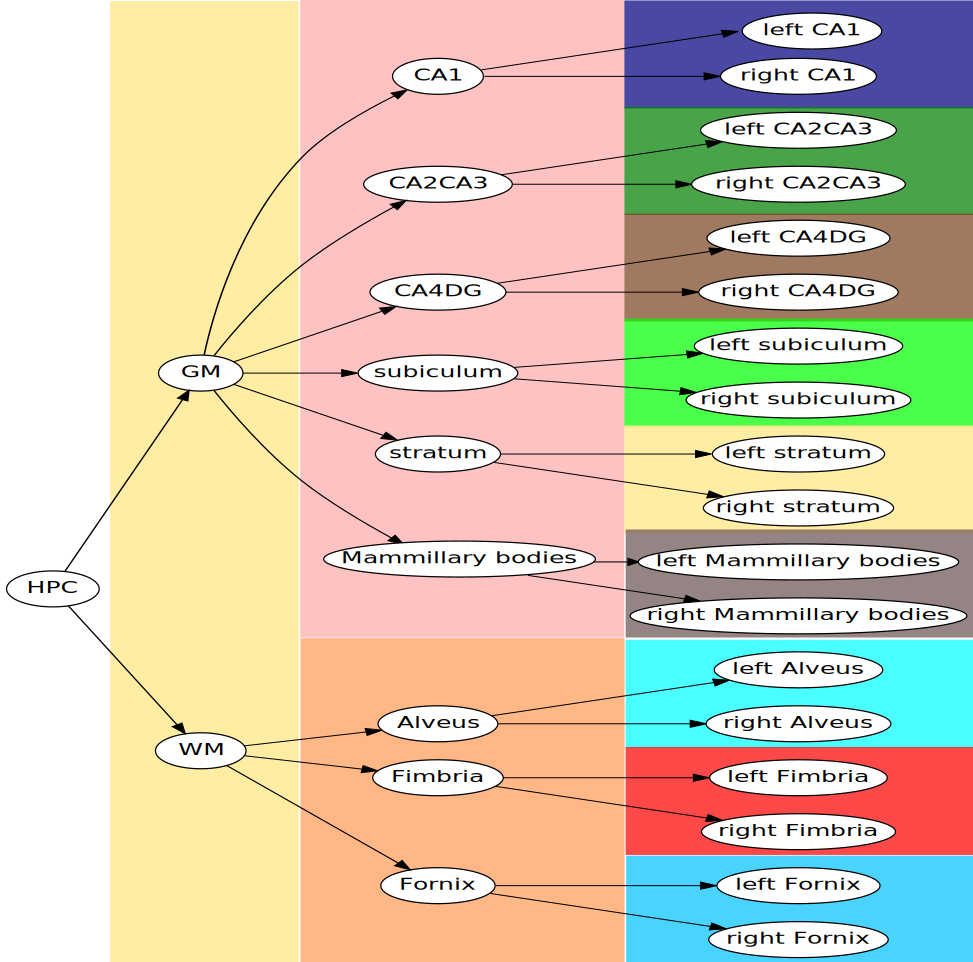

<!-- TODO: 
  - better explain effect diffusion tree: equations (verbal)
  - better explain figures
-->

```{r, include = FALSE}
library(ggtree)
library(ggplot2)
library(data.tree)
library(dplyr)
library(tidyr)
library(purrr)
library(ggrepel)
library(MRIcrotome)
library(RMINC)
library(grid)
library(bayesplot)
library(rstan)
library(rstanarm)
library(hashmap)

options(digits = 3)

dtree <- readRDS("tree.rds")
ptree <- readRDS("ptree.rds")
nodes <- c(ptree$tip.label, ptree$node.label)
labs <- mincArray(mincGetVolume("labels.mnc"))[]
anat <- mincArray(mincGetVolume("anat.mnc"))

rois <-
  c("root2", "Basic cell groups and regions"
  , "Cortical plate", "Isocortex")

dtree$Do(function(n){
  n$node_num <- which(nodes == gsub(",", "", gsub(" ", "_", n$name)))
})

# remap hanats
remap_tree <- function(tree){
  hvol <- round(hanatToVolume(tree, labs, "node_num"))
  lut <-
    unique(hvol[hvol > 0]) %>%
    sort %>%
    setNames(seq_along(.), .)

  colour_pal <- scales::hue_pal()(length(lut))
  colour_map <-
    setNames(colour_pal[lut], names(lut)) %>%
    c("0" = NA)
  
  hvol[] <- colour_map[as.character(hvol)]
  hvol
}

roi_anat <- function(i, remove_children = TRUE){ 
  hv <- Clone(FindNode(dtree, rois[i]))
  if(remove_children)
    hv$children <- map(hv$children, function(k){ k$children <- NULL; k })
  hv <- remap_tree(hv)
  hv <- hv[ , 40:418, 50:200]
  attr(hv, "sizes") <- rev(dim(hv))

  sliceSeries(ncol = 4, nrow = 5, dimension = 1, begin = 60, end = 200) %>%
    anatomy(anat[, 40:418, 50:200], low = 700, high = 1500) %>%
    overlay(hv)
}
```

```{r make_anat_figs, cache = TRUE, echo = FALSE, warning = FALSE}
rplt1 <- roi_anat(1) 
rplt2 <- roi_anat(2)
rplt3 <- roi_anat(3)
rplt4 <- roi_anat(4) 
```

```{r allen_fig, cache = TRUE, echo = FALSE, fig.width = 8.83, fig.height = 5}
lmap <-
  hashmap(as.numeric(dtree$Get("label", filterFun = isLeaf))
        , dtree$Get("color_hex_triplet", filterFun = isLeaf))

allen_vol <- labs
allen_vol[] <- lmap$find(labs)
# Crop volume
av_cor_crop <- allen_vol[26:290, , 50:200]

sliceSeries(ncol = 1, nrow = 1, slices = 180) %>%
  anatomy(anat[26:290, , 50:200], low = 700, high = 1500) %>%
  overlay(av_cor_crop) %>%
  draw
```

# Overview

- Use hierarchical modelling in Stan to improve efficiency of
  brain anatomy studies.
- Focus on mouse brain, but generalizes naturally to
  other species (humans) and measures (function).

---

# A hypothetical study

- Want to estimate the effect of a drug on brain development
- 10 control mice
- 10 mice receive the drug
- Localize in space where the treated mouse brains differ from controls

---

# Analysis Pipeline

- Automatically label the regions of the brain
- Bring brain images into alignment - **registration**
- Take a labelled brain - **atlas**
- Propagate labels from the atlas to the images
- Compute structure volumes
- Find regions where volumes differ

---

# Traditional Analysis

## Massively Univariate Modelling
- Fit one linear model per structure
- Extract t-statistics
- Compute p-values
- FDR control

---

# Traditional Analysis

## Massively Univariate Modelling
- Fit one linear model per structure
- Extract t-statistics
- Compute p-values
- FDR control
- No pooling

---

# The Mouse Brain

```{r, echo = FALSE, fig.width = 12}
nlabs <- max(unique(as.numeric(labs)))
leaf_vol <- labs
leaf_vol[] <- c(NA, scales::hue_pal()(nlabs+1))[labs+1]

brain_series <-
  sliceSeries(ncol = 4, nrow = 5
            , dimension = 1
            , begin = 60, end = 200) %>%
  anatomy(anat[, 40:418, 50:200], 700, 1500)

draw(brain_series)
```

---

# The Mouse Brain Labelled

```{r, echo = FALSE, fig.width = 12}
brain_series %>%
  overlay(leaf_vol[, 40:418, 50:200]) %>%
  draw()
```

---

# The Mouse Brain Labelled

```{r, echo = FALSE, fig.width = 12}
brain_series %>%
  overlay(leaf_vol[, 40:418, 50:200]) %>%
  draw()
```

- Fit 336 linear models

---

# Downside

- Ignore covariance
- Unable to borrow strength from similar structures
- Needs separate analyses for multiple scales

---

# First Improvement: Allow for pooling

- Use brain structure to construct hierarchical model
- Pool effects of interest across structures
- `y ~ eff + (eff | structure) + (1 | ID)`

---

# What we gain

- This already has advantages over unpooled models.
- Structures can borrow strength from each other.
- Individual level effects can be estimated

---

# What we gain

- This already has advantages over unpooled models.
- Structures can borrow strength from each other.
- Individual level effects can be estimated

# Room for improvement

- Pooling is driven only by stucture variance
- We are ignoring lots we know about the brain

---

# The Mouse Brain Tree

```{r, echo = FALSE, warning = FALSE, fig.width = 12, results = "asis"}
narrow_theme <-
  theme(plot.margin = unit(c(-.1, -.1, -.1, -.1), "npc")
      , legend.position = "none")

ggtree(ptree, layout = "circular") +
  geom_rootpoint() +
  narrow_theme
```

- Hierarchy from histology atlas from the Allen Institute

---

# A tree structured atlas

```{r, echo = FALSE, warning = FALSE, fig.height = 5, fig.width = 12}
cowplot::plot_grid(
           ggtree(ptree, layout = "circular") +
           geom_rootpoint() +
           narrow_theme
         , sliceSeries(ncol = 1, nrow = 1, slices = 180) %>%
           anatomy(anat[26:290, , 50:200], low = 700, high = 1500) %>%
           overlay(av_cor_crop) %>%
           grobify
) 
```

- Hierarchical MRI atlas
- Structures organized into the taxonomy shown before

---

# The First Split

```{r, echo = FALSE, warning = FALSE, results = "asis", fig.width = 12}
get_depth <- function(d){
  data_frame(
    name = Get(Traverse(dtree, filterFun = function(n) n$level == d)
             , "name")
  , node = Get(Traverse(dtree, filterFun = function(n) n$level == d)
             , "node_num")) %>%
    mutate(
      col = scales::hue_pal()(n()))
}

get_children <- function(d){
  n <- FindNode(dtree, d)$children
  data_frame(
    name = Get(n, "name")
  , node = Get(n, "node_num")) %>%
    mutate(
      col = scales::hue_pal()(n()))
}

g <-
  ggtree(ptree, layout = "circular") +
  geom_rootpoint() 


plot_children <- function(i){
  plt <- 
    reduce(transpose(get_children(rois[i])), function(acc, d){
      tmp <-
        acc +
        geom_hilight(node = d$node, fill = d$col) 

      last_data <- layer_data(tmp, length(tmp$layers))
      text_data <-
        with(last_data,
             data_frame(x = xmin + (xmax - xmin)/2
                      , y = ymin + (ymax - ymin)/2
                      , label = d$name))
      
      tmp + geom_label(data = text_data, aes(x = x, y = y, label = label))
    }, .init = g)

  # Fix font size
  plt$layers <-
    modify(plt$layers, function(l)
      `if`(class(l$geom)[1] == "GeomLabel"
         , { l$aes_params <- update_list(l$aes_params, size = 6, fill = "#FFFFFFCB"); l}
         , l)) %>%
    (function(l, t = list(), nt = list()){
      if(length(l) == 0)
        return(c(nt, t))

      if(class(l[[1]]$geom)[1] == "GeomLabel"){
        t <- c(t, l[[1]])
      } else {
        nt <- c(nt, l[[1]])
      }

      return(Recall(l[-1], t, nt))
    })
  plt
}

plot_child <-
  function(i, k){
    children <- get_children(rois[i])
    child <- children %>% filter(name == k)

    plt <-
      reduce(transpose(child), function(acc, d){
        tmp <-
          acc +
          geom_hilight(node = d$node, fill = d$col) 
        
        last_data <- layer_data(tmp, length(tmp$layers))
        text_data <-
          with(last_data,
               data_frame(x = xmin + (xmax - xmin)/2
                        , y = ymin + (ymax - ymin)/2
                        , label = d$name))
      
        tmp + geom_label(data = text_data, aes(x = x, y = y, label = label))
      }, .init = g)

    # Fix font size
    plt$layers <-
      modify(plt$layers, function(l)
        `if`(class(l$geom)[1] == "GeomLabel"
           , { l$aes_params <- update_list(l$aes_params, size = 6, fill = "#FFFFFFCB"); l}
           , l)) %>%
      (function(l, t = list(), nt = list()){
        if(length(l) == 0)
          return(c(nt, t))
        
      if(class(l[[1]]$geom)[1] == "GeomLabel"){
        t <- c(t, l[[1]])
      } else {
        nt <- c(nt, l[[1]])
      }

        return(Recall(l[-1], t, nt))
      })
    plt
  }

plot_children(1) + narrow_theme
cat("\n\n---\n#The First Split\n\n")
draw(rplt1)
cat("\n\n---\n#Subdividing the Grey Matter\n\n")
plot_children(1) + narrow_theme
cat("\n\n---\n#Subdividing the Grey Matter\n\n")
plot_child(1, "Basic cell groups and regions") + narrow_theme
cat("\n\n---\n#Subdividing the Grey Matter\n\n")
plot_children(2) + narrow_theme
cat("\n\n---\n#Subdividing the Grey Matter\n\n")
draw(rplt2)
cat("\n\n---\n#Subdividing the Grey Matter\n\n")
plot_children(2) + narrow_theme
cat("\n\n---\n#Subdividing the Grey Matter\n\n")
plot_child(2, "Cerebrum") + narrow_theme
cat("\n\n---\n#Subdividing the Grey Matter\n\n")
plot_children(3) + narrow_theme
cat("\n\n---\n#Subdividing the Grey Matter\n\n")
draw(rplt3)
cat("\n\n---\n#Subdividing the Cortex\n\n")
plot_children(3) + narrow_theme
cat("\n\n---\n#Subdividing the Cortex\n\n")
plot_child(3, "Isocortex") + narrow_theme

cr4 <- get_children(rois[4])

plt4 <-
  reduce(transpose(cr4), function(acc, d){
    acc$p <-
      acc$p +
      geom_hilight(node = d$node, fill = d$col)
    #
    last_data <- layer_data(acc$p, length(acc$p$layers))
    text_data <-
      with(last_data,
           data_frame(x = xmin + (xmax - xmin)/2
                    , y = ymin + (ymax - ymin)/2
                    , label = d$name))
#
    acc$d <- bind_rows(acc$d, text_data)
    acc
  }, .init = list(p = g))

set.seed(2)
cat("\n\n---\n#Subdividing the Cortex\n\n")
plt4$p +
  geom_label_repel(data = plt4$d, aes(x = x, y = y, label = label)
                 , size = 5, fill = "#FFFFFFDF", segment.color = "red") +
  narrow_theme

cat("\n\n---\n#Subdividing the Cortex\n\n")
draw(rplt4)
```

---

# Second Step: Pool by taxonomy

- Use the structure of the taxonomy to guide pooling
- Two main approaches:
    1. Pool across depths
    1. Pool toward immediate parent 

---

# Assess Five Models

- **No pooling**: chunk the data by structure, fit:
  
    `y ~ eff` 
	with `stan_lm` then combine estimates

---

# Assess Five Models

- **No pooling**: chunk the data by structure, fit:
  
    `y ~ eff` 
	with `stan_lm` then combine estimates
	
- **Flat model**: pool across all structures, fit:
  
    `y ~ eff + (eff | structure) + (1 | ID)` 
	with `stan_lmer`
	

---
class: center

# Flat Model

<code class="remark-inline-code"></br>&zwnj;</code>

```{r, out.height = "400px", echo = FALSE}

```

---
class: center

# Flat Model

`y ~ eff + (eff | structure) + (1 | ID)`
<code class="remark-inline-code"></br>&zwnj;</code>

```{r, out.height = "400px", echo = FALSE}

```

---

# Assess Five Models

- **No pooling**: chunk the data by structure, fit:
  
    `y ~ eff` 
	with `stan_lm` then combine estimates
	
- **Flat model**: pool across all structures, fit:
  
    `y ~ eff + (eff | structure) + (1 | ID)` 
	with `stan_lmer`
	
- **Parental model**: pool across all structures and add a pooled
  effect of parent, fit:
  
    `y ~ eff + (eff | structure) + (eff | parent) + (1 | ID)`
	
---
class: center

# Parental Model

`y ~ eff + (eff | structure) + (eff | parent) + (1 | ID)`
<code class="remark-inline-code"></br>&zwnj;</code>

```{r, out.height = "400px", echo = FALSE}

```

---

# Assess Five Models

- **No pooling**: chunk the data by structure, fit:
  
    `y ~ eff` 
	with `stan_lm` then combine estimates
	
- **Flat model**: pool across all structures, fit:
  
    `y ~ eff + (eff | structure) + (1 | ID)` 
	with `stan_lmer`
	
- **Parental model**: pool across all structures and add a pooled
  effect of parent, fit:
  
    `y ~ eff + (eff | structure) + (eff | parent) + (1 | ID)`
	
- **Grand-parental model**: add an effect for grand-parent, fit:

	`y ~ eff + (eff | structure) + (eff | parent) +` </br>
	`     (eff | gparent) + (1 | ID)`

---
class: center

# Grand Parental Model

`y ~ eff + (eff | structure) + (eff | parent) + (eff | grandparent) + (1 | ID)`

```{r, out.height = "400px", echo = FALSE}

```
---

# Assess Five Models

- **No pooling**: chunk the data by structure, fit:
  
    `y ~ eff` 
	with `stan_lm` then combine estimates
	
- **Flat model**: pool across all structures, fit:
  
    `y ~ eff + (eff | structure) + (1 | ID)` 
	with `stan_lmer`
	
- **Parental model**: pool across all structures and add a pooled
  effect of parent, fit:
  
    `y ~ eff + (eff | structure) + (eff | parent) + (1 | ID)`
	
- **Grand-parental model**: add an effect for grand-parent, fit:

    `y ~ eff + (eff | structure) + (eff | parent) +` </br>
	`     (eff | gparent) + (1 | ID)`
	
- **Effect Diffusion Tree**: a pooling across branches.	

---
class: center

# Effect Diffusion Tree

<code class="remark-inline-code"></br>&zwnj;</code>

```{r, out.height = "400px", echo = FALSE}

``` 

---

# Effect Diffusion Tree

### Base Model

$$\large{y_{is} = \boldsymbol{\beta} \mathbf{x}_i^t + \boldsymbol{\beta}_{s} \mathbf{x}_i^t  + r_i + \epsilon_{is}}$$

---

# Effect Diffusion Tree

### Base Model

$$\large{y_{is} = \boldsymbol{\beta} \mathbf{x}_i^t + \boldsymbol{\beta}_{s} \mathbf{x}_i^t  + r_i + \epsilon_{is}}$$

### Non-centered hierarchical effects

$$\large{\boldsymbol{\beta}_s = \Sigma^{1/2} \boldsymbol{\epsilon}_{s}}$$

---

# Effect Diffusion Tree

### Base Model

$$\large{y_{is} = \boldsymbol{\beta} \mathbf{x}_i^t + \boldsymbol{\beta}_{s} \mathbf{x}_i^t  + r_i + \epsilon_{is}}$$

### Non-centered hierarchical effects

$$\large{\boldsymbol{\beta}_s = \Sigma^{1/2} \boldsymbol{\epsilon}_{s}}$$

### Effect diffusion model

$$\large{\boldsymbol{\beta}_s = \boldsymbol{\beta}_{p_s} + \Sigma^{1/2} \boldsymbol{\epsilon}_{s}}$$

---

# Simulation Results

- Simulated from two data generating processes
- When simulating from effect diffusion prior, the effect
  diffusion model performs better
- When simulating from a simpler DGP, all hierarchical
  models perform similarly

---

```{r real-res, include = FALSE}
experiment <-
  readRDS("2018-08-24_experiment-no-res.rds") %>%
  mutate(model_nm = case_when(model == "f" ~ "Flat"
                            , model == "h" ~ "Parental"
                            , model == "h2" ~ "Grand-parental"
                            , model == "np" ~ "No-pooling"
                            , model == "edt" ~ "Diffusion Tree"))
```

# Real Data Results

- Each study collects controls, so we have many replicates of control mice.
- Can examine each set of controls for sex differences
- Examined five studies
    1. AndR - 20 mice
    1. Foster - 158 mice
	1. MAR - 45 mice
	1. Palmert - 40 mice
	1. SERT_KI - 20 mice
- Estimates from each study were compared against
  the average of the other four studies.
- Assess predictive performance
- Assess type S error 
- Assess effect consistency across replicates. 

---

# Compare Loo

```{r, echo = FALSE, fig.width = 12}
pal <- scales::hue_pal()(5)

experiment <-
  experiment %>%
  mutate(elpd = map_dbl(loo, ~ .$estimates["elpd_loo", "Estimate"])
         , elpd_se = map_dbl(loo, ~ .$estimates["elpd_loo", "SE"])
         , Study_Name = unlist(Study_Name)) %>%
  mutate(model_nm =
         factor(model_nm
              , levels = c("No-pooling", "Flat", "Parental", "Grand-parental"
                         , "Diffusion Tree")))

experiment %>%
  mutate(n = map_dbl(data, ~ length(.$hept$y))
       , elpd_p_n = elpd / n) %>%
  ggplot(aes(x = model_nm, y = elpd
           , ymin = elpd - elpd_se, ymax = elpd + elpd_se
           , group = model_nm, colour = model_nm)) +
  geom_point(size = 4) +
  geom_linerange(size = 2) +
  facet_wrap(~ Study_Name, scales = "free_y") +
  scale_colour_manual(values = pal, guide = FALSE) +
  xlab("Model") +
  ylab("Expected Log Predictive Density") +
  theme(
    axis.title = element_text(size = 16)
  , axis.text = element_text(size=14, face = "bold")
  , axis.text.x = element_text(angle = 60, hjust = 1)
  , strip.text = element_text(size = 14)) 
         
```

---

# Compare Loo

```{r, echo = FALSE, fig.width = 12}
experiment %>%
  mutate(elpd = map_dbl(loo, ~ .$estimates["elpd_loo", "Estimate"])
       , elpd_se = map_dbl(loo, ~ .$estimates["elpd_loo", "SE"])
       , Study_Name = unlist(Study_Name)) %>%
  filter(model != "np") %>%
  mutate(n = map_dbl(data, ~ length(.$hept$y))
       , elpd_p_n = elpd / n) %>%
  ggplot(aes(x = model_nm, y = elpd
           , ymin = elpd - elpd_se, ymax = elpd + elpd_se
           , group = model_nm, colour = model_nm)) +
  geom_point(size = 4) +
  geom_linerange(size = 2) +
  facet_wrap(~ Study_Name, scale = "free_y") +
  scale_colour_manual(values = pal[-1], guide = FALSE) +
  xlab("Model") +
  ylab("Expected Log Predictive Density") +
  theme(axis.title = element_text(size = 16)
      , axis.text = element_text(size=14, face = "bold")
      , axis.text.x = element_text(angle = 60, hjust = 1)
      , strip.text = element_text(size = 14)) 
```

---

# Claims with confidence

```{r, echo = FALSE, fig.with = 12, results = "asis"}
sig_frame <-
  experiment %>%
  mutate(sigs =
           map(summ, function(x) {
             nz_effs <-
               apply(posterior_interval(x$scaled_post), 1, function(int){
                 sign(int[1]) == sign(int[2])
               })

             colnames(x$scaled_post)[nz_effs]               
           })
       , betas = map2(summ, sigs, ~ apply(.x$scaled_post[,.y], 1, median))
       , nsigs = map_dbl(sigs, length)) %>%
  mutate(Study_Name = unlist(Study_Name)) %>%
select(Study_Name, sigs, nsigs, model, model_nm)

sig_frame %>%
  select(model_nm, Study_Name, nsigs) %>%
  rename(model = model_nm) %>%
  mutate(Study_Name = sub("_.*", "", Study_Name)) %>%
  group_by(model) %>%
  mutate(avg = mean(nsigs)) %>%
  ungroup %>%
  spread(Study_Name, nsigs) %>%
  #  select(everything(), -avg, avg) %>%
  select(model, avg) %>%
  spread(model, avg) %>%
  (knitr::kable)(format = "html")
```

- Claims with confidence where 90% credible interval doesn't bound zero
- No-pooling and parental models make the most claims with confidence
- Grand-parental model makes very few

---

# Set similarity of claims with confidence

```{r, echo = FALSE}
jaccard <- function(x,y) length(intersect(x,y)) / length(union(x,y))

list_sim <- function(l){
  sims <-
    imap(l, function(x,i)
      imap(l[(i+1):length(l)], function(y,j)
        jaccard(x,y)))[-length(l)]

  m <- matrix(0, ncol = length(l), nrow = length(l))
  m[lower.tri(m)] <- unlist(sims)
  m + t(m)
}

sig_frame %>%
  select(model_nm, Study_Name, sigs) %>%
  group_by(model_nm) %>%
  summarize(jaccard = list_sim(sigs) %>% { .[lower.tri(.)] } %>% mean) %>%
#    union = length(reduce(sigs, union))
#  , intersection = length(reduce(sigs, intersect))
#  , jaccard = list_sim(sigs) %>% { .[lower.tri(.)] } %>% mean) %>%
#  gather(measure, value, union:jaccard) %>%
#  mutate(value = case_when(value %% 1 == 0 ~ as.character(value),
#                                TRUE ~ format(value, digits = 2))) %>%
#  spread(model_nm, value) %>%
  #  .[c(1,3,2),] %>%
  spread(model_nm, jaccard) %>%
  (knitr::kable)(format = "html")
```

- Mean pairwise Jaccard similarity of recovered structures
- The grand-parental model has the highest mean similarity
- The no-pooling model has high similarity
- Flat and effect diffusion have the lowest set similarities

---

# Type S errors

```{r, echo = FALSE, fig.width = 12}
model_to_modelnm_lut <-
  select(experiment, model, model_nm) %>%
  unique
  
sig_strs <-
  sig_frame %>%
  select(-nsigs) %>%
  spread(model, sigs) %>%
  summarize_at(vars(edt:np)
             , funs(reduce(., function(acc,x) list(union(acc[[1]], x))
                         , .init = list(.[[1]])))) %>%
  gather(model, sig_strs, edt:np)

sig_beta_frame <-
  experiment %>%
  inner_join(sig_strs, by = "model") %>%
  mutate(sig_betas = map2(summ, sig_strs, ~ apply(.x$scaled_post[,.y], 2, median))) %>%
  select(Study_Name, model, sig_betas, sig_strs) %>%
  mutate(Study_Name = unlist(Study_Name))

type_s_frame <- 
  sig_beta_frame %>%
  rename(beta = sig_betas) %>%
  group_by(model) %>%
  summarize(type_s = list(imap(beta, function(b, i){
    sapply(beta[-i], function(other_bs) mean(sign(b) != sign(other_bs)))
  }))
, Study_Name = list(Study_Name)) %>%
unnest %>%
group_by(model) %>%
summarize(mean = unlist(type_s) %>% mean
     , median = unlist(type_s) %>% median
     , min = unlist(type_s) %>% min
     , max = unlist(type_s) %>% max) %>%
inner_join(model_to_modelnm_lut, by = "model") %>%
mutate(model = model_nm, model_nm = NULL)

type_s_frame %>%
  ggplot(aes(x = model, y = median, ymin = min, ymax = max, colour = model)) +
  geom_point(size = 4) +
  geom_linerange(size = 2) +
  scale_colour_manual(values = pal, guide = FALSE) +
  xlab("Model") +
  ylab("Percent Type S Errors") +
  theme(axis.title = element_text(size = 16)
      , axis.text = element_text(size=14, face = "bold")
      , strip.text = element_text(size = 14)) 
```

---

# Effect Correlation

```{r, echo = FALSE, fig.width = 12}
cor_frame <- 
  sig_beta_frame %>%
  inner_join(model_to_modelnm_lut, by = "model") %>%
  mutate(model = model_nm) %>%
  rename(beta = sig_betas) %>%
  group_by(model) %>%
  summarize(type_s = list(imap_dfr(beta, function(b, i){
    other_bs <- beta[-i] %>% reduce(cbind) %>% rowMeans
    data_frame(x = other_bs, y = b, Study_Name = Study_Name[i])
  }))) %>%
  unnest

cor_frame %>%
  ggplot(aes(x = x, y = y, colour = model)) +
  geom_point() +
  geom_abline(slope = 1, intercept = 0) +
  geom_smooth(method = "lm", color = "red") +
  facet_grid(model ~ Study_Name) +
  scale_colour_manual(values = pal, guide = FALSE) +
  xlab("Consensus") +
  ylab("Fitted") +
  theme(axis.title = element_text(size = 16)
      , axis.text = element_text(size=14, face = "bold")
      , strip.text = element_text(size = 14)) 
```

---

# Effect Correlation

```{r, echo = FALSE, fig.width = 12}
cor_frame %>%
  ggplot(aes(x = x, y = y, colour = model)) +
  geom_point() +
  geom_abline(slope = 1, intercept = 0) +
  geom_smooth(method = "lm", color = "red") +
  geom_rect(data =
              with(cor_frame
                 , data.frame(
                     xmin = min(x) - .1
                   , ymin = min(y) - .1
                   , x = x[1]
                   , y = y[1]
                   , xmax = max(x) + .1
                   , ymax = max(y) + .1
                   , model = "No-pooling"))
          , aes(xmin = xmin, ymin = ymin, xmax = xmax, ymax = ymax)
          , alpha = 0) +
  facet_grid(model ~ Study_Name) +
  scale_colour_manual(values = pal, guide = FALSE) +
  xlab("Consensus") +
  ylab("Fitted") +
  theme(axis.title = element_text(size = 16)
      , axis.text = element_text(size=14, face = "bold")
      , strip.text = element_text(size = 14)) 
```

---

# Effect Correlation

```{r, echo = FALSE, fig.width = 12}
cor_frame %>%
  filter(model == "No-pooling") %>%
  ggplot(aes(x = x, y = y, colour = model)) +
  geom_point() +
  geom_abline(slope = 1, intercept = 0) +
  geom_smooth(method = "lm", color = "red") +
  facet_grid(model ~ Study_Name) +
  scale_colour_manual(values = pal, guide = FALSE) +
  xlab("Consensus") +
  ylab("Fitted") +
  theme(axis.title = element_text(size = 16)
      , axis.text = element_text(size=14, face = "bold")
      , strip.text = element_text(size = 14)) 
```

---

# Effect Correlation

```{r, echo = FALSE, fig.width = 12}
cor_frame %>%
  filter(model != "No-pooling") %>%
  ggplot(aes(x = x, y = y, colour = model)) +
  geom_point() +
  geom_abline(slope = 1, intercept = 0) +
  geom_smooth(method = "lm", color = "red") +
  facet_grid(model ~ Study_Name) +
  scale_colour_manual(values = pal, guide = FALSE) +
  xlab("Consensus") +
  ylab("Fitted") +
  theme(axis.title = element_text(size = 16)
      , axis.text = element_text(size=14, face = "bold")
      , strip.text = element_text(size = 14)) 

```

---

# Effect Correlation

```{r, echo = FALSE, fig.width = 12, fig.height = 5}
cor_frame %>%
  group_by(model, Study_Name) %>%
  summarize(cor = cor(x,y)) %>%
  summarize(mean = mean(cor)
          , sd = sd(cor)) %>%
  ggplot(aes(x = model, y = mean, ymin = mean - sd, ymax = mean + sd
           , colour = model)) +
  geom_point(size = 4) +
  geom_linerange(size = 2) +
  scale_colour_manual(values = pal, guide = FALSE) +
  xlab("Model") +
  ylab("Mean Correlation") +
  theme(axis.title = element_text(size = 16)
      , axis.text = element_text(size=14)
      , strip.text = element_text(size = 14)) 
```

- The grand-parental model had the best agreement between individual
studies and the average of the others. (I'm suspicious)
- No-pooling had the most variance
- The diffusion tree outperformed no-pooling, flat, and parental models.

---

# Next Steps

- Identify the circumstances under which each model is most useful
- Explore other notions of distance, perhaps using gaussian processes
- Scale up - move from $10^2$ structures to $10^7$ voxels.
- Regularize
- Aggregate

---

# Take Aways

- Region based neuroscience can benefit from hierarchical modelling.
- All hierarchical models outperform no-pooling
- We can slightly improve performance when respecting the brains 
  taxonomic structure
- It is unclear how exactly to model the taxonomy
- The effect diffusion performs as well as simpler methods, 
  but can model more complex trees
- Lots to be done.

---
background-image: url("acknowledgements.png")
background-size: cover

---

# Take Aways

- Region based neuroscience can benefit from hierarchical modelling
- All hierarchical models outperform no-pooling
- We can slightly improve performance when respecting the brains 
  taxonomic structure
- It is unclear how exactly to model the taxonomy
- The effect diffusion performs as well as simpler methods, 
  but can model more complex trees
- Lots to be done.

# Contact me

- Chris Hammill 
- twitter: @cfhammill
- github: @cfhammill
- website: cfhammill.github.io


