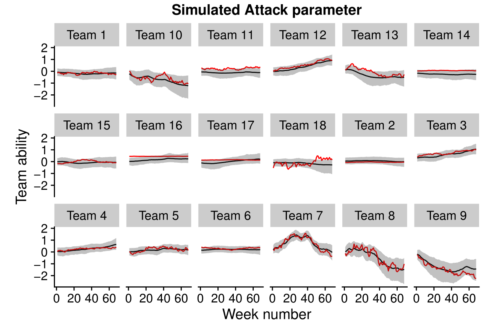

```{r setup, include=FALSE}
knitr::opts_chunk$set(echo = FALSE, size = "tiny", highlight = FALSE, message = FALSE, warning = FALSE)
```


```{r results = 'hide', message = FALSE}
library(data.table)
library(ggplot2)
library(rstan)
library(cowplot)

rstan_options(auto_write = TRUE)
options(mc.cores = parallel::detectCores())
```

```{r results = 'hide'}
# Toggle MCMC sampling on or off
fullrun <- 0
```


```{r results = 'hide'}
source("../code/rankProbScore.R")
source("../code/ppc_coverage_plot.R")
source("../code/MakeTimeSeriesPlot.R")
source("../code/Create_model_data_for_TS2.R")
source("../code/addTeamIds.R")
source("../code/create_league_table.R")
source("../code/MakeEPLPlotAbility.R")
source("../code/games_predicted_vs_actual_intervals.R")
source("../code/ppc_coverage_plot.R")
source("../code/calc_rps_scores.R")
source("../code/odds_to_probability.R")
source("../code/ReadfitsandCalculateRPS.R")
source("../code/array_to_table.R")
source("../code/FitStanModel.R")

```

```{r load_data, results = 'hide', message = FALSE}
NL_ALL <- readRDS("../output/NL_ALL.rds")
```


```{r echo = FALSE}
result_by_model <- readRDS("../output/20180406 average RPS by model.rds")

tidy_coef_res <- readRDS("../output/tidy_coef_res.RDS")
# rename variable for plotting
tidy_coef_res <- tidy_coef_res[L1 == "b_home", L1 := "home_advantage"]

NL_ALL_PRED <- readRDS("../Output/20180406 NL_ALL_PRED_w_odds.rds")

# model checking
res <- readRDS("../output/res_match_type.rds")
res_upper_lower <- readRDS("../output/res_upper_lower.RDS")
res_time <- readRDS("../output/res_time.RDS")
```

# Presentation information

https://github.com/gsverhoeven/artificial_turf_predictive

\vspace{5mm}

You'll find:

- These slides

- The paper as a reproducible Markdown document

# About this project

- Pet project not related to work (but positive externalities)

- My StanCon visit is paid for by my employer (the Dutch Healthcare Authority)

- Builts on work presented at first StanCon by Milad Kharratzadeh, as well as work by Ben Torvaney (https://github.com/Torvaney/karlis-ntzoufras-reproduction) and Rutger Lit 

# About Dutch Football


# The Artificial Turf Advantage

{ width=50% }\


- Extra home advantage due to artificial turf
- Two requirements: 
    - The match is played on Artificial Turf
    - The away team has natural grass in their Home Stadium

- 2017 paper by Economist Jan van Ours: +0.5 extra goals per match
- Compare with:
    - Regular home advantage: +0.4 extra goals
    - On average teams score 1-2 times per match

# Some facts on Dutch Eredivisie and Artificial Turf

- 18 clubs play in Dutch Eredivisie
- Eredivisie is highest professional league
- Per season, each team plays each other team twice 
- Budget differs one order of magnitude between clubs
- Since 2014/2015 season, 6 out of 18 clubs have artificial turf in their home stadium
- Cost primary motivation for clubs to switch 


# Must haves for a parametric football model

- include regular home advantage (+0.4 goals on average)
- address correlation between home and away goals
- allow changes in team ability over time
- partial pooling of variance of team ability time evolution 

# Overview of the models

- Predict Goal difference of match $Y_{ijt}$ between home team $i$ and away team $j$ at time $t$
- $Y_{ijt}$ is a function of latent "scoring intensities" $Y_{ijt} = Y(\lambda_{it}, \lambda_{jt})$
- Two variants:

    $Y_{ijt} \sim t(\lambda_{it} - \lambda_{jt}, \sigma_Y, \nu)$
    
    $Y_{ijt} \sim Skellam(\lambda_{it}, \lambda_{jt}) \Leftrightarrow 
    Y_{ijt} \sim Poisson(\lambda_{it}) - Poisson(\lambda_{jt})$

`real skellam_lpmf( ... )`
`real skellam_rng( ... )`

# Model details

- Scoring intensities for Skellam model with Attack/defense abilities:

    $\lambda_{it} = exp(\mu + \delta + \kappa d_{ijt} + \alpha_{it} - \beta_{jt})$
    
    $\lambda_{jt} = exp(\mu + \alpha_{jt} - \beta_{it})$

- Team ability time evolution modeled by random walk

    $\alpha_{it} = \alpha_{i, t-1} + \eta_{it}$
    
    $\eta_{it} \sim Normal(0,\sigma_{it})$
- Priors weakly informative based on typical n_goals scored

# The Core of Modern Statistical Workflow 

- Fit model to fake data simulated from generative model


  
# Partial pooling versus no pooling


# Forecasting approach

- Out-of-sample forecasts using expanding window
- Use posterior predictive distribution $p(y_{rep} | y)$ for next's week matches
- Gives for each match a probabilistic forecast $p_{win}, p_{draw}, p_{loss}$
- Use Ranked Probability Score to quantify discrepancy

# Ranked Probability Score (RPS)

```{r}
cat_label <- factor(c("Win", "Draw", "Loss"), 
                    levels = c("Win", "Draw", "Loss")) # specify order
outcome_pdf <- c(0, 1, 0)
pred_pdf <- c(0.25, 0.5, 0.25)

df <- data.frame(cat_label, observed_PDF = outcome_pdf, forecast_PDF = pred_pdf)
df <- melt(df)

gp <-ggplot(df, aes(x = cat_label, y = value, group = variable, fill = variable)) +
 # geom_line(size = 1) + 
  geom_col(size = 1, position = position_dodge(), width = 0.2) + ylab("Probability density") + 
  xlab("Ordered Match Outcome") +
  theme_classic()
```


```{r}
cat_label <- factor(c("Win", "Draw", "Draw", "Loss"), 
                    levels = c("Win", "Draw", "Loss")) # specify order
outcome_cdf <- c(0, 0, 1, 1)
pred_cdf <- c(0.25, 0.75, 0.75, 1)

df <- data.frame(cat_label, observed_CDF = outcome_cdf, forecast_CDF = pred_cdf)
df <- melt(df)

gp2 <- ggplot(df, aes(x = cat_label, y = value, group = variable, col = variable)) +
  geom_ribbon(aes(x = cat_label, ymax = value),ymin = 0, alpha = 0.3, linetype=0) + 
  geom_ribbon(data=subset(df, variable == "forecast_CDF" & cat_label != "Win"), aes(x = cat_label, ymax = value),ymin = 0, fill = "white", linetype=0) + 
  geom_line(size = 1) + 
  geom_point(size = 3) + ylab("Cumulative probability density") + 
  xlab("Ordered Match Outcome") +
  theme_classic()
```
```{r, fig.height= 4, fig.width= 8}
library(cowplot)

plot_grid(gp, gp2, labels = c("A", "B"))
```

```{r, echo = TRUE}
calculate_rps(rbind(c(0.25, 0.5, 0.25), 
                    c(1/3, 1/3, 1/3)), 
              rbind(c(0, 1, 0), 
                    c(0, 1, 0)))
```


# Ranked Probability Score is distance sensitive

```{r}
cat_label <- factor(c("Win", "Draw", "Loss"), 
                    levels = c("Win", "Draw", "Loss")) # specify order
outcome_pdf <- c(0, 0, 1)
pred_pdf <- c(0.2, 0.4, 0.4)

df <- data.frame(cat_label, observed_PDF = outcome_pdf, forecast_PDF = pred_pdf)
df <- melt(df)

gp <-ggplot(df, aes(x = cat_label, y = value, group = variable, fill = variable)) +
 # geom_line(size = 1) + 
  geom_col(size = 1, position = position_dodge(), width = 0.2) + ylab("Probability density") + 
  xlab("Ordered Match Outcome") +
  theme_classic()

```

```{r}
cat_label <- factor(c("Win", "Draw", "Loss"), 
                    levels = c("Win", "Draw", "Loss")) # specify order
outcome_pdf <- c(0, 0, 1)
pred_pdf <- c(0.35, 0.25, 0.4)

df <- data.frame(cat_label, observed_PDF = outcome_pdf, forecast_PDF = pred_pdf)
df <- melt(df)

gp2 <-ggplot(df, aes(x = cat_label, y = value, group = variable, fill = variable)) +
 # geom_line(size = 1) + 
  geom_col(size = 1, position = position_dodge(), width = 0.2) + ylab("Probability density") + 
  xlab("Ordered Match Outcome") +
  theme_classic()

```

```{r}
cat_label <- factor(c("Win", "Draw", "Loss"), 
                    levels = c("Win", "Draw", "Loss")) # specify order
outcome_cdf <- c(0.25, 0.6, 1)
pred_cdf <- c(0.35, 0.6,  1)

df <- data.frame(cat_label, modelA_CDF = outcome_cdf, modelB_CDF = pred_cdf)
df <- melt(df)

gp3 <- ggplot(df, aes(x = cat_label, y = value, group = variable, col = variable)) +
  geom_ribbon(aes(x = cat_label, ymax = value),ymin = 0, alpha = 0.3, linetype=0) + 
  geom_ribbon(data=subset(df, variable == "forecast_CDF" & cat_label != "Win"), aes(x = cat_label, ymax = value),ymin = 0, fill = "white", linetype=0) + 
  geom_line(size = 1) + 
  geom_point(size = 3) + ylab("Cumulative probability density") + 
  xlab("Ordered Match Outcome") +
  theme_classic()

```

```{r, fig.height= 4, fig.width= 8}
library(cowplot)

left_part <- plot_grid(gp, gp2, ncol = 1)
composite <- plot_grid(left_part, gp3, labels = c("A", "B"))
composite
```

# RPS for Skellam model with and without artificial turf

```{r}
tmp_df <- dcast(NL_ALL_PRED[model_nr %in% c(3,10) & has_pred == 1 & season %in% c(16,17), .(row_id, model_nr, rps_vec)],
      row_id ~ model_nr)
tmp_df <- tmp_df[, diff := `3` - `10`]
gp <- ggplot(tmp_df, aes(x = `3`, y = `10`)) + geom_point() +
  xlab("Skellam model without ATA") + ylab("SKellam model with AT") +
  ggtitle("Rank Probability Score")
```

```{r}
gp2 <- ggplot(tmp_df, aes(x = diff)) + geom_histogram() +
  geom_vline(xintercept = 0, col = "red", linetype = 2) + 
  geom_vline(xintercept = mean(tmp_df$diff), col = "blue") +
  xlab("RPS diffference")

plot_grid(gp, gp2, labels = c("A", "B"))
```

# Results

```{r echo = FALSE}
tab <- result_by_model[!(model_nr %in% c(8,9)),.(name, dist, aRPS, DMstat_12, DMpval_12)]
tab <- tab[, DMstat_12 := signif(DMstat_12, 2)]
tab <- tab[, DMpval_12 := signif(DMpval_12, 2)]
setnames(tab, "name", "Model")
setnames(tab, "dist", "distribution")
setnames(tab, "DMstat_12", "DM statistic")
setnames(tab, "DMpval_12", "DM p-value")

knitr::kable(tab[order(aRPS), ], digits = 4)
```

# Artificial Turf Advantage Coefficient

```{r figInsample, echo = FALSE, fig.width = 8, fig.height = 4}
gp1 <- ggplot(tidy_coef_res[model_nr %in% c(1, 2) & L1 %in% c("home_advantage", "art_turf_effect"),], 
       aes(x=shift_nr, y = Q50, group = paste(name, L1), col = name))  +
         geom_ribbon(aes(ymin = Q5, ymax = Q95, group = paste(name, L1)), col = NA, fill = "grey70", alpha = 0.3) + 
  #geom_line() + 
  geom_point() + facet_wrap(~ L1, ncol = 1) + xlab("Week number") + ylab("parameter value") +
  geom_hline(yintercept = 0) + theme_bw() + theme(legend.position="bottom") 

gp2 <- ggplot(tidy_coef_res[model_nr %in% c(3, 10) & L1 %in% c("home_advantage", "art_turf_effect"),], 
       aes(x=shift_nr, y = Q50, group = paste(name, L1), col = name))  +
         geom_ribbon(aes(ymin = Q5, ymax = Q95, x=shift_nr, group = paste(name, L1)), col = NA, fill = "grey70", alpha = 0.3) + 
  #geom_line() + 
  geom_point() + facet_wrap(~ L1, ncol = 1) + xlab("Week number") + ylab("parameter value") +
  geom_hline(yintercept = 0) + theme_bw() + theme(legend.position="bottom") 

plot_grid(gp1, gp2, labels = c("A", "B"))
```


# Summary

- Implemented dynamic Skellam model in Stan
- Models using data on goals scored do not beat bookies but come close
- Artificial Turf Advantage (ATA) does not improve forecasts
- Evidence for a large effect of ATA is not strong
- Is comparing predictive accuracy the best way to learn about the DGP?

# Thanks!

