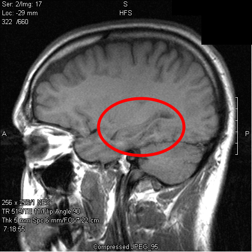

# Alzheimer's Disease Progression

The progression of Alzheimer's Disease (AD) is characterized by the gradual deterioration of biomarkers and eventual loss of basic memory and decision-making functions (Figure 1). Using these biomarker values and other tests to estimate how far an individual has progressed in the disease is valuable in diagnosis as well as in assessing the efficacy of interventions. Additionally, prediction of how the individual will continue to progress is critical in decision making. While it is known that AD only gets worse over time, it is believed that patients with the disease progress at different rates and at different stages of their lives. There is no standard path of progression for people with the disease, which makes estimation of disease severity and future progression difficult. In addition to estimating these paths for an individual given their measurements, it is of clinical and biological significance to be able to understand the order in which certain biomarkers begin to deteriorate and what their distribution might look like for various stages of the disease.


To accomplish these tasks, we introduce a probabilistic model that includes a latent, monotonically increasing variable that measures the continually worsening progression of AD in an individual given their biomarker values. To flexibly model this monotonically increasing progression, we used a basis of monotonic functions, known as I-splines. The model also describes how, and in what order the biomarker values deteriorate over the progression of AD. We illustrate how we fit the model in Stan to real patient data to realistically capture the progression of AD.

# Data and Exploratory Analysis

To simplify our notebook, we used a pre-cleaned tibble of biomarker data from the publicly available Alzheimer's Disease Neuroimaging Initiative (ADNI) dataset. The tibble (tidyverse dataframe) contains various biomarker measurements for 1,737 patients, as well as their age at the time of measurement.

```{r}
library(tidyverse)
library(dplyr)

#load pre-cleaned tibble and preview
load("data/adni_precleaned.Rdata")
adni %>% sample_n(10)
```

The biomarkers measured include the following:

* **ABETA**: Concentration of the amyloid-beta protein in cerebrospinal fluid (CSF), measured in pg/ml. In healthy individuals this harmful protein is actively cleared from the brain in to the CSF. In individuals with AD, the amyloid-beta protein concentrates in the brain to form harmful plaques. Low levels in the CSF indicate the protein is not being cleared from the brain, and is thus an indication of AD.
* **HIPPO**: Volume of the individual's hippocampal brain region as measured by MRI and normalized to their baseline brain volume. In AD the hippocampus is known to shrink in size as the disease progresses. Volume is typically estimated using software applied to images like Figure 2.
* **MMSE**: Mini-Mental State Examination (MMSE) test. A 30-point questionnaire administered by psychologists to assess working memory and brain function in an individual. Patients with AD show lower scores in MMSE, but unfortunately lowered MMSE scores typically only show once the disease has progressed significantly.
* **TAU**: Concentration of tau protein in CSF, measured in pg/ml. Tau is a protein that shows up as a byproduct of dead neurons. High tau in the CSF indicates an abundance of dying neurons in the brain.



Currently, staging of AD is accomplished by the thorough review of a patient by a panel of expert doctors. While this diagnosis serves as a gold-standard, the diagnosis process is cumbersome, prone to subjectivity, and typically only includes three discrete levels, which does not represent the continuously progressing nature of AD. These three stages are in order of severity: Normal (NL), Mild Cognitive Impairment (MCI), and Dementia.

Population histograms of these biomarkers during the three stages of the disease reveal a monotonic pattern in the four biomarkers we are considering. For example ABETA appears to be a biomodal distribution where the lower mode becomes more common as the disease worsens. The distribution of HIPPO appears to shift to the left with increased worsening of AD. These observations lead us to believe that these biomarkers can be modeled as coming from a single continuous latent variable that we can interpret as being a disease progression score.

```{r, fig.width=7}
adni %>%
  filter(DX %in% c("NL", "MCI", "Dementia")) %>%
  ggplot(aes(VALUE)) +
  geom_histogram() +
  facet_grid(DX ~ BIOMARKER, scales = "free")
```
For clarity and graphical ease, we focus on 10 specific patients for the remainder of the notebook. We selected these patients to be of different genders, ages, and stages of AD. Plots of biomarkers generally reveal monotonic trends in time for each patient:

```{r, fig.width=10, warning=FALSE, message=FALSE}
adni10 <- adni %>% filter(RID %in% c(331,729,835,671,1010,5,16,677,4090,4874))

adni10 %>%
  ggplot(aes(AGE, VALUE, color = as.factor(RID))) +
  geom_point() +
  geom_smooth(se = FALSE, span = 2) +
  facet_grid(BIOMARKER ~ RID, scales = "free") +
  scale_color_discrete(name = "Patient ID")
```


# Existing Models of Alzheimer's Disease Progression

Existing models of AD progression utilize monotonic functions to capture the continual worsening of biomarkers. @lorenzi2017disease use a monotonic Gaussian Process to model how each biomarker deteriorates over time in the population, and they use ordinary Gaussian Processes for each individual to describe random deviations from this general progression at the individual level. To achieve monotonicity in their Gaussian Processes they use the method proposed by @riihimaki2010gaussian, and fit their model using Expectation Propagation (EP). @jedynak2012computational take a different approach; they posit that the deterioration of individual biomarkers is tied to a single latent state for each patient that increases monotonically over time. This latent variable can thus be used as a disease progression score, representing how far in the disease an individual has progressed. For our analyses we start with this latter model, and add several improvements, including I-Splines.

## Linear Latent Progression Model

While the model of @jedynak2012computational was originally presented in a frequentist least-squares framework, we translated the model to a probabilistic generative model and implemented it in Stan. We then made several expansions to the model to more realistically fit the data, most notably the use of I-splines which we describe in the next section. If we let $y_{ij}(t)$ denote the $j$th biomarker for the $i$th patient at age $t$, the original model of @jedynak2012computational can be translated to the following probabilistic generative model:

$$
\begin{aligned}
s_i(t) &= \alpha_i t + \beta_i \\
y_{ij}(t) &\sim \mathcal{N}(f(s_i(t)\, |\,  a_j, b_j, c_j, d_j),\sigma_j)
\end{aligned}
$$
where $\sigma_j$ represents the measurement variability for the $j$th biomarker and $f(\cdot| a_j, b_j, c_j, d_j)$ represents a biomarker-specific 4-parameter sigmoid-curve for the $j$th biomarker

$$
f(s\,|\, a_j, b_j, c_j, d_j) = \frac{a_j}{1+e^{-b_j s- c_j}} + d_j.
$$

The parameters $c_j$ and $b_j$ are of particular importance because they indicate when a biomarker starts deteriorating and how fast it deteriorates once it does. The form of the degradation of the biomarkers takes the form of a logistic (or S-curve) because in practice biomarkers like ABETA and HIPPO seem to get worse slowly at first, then rapidly, and eventually hit a saturation point. We note that one of the biomarkers has to have fixed values for b and c, to ensure identifiability of the parameters. We chose ABETA to have $b = 1$ and $c=0$.

In this model, $s_i(t)$ is a monotonically increasing transformation of age that represents a continuous disease progression score for the $i$th individual. The individual specific parameters $\alpha_i$ and $\beta_i$ determine the rate of progression and relative onset of AD respectively for the $i$th individual. To ensure the progression variable $s_i(t)$ is monotonic in time, $\alpha_i$ is constrained to be positive.

We note that in this model the parameters of individual biomarker evolution are not allowed to vary from individual to individual, only the latent disease progression score. This implies that the degradation of the biomarkers all happen in the same relative order and relative rate in all patients, an assumption that would have to be properly verified by examining the relative rates of deterioration in individuals.

We implemented this model in Stan to obtain a baseline model. We note that in the original work of @jedynak2012computational, each patient in the model required at least two observations at different time points so that the parameter $\alpha_i$ was identifiable. In our Stan model, we instead rely on a hierarchical prior over $\alpha_i$ so that we can more flexibly fit those patients with few and even only one observation. We think the hierarchical normal prior is a valid modeling choice because we expect individual progressions to not vary too widely from one another, i.e. the distribution should not be heavy-tailed. Furthermore, human population characteristics are often normally distributed, and we have no reason to believe the progressions parameters are multi-modal. This involves the following extension to the model:

$$
\begin{aligned}
\gamma &\sim \mathrm{HalfNormal}(0, 10)\\
\alpha_i &\sim \mathrm{HalfNormal}(0, \gamma).
\end{aligned}
$$

We use a weakly informative scale parameter of 10 in the hyperparameter, as we do not have much prior information on what the scale of the $\alpha_i$ parameter should be.

### Fitting the Model in Stan

```{r, message=TRUE,comment=NA}
library(rstan)

dat <- list(N = adni10 %>% pull(RID) %>% unique %>% length,
            K = 4,
            tot_obs = nrow(adni10),
            patient_idx = adni10 %>% pull(RID) %>% as.factor %>% as.integer,
            biomarker_idx = adni10 %>% pull(BIOMARKER) %>% as.factor %>% as.integer,
            age = adni10 %>% pull(AGE) %>% (function(x) x - mean(x)),
            y = adni10 %>% pull(VALUE))

linear_progression_fit <- stan("stan/linear_progression.stan", data = dat, chains = 1, iter = 2000,refresh=1000)

linear_progression_fit %>% print(pars = c("a_abeta", "a_hippo", "a_tau", "d_abeta", "d_hippo", "d_tau", "b_hippo", "b_mmse", "b_tau", "c_hippo", "c_mmse", "c_tau", "sigma_abeta", "sigma_hippo", "sigma_mmse", "sigma_tau", "gamma"))
```

### Posterior Analysis of Biomarker Comparisons

After ensuring reasonable Rhat values, and no divergences or other warnings, we see that the model fit reveals the relative order of biomarker degradation onset ($c$) and the speed of deterioration ($b$). From posterior histograms of $c$, we can see that relative to the onset of worsening of ABETA, HIPPO seems to start deteriorating about 3 years later, while MMSE starts to deteriorate about 5 years later. For TAU there is far too much posterior uncertainty to tell when the drop off starts. This could be due to model miss-specification in how TAU is modeled. While ABETA begins to deteriorate the earliest of the biomarkers, when HIPPO and MMSE begin to deteriorate, they seem to do so much faster, according to posterior histograms of $b$.

```{r, message= FALSE, warning=FALSE}
#extract posterior samples in to tibbles with the correct column names
posterior_samples_bc <- linear_progression_fit %>%
  rstan::extract(pars = c("b","c")) %>%
  map(as_tibble) %>%
  map(. %>% set_names(c("ABETA","HIPPO","MMSE","TAU"))) %>%
  map(. %>% gather(Biomarker, Value))

#create plots for B and C to compare
posterior_plots_bc <- posterior_samples_bc %>%
  map(function(s) s %>% ggplot(aes(Value, group = Biomarker, fill = Biomarker)) + geom_density())

#reveal plots
posterior_plots_bc$b + xlab("b (Rate of Biomarker Degradation)") + ylab("Estimated Posterior Density")
posterior_plots_bc$c + xlim(0,20) + xlab("c (Relative Onset of Biomarker Degradation)") + ylab("Estimated Posterior Density")
```

### Posterior Analysis of Model Fit

With our Stan model fit, we can examine the posterior distribution of disease progression curves for individuals, as well as the degradation of their biomarkers over time. Note that we center the age by subtracting by the average age of 69.8. This is for numerical reasons.

```{r, fig.width=10,fig.height=3}
library(stringr)

#extract generated posterior samples of disease progression curves for each patient
#(sample only 100 samples from the posterior for better plot visibility)
shat_posterior_samples <- (linear_progression_fit %>% rstan::extract(pars = "shat"))$shat[sample(1:1000,100),,]

#create function and use map to put samples in to easily plottable tibble
sample_to_grid_s <- function(shat_sample) shat_sample %>% t %>% as_tibble %>%
  mutate(grid = seq(-20,20,0.5)) %>%
  gather(patient_idx,shat,-grid) %>%
  mutate(patient_idx = as.integer(str_extract(patient_idx,"[0-9]+")))

master_grid_s <- map(1:dim(shat_posterior_samples)[1], function(i) sample_to_grid_s(shat_posterior_samples[i,,]) %>% mutate(sample_num = i)) %>% bind_rows

#plot once in tibble form
master_grid_s %>%
  ggplot(aes(grid, shat, group = sample_num, color = as.factor(patient_idx))) +
  geom_line(alpha = 0.1) +
  facet_grid(. ~ patient_idx, scale = "free") +
  scale_color_discrete(name = "Patient ID")
```


```{r, fig.width=10}
#extract posterior generated samples of biomarkers into tibble so we can plot it
fhat_posterior_samples <- (linear_progression_fit %>% rstan::extract(pars = "fhat"))$fhat[sample(1:1000,100),,,]
biomarker_names <- c("ABETA","HIPPO","MMSE","TAU")

sample_to_grid <- function(fhat_sample_i) map(1:dim(fhat_posterior_samples)[2], function(j) fhat_sample_i[j,,] %>% t %>% as_tibble %>% set_names(biomarker_names) %>% mutate(grid = seq(-20,20,0.5)) %>% mutate(patient_idx = j) %>% gather(BIOMARKER,yhat,-patient_idx,-grid)) %>%
  bind_rows

master_grid <- map(1:dim(fhat_posterior_samples)[1], function(i) sample_to_grid(fhat_posterior_samples[i,,,]) %>% mutate(sample_num = i)) %>% bind_rows

#extract posterior predicted samples
yhat_posterior_samples <- (linear_progression_fit %>% rstan::extract(pars = "yhat"))$yhat[500,]

adni10 %>%
  mutate(yhat = yhat_posterior_samples) %>%
  mutate(patient_idx = as.integer(as.factor(RID))) %>%
  mutate(AGE = AGE - mean(AGE)) %>%
  ggplot(aes(AGE, VALUE, color = as.factor(patient_idx))) +
  geom_line(aes(grid, yhat, group = sample_num), alpha = 0.1, data = master_grid) +
  geom_point(aes(AGE,yhat),color = "grey50", alpha = 0.5) +
  geom_point(color = "black") +
  facet_grid(BIOMARKER ~ patient_idx, scales = "free") +
  scale_color_discrete(name = "Patient ID")
```
The linear fit does a reasonable job of capturing each individual's progression of biomarkers over time (posterior predictive points in grey). However, the linear disease progression model leaves much to be desired. The model assumes that the rate of progression of the disease is constant, i.e. that patients' disease status continuously progress at the same rate. In reality, it is probably the case that there are plateaus of AD progression, where progression can slow down then later pick back up either due to endogenous or exogenous circumstances. To more flexibly represent disease progression curves we need to be able to flexibly model monotonic functions of age. For this we turn to I-Splines.

# I-Splines

I-Splines are a flexible and adjustable set of monotone basis functions used to model monotonic functions [@ramsay1988monotone]. By taking a linear combination of these functions, and constraining the coefficients to be positive, one can flexibly model a wide class of monotone functions. Similarly, one can model increasing functions with a range from 0 to 1, by taking a linear combination of the I-Splines where the coefficients are constrained to sum to one.

To our knowledge, the only other known method for flexibly modeling monotone functions are monotone Gaussian Processes [@riihimaki2010gaussian], which were used by @lorenzi2017disease. This method relies on constraining the Gaussian Process to have a positive derivative at a set number of points, which then usually forces the function to monotone. While attractive, the method may not return true monotone functions and it is not clear how to select the points where the derivative should be positive.

## M-Splines

Given a domain, and a set of nodes $t_1, \cdots, t_D$ on that domain, the I-Spline basis functions are obtained by integrating the piece-wise-defined M-Splines, themselves a set of spline functions defined on the same domain using the same nodes. M-Splines are defined recursively. The order one M-Spline functions are piece-wise constant functions. The $i$th M-Spline of order one is defined as

$$
\begin{aligned}
M_{i1}(x) :=
\begin{cases}
\frac{1}{(t_{i+1} - t_i)},\; t_i \le x < t_{i+1}\\
0,\; \mathrm{otherwise}
\end{cases}
\end{aligned}
$$

while the $i$th M-Spline of order $k$ is defined recursively as

$$
\begin{aligned}
M_{ik}(x) := \left( \frac{k}{k-1} \right) \frac{(x-t_i)M_{i,k-1}(x) + (t_{i+k}-x) M_{i+1,k-1}(x)}{t_{i+k} - t_i}.
\end{aligned}
$$

One can show that the M-Spline basis functions each integrate to one over the specified domain and are positive. We plot the M-Spline basis functions for orders $k = 1,2,3,4$ using custom code written to generate M-Splines in R.


```{r, warning=FALSE, message=FALSE, fig.height=7}
library(gridExtra)
source("R/isplines.R")

nodes <- list(t1=-20,t2=-20,t3=-20,t4=-20,t5=-16,t6=-12,t7=-8,t8=-4,t9=0,t10=4,t11=8,t12=12,t13=16,t14=20,t15=20,t16=20,t17=20) # K=9

M_spline_expr <- get_order_4_M_spline_expr(K = 9, nodes = nodes)
M_spline_functions <- expr_to_R_functions(M_spline_expr,nodes = nodes)
M_spline_plots <- M_spline_functions %>% map(plot_function_list, nodes = nodes)

#adjust plots for better visibility
M_spline_plots[[3]] <- M_spline_plots[[3]] + ylim(0,0.3)
M_spline_plots[[4]] <- M_spline_plots[[4]] + ylim(0,0.3)

do.call(grid.arrange, c(M_spline_plots, nrow = 4))
```

## Obtaining I-Splines from M-Splines

Because M-Splines integrate to one over the specified domain and are positive, their integral will be a set of functions that monotonically increase from 0 to 1 over the domain. Since the M-Splines are piece-wise polynomials, this integral is easy to compute. We illustrate the I-Splines that we computed using the Ryacas system for symbolic integration along with other custom code we wrote, available in the isplines.R file.

```{r, warning=FALSE,message=FALSE}
M4_expr <- M_spline_expr[[4]]
I_splines_functions <- M4_expr_to_R_I_spline(M4_expr, nodes)
plot_function_list(I_splines_functions, nodes)
```

## Using I-Splines to Represent Monotonic Functions

Positive linear combinations of I-Splines will be monotone, while symplectic linear combinations will be monotone and range from 0 to 1. We illustrate the latter case, by taking different linear combinations of our $D=13$ I-Splines over the domain, where the coefficients are drawn from a uniform Dirichlet distribution, and hence sum to one.

```{r}
library(MCMCpack)

D <- length(I_splines_functions) #number of I-Spline Functions in our Basis
ggplot(aes(x), data = tibble(x = c(-20,20))) +
  stat_function(fun = convex_combination(rdirichlet(1, rep(1,D)), I_splines_functions)) +
  stat_function(fun = convex_combination(rdirichlet(1, rep(1,D)), I_splines_functions)) +
  stat_function(fun = convex_combination(rdirichlet(1, rep(1,D)), I_splines_functions)) +
  stat_function(fun = convex_combination(rdirichlet(1, rep(1,D)), I_splines_functions)) +
  stat_function(fun = convex_combination(rdirichlet(1, rep(1,D)), I_splines_functions)) +
  stat_function(fun = convex_combination(rdirichlet(1, rep(1,D)), I_splines_functions)) +
  stat_function(fun = convex_combination(rdirichlet(1, rep(1,D)), I_splines_functions)) +
  stat_function(fun = convex_combination(rdirichlet(1, rep(1,D)), I_splines_functions)) +
  stat_function(fun = convex_combination(rdirichlet(1, rep(1,D)), I_splines_functions)) +
  stat_function(fun = convex_combination(rdirichlet(1, rep(1,D)), I_splines_functions))
```

## I-Splines in Stan

We use custom code from the file isplines.R to convert the symbolic expressions, M4_expr into Stan code so that we can copy and paste the code in to Stan (see the functions expr_to_stan_str and linear_combination_stan). Using this we can infer monotonic functions in Stan. We draw from a uniform Dirichlet distribution a set of coefficients, use these as coefficients of the I-Splines to create a monotonic function, then create noisy observations of the function using Gaussian noise. We then infer the monotonic function from the resulting data using I-Splines in Stan.

```{r,comment=NA}
#create random monotonic function
#we use a fixed draw and a set seed for consistency
#s <- rdirichlet(1, rep(1,D))
s <- c(0.2244201, 0.01539845, 0.01960153, 0.0337366, 0.0289699, 0.2522589, 0.01027158, 0.02960878, 0.1609171, 0.1046438, 0.005866026, 0.01806087, 0.09624631)
f <- convex_combination(s, I_splines_functions)

N <- 100
set.seed(1991)

#simulate random observations of the function
sim <- tibble(x = runif(N, -20, 20)) %>% mutate(y = f(x) + rnorm(N, sd = 0.05))

#plot generated data
ggplot(sim, aes(x,y)) + geom_point() + stat_function(fun = f)

#fit in Stan
dat_ispline <- list(N = N, x = sim$x, y = sim$y)
fit <- stan("stan/isplines.stan", data = dat_ispline, chains = 1, iter = 1000,refresh=1000)

posterior_summary <- (summary(fit, pars = "fhat")$summary)[,c("2.5%", "50%", "97.5%")] %>%
  as_tibble %>%
  mutate(x = seq(-20, 20, by = 0.5))

#plot posterior mode in red
ggplot() +
  geom_point(aes(x,y), data = sim) +
  stat_function(fun = f, geom = "line", data = data.frame(x = c(-20, 20))) +
  geom_line(aes(x,`50%`),data = posterior_summary, color = "red") +
  geom_ribbon(aes(x, ymin=`2.5%`,ymax=`97.5%`), data = posterior_summary, alpha = 0.2)
```

# Modeling AD Progression with I-Splines

With I-Splines in our toolbelt, we can finally expand the linear latent progression model to a more flexible latent progression using I-Splines. We make the following improvements to the linear progression model:

1. We replace the latent disease progression function, $s_i(t)$, to be a positive linear combination of I-Splines rather than a linear function.
2. We let the measurement variability of the ABETA measurements be different for each individual, and place a hierarchical prior over these parameters. The biomarker plots suggest that the random variation in these measurements may differ in magnitude from person to person. 

```{r,comment=NA}
library(rstan)

ispline_progression_fit <- stan("stan/ispline_progression.stan", data = dat, chains = 1, iter = 2000,refresh=1000,
                                control = list(adapt_delta = 0.99, max_treedepth = 14))

ispline_progression_fit %>% print(pars = c("a_abeta", "a_hippo", "a_tau", "d_abeta", "d_hippo", "d_tau", "b_abeta", "b_hippo", "b_mmse", "b_tau", "c_abeta", "c_hippo", "c_mmse", "c_tau", "sigma_abeta", "sigma_hippo", "sigma_mmse", "sigma_tau", "gamma"))
```

## An Improved Fit with I-Splines

Posterior draws of individual disease progression curves immediately reveal possible non-linearities in disease progression. While some patients still maintain approximately linear disease progression such as patient 4, others such as 5 or 9 display slow initial progressions then a sharp worsening in the disease. Others, such as patient 7 seem to worsen then have a flattened prior where progression is slow, followed by another quickly progressing epoch. These more flexible disease progression curves also manifest in seemingly more accurate biomarker progression curves, leaving us with an overall more trustworthy and robust model.

```{r, fig.width=10,fig.height=3}
#repeat earlier progression plots
shat_posterior_samples <- (ispline_progression_fit %>% rstan::extract(pars = "shat"))$shat[sample(1:1000,100),,]
master_grid_s <- map(1:dim(shat_posterior_samples)[1], function(i) sample_to_grid_s(shat_posterior_samples[i,,]) %>% mutate(sample_num = i)) %>% bind_rows

#plot once in tibble form
master_grid_s %>%
  ggplot(aes(grid, shat, group = sample_num, color = as.factor(patient_idx))) +
  geom_line(alpha = 0.1) +
  facet_grid(. ~ patient_idx, scale = "free") +
  scale_color_discrete(name = "Patient ID")
```

```{r, fig.width=10}
#repeat biomarker progression plots for new I-Spline model
fhat_posterior_samples <- (ispline_progression_fit %>% rstan::extract(pars = "fhat"))$fhat[sample(1:1000,100),,,]
master_grid <- map(1:dim(fhat_posterior_samples)[1], function(i) sample_to_grid(fhat_posterior_samples[i,,,]) %>% mutate(sample_num = i)) %>% bind_rows

#extract posterior predicted samples
yhat_posterior_samples <- (ispline_progression_fit %>% rstan::extract(pars = "yhat"))$yhat[500,]

adni10 %>%
  mutate(yhat = yhat_posterior_samples) %>%
  mutate(patient_idx = as.integer(as.factor(RID))) %>%
  mutate(AGE = AGE - mean(AGE)) %>%
  ggplot(aes(AGE, VALUE, color = as.factor(patient_idx))) +
  geom_line(aes(grid, yhat, group = sample_num), alpha = 0.1, data = master_grid) +
  geom_point(aes(AGE,yhat),color = "grey50", alpha = 0.5) +
  geom_point(color = "black") +
  facet_grid(BIOMARKER ~ patient_idx, scales = "free") +
  scale_color_discrete(name = "Patient ID")
```

# Future Directions

* **Model individual responses in MMSE separately**: Rather than using the MMSE score at face value, it may be more prudent to model the response to individual questions on the MMSE using the tools of Item Response Theory (IRT), since the MMSE score could be calculated in an arbitrary way. This was done in in the Alzheimers setting by @vandemeulebroecke2017longitudinal.

* **Model the distribution of ABETA as a mixture of Gaussians**: The bimodal nature of the population histograms of ABETA suggest that the value advances from a health Gaussian mode, to an unhealthy one as AD progresses, rather than evolving continuously as a sigmoid might suggest. Depending on how individual time series of ABETA appear, and domain knowledge, we may decide to model ABETA as a mixture whose mixture probability is governed by the latent disease progression via a logistic regression.

* **Allow variability in the biomarker progression parameters at the individual level**: We may want to examine the literature and our data to see whether progression of the various biomarkers could occur in a different order or at different relative rates depending on the patient. One possible cause of a different ordering of biomarker degradation could be differing types of dementia such as vascular dementia, as oppose to AD.

# References